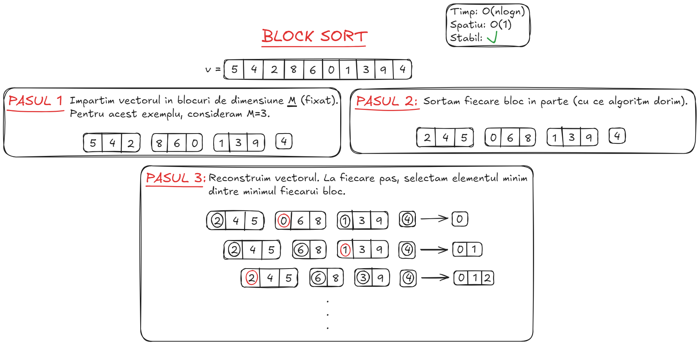
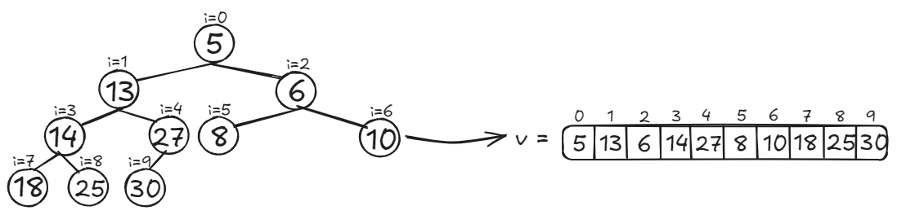
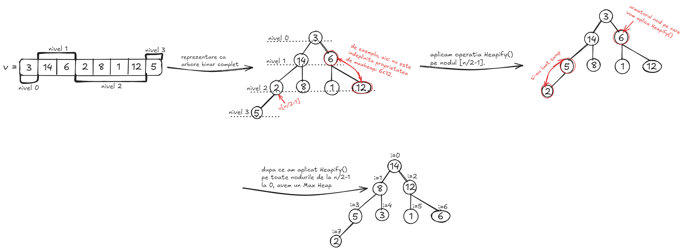
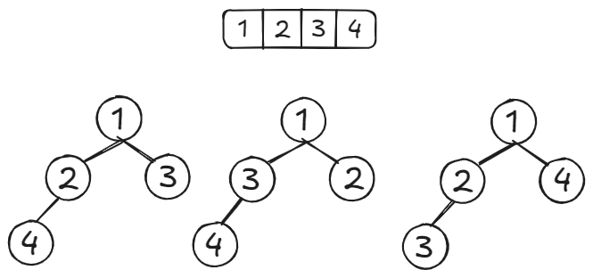
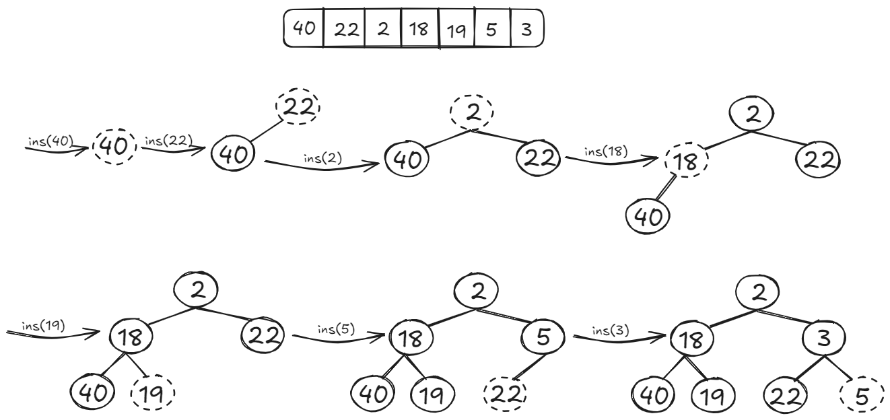
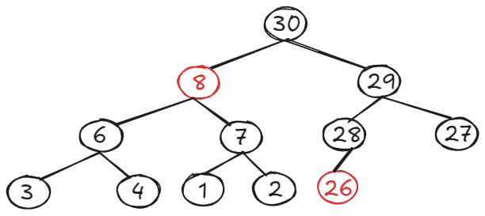

# Table of contents
- [1 - Introducere in algoritmica](#1---introducere-in-algoritmica)
- [2 - Algoritmi si complexitati](#2---algoritmi-si-complexitati)
- [3 - Teorema master](#3---teorema-master)
- [4 - Algoritmi de sortare](#4---algoritmi-de-sortare)
- [5 - Analiza probabilistica](#5---analiza-probabilistica)
- [6 - Stiva](#6---stiva)
- [7 - Coada](#7---coada)
- [8 - Deque](#8---deque)
- [9 - Heap](#9---heap)
- [10 - Exercitii generale](#10---exercitii-generale)
- [11 - Exercitii examen](#10---exercitii)
    - [Seria 13](#seria-13)
    - [Seria 13 (rezolvari)](#seria-13---rezolvari)
    - [Seria 14](#seria-14)
    - [Seria 14 (rezolvari)](#seria-14---rezolvari)
    - [Seria 15](#seria-15)
    - [Seria 15 (rezolvari)](#seria-15---rezolvari)

---

## 1 - Introducere in algoritmica
- Informatica presupune in principal lucrul cu instrumente, cele mai comune fiind **limbajele de programare**
- Limbajele de programare constau intr-o serie de instructiuni care sunt convertite, in final, intr-o sintaxa (cod masina, sir de 0 si 1) pe care calculatorul o poate intelege si executa
- Aceste instructiuni reprezinta o serie de pasi dati calculatorului pentru a obtine un rezultat (**output**) in functie de un set de date de intrare (**input**)
- Aceasta serie de pasi descrisa mai sus formeaza un **algoritm**, iar unul sau mai multi algoritmi alcatuiesc un program
- Deseori, in cadrul unui algoritm, avem nevoie sa stocam date, care pot fi obtinute fie din input, fie din procesari ale inputului. Stocarea datelor, insa, trebuie facuta astfel incat accesarea lor atunci cand e nevoie sa fie cat mai rapida, si teoretic (analizand complexitatile de timp si memorie) si practic (implementarea propriu-zisa a algoritmului stiind limitarile hardware-ului si limbajelor de programare)
- Pentru a rezolva problema, vom folosi ceea ce se numeste o **structura de date**; ea are rolul de a stoca datele pentru folosirea lor ulterioara in program
- Evident, nu exista o structura de date care poate satisface optim toate cazurile posibile, deci avem nevoie de una care sa se comporte cat mai bine pentru cazul nostru particular (si ideal sa fie cat mai robusta, adica daca volumul de date creste, complexitatea ei sa creasca liniar cu acesta sau sa ramana constanta); pentru aceasta putem fie sa cream una noi insine de la $0$ (bazandu-ne pe un suport teoretic sau nu - research position), fie sa le folosim pe cele existente care sunt implementate deja in limbajele de programare
- In cele ce urmeaza, pana la finalul semestrului, vom analiza teoria si implementarile din spatele celor mai comune structuri de date; dar pana atunci, inca putina algoritmica :)

---

## 2 - Algoritmi si complexitati
- Structurile de date se bazeaza si ele pe diversi algoritmi, deci pentru a le putea analiza pe ele, trebuie mai intai sa stim cum analizam algoritmii
- Cele mai comune metrici sunt timpul de executie si memoria utilizata, ce se transpun in complexitate de timp si, respectiv, complexitate de spatiu ocupat
- Pentru inceput, pentru un algoritm fie $f(n)$ numarul de operatii necesare terminarii algoritmului dandu-se un input de marime $n$
- Pentru a analiza complexitatea timpului de executie, exista 3 moduri de a le descrie 9:
1. **Big $O$**
    - fiind data o functie $g(n)$, $f(n) \in O(g(n))$ daca si numai daca $\exists c, n_0 \gt 0 \space astfel \space incat \space 0 \le f(n) \le cg(n), \forall n \ge n_0$

    - cu alte cuvinte, de la un $n_0$ incolo functia $g$ va fi mai mare decat $f$ (de cele mai multe ori cu o constanta in fata)
    - de exemplu $\frac{1}{2}n ^ 3 + 100n + 100000 \in O(n ^ 3)$, adica este marginita superior de $O(n ^ 3)$ de la un n incolo
    - de asemenea, avem si ca $n ^ 2 \in O(n ^ 3)$
    - in cazul in care limita nu este stransa, adica in cazul de mai sus, se va nota $o(n)$; **Atentie: chiar daca $n ^ 2 \in o(n^3)$, $n ^ 2 \notin o(n ^ 2)$!!! $f$ trebuie sa fie strict mai mica**
2. **Big $\Omega$**
    - fiind data o functie $g(n)$, $f(n) \in \Omega(g(n))$ daca si numai daca $\exists c, n_0 \gt 0 \space astfel \space incat \space 0 \le cg(n) \le f(n), \forall n \ge n_0$

    - cu alte cuvinte, de la un $n_0$ incolo functia $g$ va fi mai mica decat $f$ (de cele mai multe ori cu o constanta in fata)
    - de exemplu $\frac{4}{11}n ^ 3 + 4n ^ 2 \in \Omega(n ^ 3)$, adica este marginita inferior de $O(n ^ 3)$ de la un $n$ incolo
    - de asemenea, avem si ca $n ^ 2 \in \Omega(n)$
    - in cazul in care limita nu este stransa, adica in cazul de mai sus, se va nota $\omega(n)$; **Atentie: chiar daca $n ^ 2 \in \omega(n)$, $n ^ 2 \notin \omega(n^2)$!!! $f$ trebuie sa fie strict mai mare**
3. **Big $\Theta$**
    - fiind data o functie $g(n)$, $f(n) \in \Theta(g(n))$ daca si numai daca $\exists c_1, c_2, n_0 \gt 0 \space astfel \space incat \space c_1g(n) \le f(n) \le c_2g(n), \forall n \ge n_0$
    - in alte cuvinte, clasa de functii $\Theta$ reprezinta toate functiile $f$ care sunt marginite si superior si inferior de functia $g$ (deseori folosindu-se constante in fata)
    - de exemplu, $100n ^ 3 + 4n ^ 2 + 1000 \in \Theta(n ^ 3)$, dar $100n ^ 3 + 4n ^ 2 + 1000 \notin \Theta(n ^ 4) \space sau \space \Theta(n ^ 2)$

- Exercitiu: Este adevarat ca $2 ^ {n + 1} \in O(2 ^ n)$? Dar $2 ^ {2n} \in O(2 ^ n)$?


- **FOARTE IMPORTANT**: desi functia $g(n)$ are constante in fata de cele mai multe ori, observati ca in descrierea clasei ele nu exista, adica **CONSTANTELE SUNT IGNORATE ATUNCI CAND DESCRIEM CLASE DE COMPLEXITATI**; in particular, daca o functie a unui algoritm este constanta, de exemplu daca itereaza prin numerele de la $1$ la $100000$ mereu ca sa vada cate sunt divizibile cu un numar $x$ dat, ea apartine claselor $\Theta(1)$, $\Omega(1)$ si $O(1)$ (ultima fiind cea mai folosita)
- Probabil va intrebati de ce exista 3 clase de complexitate. Ce, doar $\Theta$ nu era suficienta? Ei bine, in multe cazuri, nu putem spune exact ca un algoritm este intr-una din clasele date de $\Theta$, ci putem doar demonstra ca este mai eficient decat o anumita functie, adica $f(n)$ este marginita doar superior sau stim sigur $f(n)$ este mai mare decat o alta functie, deci este marginita inferior
- De exemplu, in cazul algoritmului de Insertion Sort, daca sirul dat este sortat algoritmul are complexitatea $\Theta(n)$, iar in cazul in care este sortat descrescator algoritmul va fi in $\Theta(n ^ 2)$
- Totusi, daca vrem sa descriem general algoritmul, nu putem spune ca este in $\Theta(n ^ 2)$, decat daca analizam doar cel mai rau caz
- In exemplul prezentat, Insertion Sort va fi in $\Omega(n)$ si in $O(n^2)$, care reprezinta si limitele cele mai stranse (the most tight bounds)
- **Exercitiu:** Dati exemplu de un algoritm aflat in $\Theta(n ^ 3)$
- Complexitate de spatiu ocupat se face similar si este intuitiva dupa ce ati inteles-o pe cea de timp, de multe ori fiind cea mai usoara de aflat; un exemplu ar fi ca daca in cadrul programului avem o matrice de dimensiune $n ^ 2$ si un vector de dimensiune $10n$ atunci algoritmul va fi in $O(n ^ 2)$, chiar $\Theta(n ^ 2)$; daca sirul avea dimensiunea $m$ atunci complexitate finala era $O(n ^ 2 + m)$, la fel ca la timp ;)

---

## 3 - Teorema master
- Algoritmii se clasifica in 2 clase: cei iterativi si cei recursivi
- Pentru cei iterativi deseori nu este complicat sa aflam complexitatile, mai ales ca sunt mai usor de urmarit
- Pentru cei recursivi insa, trebuie sa tinem cont de mai multi factori, inclusiv de cate apeluri sunt facute si de ce complexitate au operatiile efective; pentru aceasta este foarte utila **Teorema Master**, invatata la Programarea Algoritmilor din semestrul I
- Pe scurt, pentru a afla numarul de pasi pe care ii realizeaza algoritmul in functie de inputul dat, se va folosi formula urmatoare: $T(n) = aT(\frac{n}{b}) + f(n)$, unde $a$ reprezinta numarul maxim de subprobleme apelate la un pas din recursivitate, $b$ reprezinta numarul de subprobleme egale in care este impartita problema la un pas din recursivitate, iar $f(n)$ este complexitatea, in functie de inputul $n$ al unui apel al functiei, fara a considera subapelurile; de asemenea, **$a$ si $b$ trebuie sa fie constante, daca nu sunt nu merge aplicata teorema**
- De aici, puteti fie sa folositi in continuare teorema ce va fi prezentata mai jos, fie faceti de mana toate calculele si obtineti o forma finala din care reiese complexitatea; exemplu:
- Pe baza formulei de mai sus, in functie de diferiti factori, se disting 3 cazuri (vom considera $\alpha = \log_b a$):
1. Primul caz:
    - Daca $f(n) = O(n ^ c), \space c < \alpha$ atunci $T(n) = \Theta(n ^ \alpha)$
    - De exemplu, pentru $T(n) = 8T(n / 2) + 1000 n ^ 2$ avem ca $T(n) \in \Theta(n ^ 3)$
2. Al doilea caz:
    - Daca $f(n) \in \Theta(n ^ \alpha (\log n) ^ k)$ atunci $T(n) = \Theta(n ^ \alpha (\log n) ^ {k + 1})$
    - De exemplu, $T(n) = 2T(\frac{n}{2}) + 10n$, avem ca $T(n) \in \Theta(n \log n)$
3. Al treilea caz:
    - Daca $f(n) = \Omega(n ^ c), \space c > \alpha$ atunci $T(n) \in \Theta(f(n))$
    - De exemplu, daca avem $T(n) = 2T(\frac{n}{2}) + n ^ 2$, atunci $T(n) \in \Theta(n ^ 2)$

- Din cate se poate observa, cele 3 cazuri **nu acopera toate posibilitatile**, deoarece intre cazul 1 si cazul 2 si cazul 2 si cazul 3, diferentele dintre complexitati trebuie sa fie polinomiale (adica sa fie de forma $n ^ d$ (luati $k = 0$ in cazul 2)); deci daca am avea $f(n) = O(n ^ c + m)$ atunci nu am intra in niciun caz, deci nu  putem rezolva problema cu teorema Master

---

## 4 - Algoritmi de sortare

* ### <ins>4.1. Bubble Sort</ins>


```cpp
void bubbleSort(std::vector<int> &t) {
    const int n = t.size();
    for (int i = 0; i < n - 1; ++i) {
        bool ok = false;
        for (int j = 0; j < n - i - 1; ++j) {
            if (t[j] > t[j + 1]) {
                std::swap(t[j], t[j + 1]);
                ok = true;
            }
        }
        if (!ok) {
            return;
        }
    }
}
```

* ### <ins>4.2. Count Sort<ins> 


```cpp
void countSort(std::vector<int> &t) {
    const int n = t.size();
    int maxValue = t[0];
    for (int i = 1; i < n; ++i) {
        if (t[i] > maxValue) {
            maxValue = t[i];
        }
    }

    std::vector count(maxValue + 1, 0);
    for (const auto &x: t) {
        ++count[x];
    }

    for (int i = 1; i <= maxValue; ++i) {
        count[i] += count[i - 1];
    }

    std::vector<int> aux(n);
    for (int i = n - 1; i >= 0; --i) {
        aux[count[t[i]] - 1] = t[i];
        --count[t[i]];
    }
    t = aux;
}
```

* ### <ins>4.3. Select Sort</ins>


```cpp
void selectSort(std::vector<int> &t) {
    const int n = t.size();
    for (int i = 0; i < n - 1; ++i) {
        int minIndex = i;
        for (int j = i + 1; j < n; ++j) {
            if (t[j] < t[minIndex]) {
                minIndex = j;
            }
        }
        std::swap(t[i], t[minIndex]);
    }
}
```


* ### <ins>4.4. Insert Sort</ins>


```cpp 
void insertSort(std::vector<int> &t) {
    for (int i = 1; i < t.size(); ++i) {
        int j = i - 1;
        const int aux = t[i];
        while (j >= 0 && aux <= t[j]) {
            t[j + 1] = t[j];
            --j;
        }
        t[j + 1] = aux;
    }
}
```

* ### <ins>4.5. Quick Sort (discutie pe pivot)</ins>


```cpp
int medianThree(std::vector<int> &t, const int i, const int j, const int k) {
    // XOR TRICK
    if ((t[i] > t[j]) ^ (t[i] > t[k]))
        return i;
    if ((t[j] < t[i]) ^ (t[j] < t[k]))
        return j;
    return k;
}

int partition(std::vector<int> &t, const int left, const int right) {
    const int middle = (right - left) / 2 + left; // anti overflow
    const int pivot = medianThree(t, left, right, middle);
    std::swap(t[pivot], t[right]);

    int i = left - 1;
    for (int j = left; j < right; ++j) {
        if (t[j] < t[right]) {
            std::swap(t[++i], t[j]);
        }
    }
    std::swap(t[i + 1], t[right]);
    return i + 1;
}

void quickSort(std::vector<int> &t, const int left, const int right) {
    if (left < right) {
        const int index = partition(t, left, right);
        quickSort(t, left, index);
        quickSort(t, left + 1, right);
    }
}
```

* ### <ins>4.6. Merge Sort</ins>


```cpp 
void merge(std::vector<int> &t, const int left, const int mid, const int right) {
    const int n1 = mid - left + 1; // include mijlocul
    const int n2 = right - mid;
    std::vector<int> leftArray, rightArray;

    for (int i = 0; i < n1; ++i) {
        leftArray.push_back(t[left + i]);
    }
    for (int j = 0; j < n2; ++j) {
        rightArray.push_back(t[j + mid + 1]);
    }

    int i = 0, j = 0, k = left;
    while (i < n1 && j < n2) {
        if (leftArray[i] <= rightArray[j]) {
            t[k++] = leftArray[i++];
        } else {
            t[k++] = rightArray[j++];
        }
    }
    while (i < n1) {
        t[k++] = leftArray[i++];
    }
    while (j < n2) {
        t[k++] = rightArray[j++];
    }
}

void mergeSort(std::vector<int> &t, const int left, const int right) {
    if (left < right) {
        const int mid = (right - left) / 2 + left;
        mergeSort(t, left, mid);
        mergeSort(t, mid + 1, right);
        merge(t, left, mid, right);
    }
}
```

* ### <ins>4.7. Heap Sort</ins>


```cpp
void heapify(std::vector<int> &t, const int n, const int node) {
    int largest = node;
    const int left = 2 * node + 1;
    const int right = 2 * node + 2;

    if (left < n && t[left] > t[largest]) {
        largest = left;
    }
    if (right < n && t[right] > t[largest]) {
        largest = right;
    }
    if (largest != node) {
        std::swap(t[largest], t[node]);
        heapify(t, n, largest);
    }
}

void heapSort(std::vector<int> &t) {
    const int n = t.size();
    for (int i = n / 2 - 1; i >= 0; --i) {
        heapify(t, n, i);
    }
    for (int i = n - 1; i > 0; --i) {
        std::swap(t[0], t[i]);
        heapify(t, i, 0);
    }
}
```


* ### <ins>4.8. Bucket Sort</ins>


```cpp
void bucketSort(std::vector<double> &t) {
    std::vector<std::vector<double> > buckets(10);

    double maxValue = t[0];
    for (int i = 1; i < t.size(); ++i) {
        if (t[i] > maxValue) {
            maxValue = t[i];
        }
    }

    for (const auto &x: t) {
        buckets[static_cast<int>((x * 10) / maxValue) - 1].push_back(x);
    }

    // aici poate intra orice algoritm de sortare stabil
    for (int i = 0; i < 10; ++i) {
        std::ranges::sort(buckets[i]);
    }

    int j = 0;
    for (int i = 0; i < 10; ++i) {
        for (const auto &x: buckets[i]) {
           t[j++] = x;
        }
    }
}
```

* ### <ins>4.9. Radix Sort (MSD/LSD)</ins>


```cpp
void countSortAux(std::vector<int> &t, int &n, const int exp) {
    std::vector count(10, 0);
    std::vector<int> aux(n);

    for (const auto &x: t) {
        ++count[(x / exp) % 10];
    }

    for (int i = 1; i < 10; ++i) {
        count[i] += count[i - 1];
    }

    for (int i = t.size() - 1; i >= 0; --i) {
        aux[count[(t[i] / exp) % 10] - 1] = t[i];
        --count[(t[i] / exp) % 10];
    }
    t = aux;
}

void radixSort(std::vector<int> &t) {
    int maxValue = t[0];
    for (const auto &x: t) {
        if (x > maxValue) {
            maxValue = x;
        }
    }
    int n = t.size();
    for (int exp = 1; maxValue / exp > 0; exp *= 10) {
        countSortAux(t, n, exp);
    }
}
```

* ### <ins>4.10. Block Sort</ins>



```cpp
void blockSort(std::vector<int> &t) {
    const int blockSize = 3;
    const int n = t.size();
    std::vector<std::vector<int> > blocks;
    for (int i = 0; i < n; i += blockSize) {
        std::vector<int> auxBlock;
        for (int j = i; j < i + blockSize && j < n; ++j) {
            auxBlock.push_back(t[j]);
        }
        // aici intra orice sortare
        std::ranges::sort(auxBlock);
        blocks.push_back(auxBlock);
    }
    int m = blocks.size();
    int j = 0;
    while (!blocks.empty()) {
        int minIndex = 0;
        for (int i = 1; i < m; ++i) {
            if (blocks[i][0] < blocks[minIndex][0]) {
                minIndex = i;
            }
        }
        t[j++] = blocks[minIndex][0];
        blocks[minIndex].erase(blocks[minIndex].begin());
        if (blocks[minIndex].empty()) {
            blocks.erase(blocks.begin() + minIndex);
            --m;
        }
    }
}
```

* ### <ins>4.11. Shell Sort</ins>


```cpp
void shellSort(std::vector<int>& t) {
    const int n = t.size();
    for (int gap = n / 2; gap > 0; gap /= 2) {
        for (int i = gap; i < n; ++i) {
            const int aux = t[i];
            int j;
            for (j = i; j >= gap && t[j - gap] > aux; j -= gap) {
                t[j] = t[j - gap];
            }
            t[j] = aux;
        }
    }
}
```

* ### <ins>4.12. Intro Sort</ins>

Este algoritmul de sortare folosit de <b>C++</b> (si alte limbaje). Este un <b>algoritm hibrid</b>, deoarece combina <b>Quick Sort</b>, <b>Heap Sort</b> si <b>Insertion Sort</b>, in functie de caz.

Fiecare dintre cei 3 algoritmi de mai sus exceleaza in anumite cazuri. Felul in care se alege o sortare este urmatoarea:

1. Se incepe cu <b>Quick Sort</b> si se creeaza o partitie. Daca exista o posibilitate ca partitionarea respectiva sa conduca la un anumit numar ridicat de apeluri recursive (<b>2*logn</b>), se utilizeaza <b>Heap Sort</b>.
2. Daca partitiile sunt prea mici (<b>16</b> elemente), se trece pe <b>Insert Sort</b>.
3. Altfel, continuam cu <b>Quick Sort</b>.

#### De ce se foloseste Insert Sort?

Este cel mai optim algoritm de sortare, atunci cand sunt putine valori.

#### De ce se foloseste Heap Sort?

Se pune accent pe faptul ca foloseste <b>O(1)</b> spatiu.

#### De ce s-au ales acele 2 limite pentru apeluri recursive si numar de elemente?

Dupa multe studii si teste practice, s-a ajuns la concluzia ca <b>Intro Sort</b> se descurca cel mai bine pe aceste valori.

* ### <ins>4.13. Tim Sort</ins>

---

## 5 - Analiza probabilistica
- Deseori, analiza de tip **worst case scenario** nu ne ofera informatii prea realiste cu privire la complexitatea pe care o sa o aiba un algoritm in practica, de cele mai multe ori
- De aceea, dorim sa analizam un algoritm si avand in vedere **average running time**-ul lui, iar acest lucru se face deseori tinand cont de anumite probabilitati ale formatului inputului
- Ca exemplu, o problema clasica este **hiring assistant problem**: aveti la dispozitie $n$ posibili angajati. Voi ii luati la rand si, in momentul in care cel curent este mai bun decat toti ceilalti, il dati afara pe cel existent si il angajati pe cel curent, insa la fiecare noua angajare platiti un cost $m$. Intrebarea importanta este cat va fi costul pe care trebuie sa-l platiti dupa ce ati procesat toti cei $n$ angajati (worst case este $nm$, dar este foarte improbabil caci avem $n!$ permutari din care putem alege)
- Acum, in functie de ce distributie are inputul, putem aplica analiza probabilistica sau nu. De exemplu, daca stim ca numerele corespunzatoare rank-urilor angajatilor sunt sortate crescator in majoritatea timpului, atunci este costul va fi $nm$ sau pe aproape, si nu putem folosi probabilistica. Daca inputul are o distributie aleatoare atunci putem, caci putem folosi putin din teoria probabilitatilor despre care veti invata in anul 2 sem 1
- Pentru a rezolva problema in continuare in mod probabilistic, presupunem ca inputul a fost generat random. Astfel, mai departem vom introduce o variabila $X_i$ ce reprezinta cati angajati ne asteptam sa avem cand procesam candidatul $i$; evident sunt fie 0 sau 1. Inmultind ambele numere cu probabilitatea ca acest candidat $i$ sa fie angajat (cum avem de ales din $i$ candidati dintre care exista un singur maxim, avem ca probabilitatea este $\frac{1}{i}$), obtinem ca $X_i$ = $\frac{1}{i}$. Aici am aplicat conceptul de **expected value** (exemplu aruncare moneda sau zar). La final, pentru fiecare $i$ adunam valorile lui $X_i$ si obtinem costul ca fiind exact $m\ln n$
- **Important de observat**: problema poate fi modificata astfel incat complexitatea de timp sa fie cea pe care dorim sa o aflam: inlocuind costul $m$ cu executia unui program de complexitate $O(m)$ atunci cand se angajeaza cineva. In acest mod, putem observa cum analiza probabilistica are relevanta in practica, desi nu este descrie toate cazurile. De exemplu, complexitatea in acest caz a algoritmului nu ar fi fost $O(nm)$ cu $O(n \log n)$
- In cazul in care distributia inputului nu este random, de exemplu stim ca este mereu sortat sau aproape sortat, putem sa generam random o permutare si astfel sa obtinem un nou input pe care complexitatea sa fie, in medie, mai buna. Astfel, adaugand aceasta reordonare, am obtinut un **algoritm randomizat**
- Alte probleme de analiza probabilistica cu rezultate neintuitive: **secretary problem**, **birthday paradox**

---

## 6 - Stiva
- Stiva este o structura de date care aranjeaza elementele dupa principiul **LIFO (Last In First Out)** (ganditi-va la cum se comporta o stiva de farfurii - puteti adauga sau extrage elemente doar din varf)
- Operatia de adaugare a unui element se numeste **PUSH**, cea de stergere din varful stivei **POP**, iar cea de aflare a elementului din varful **TOP** / **PEEK**
- Complexitatea de timp a adaugarii unui element este $O(1)$, iar a stergerii unui anumit element este $O(n)$
- Pentru a lucra cu stive eficient in C++, fie se va creati voi una (un exemplu este dat mai jos), fie se va folosi implementarea deja existenta din **STL**, si anume `std::stack` despre care puteti afla mai multe lucruri de [aici](https://en.cppreference.com/w/cpp/container/stack)
- **STL** este colectie de structuri de date, fiecare cu biblioteca ei ce trebuie importata, care are implementari abstracte (de exemplu, se pot defini pe diferite tipuri de date) pentru toate structurile de date uzuale
- Implementare STL pentru stiva:
```cpp
#include <iostream>
#include <stack>

int main() {
    std::stack<int> stack;

    // Push elements
    stack.push(10);
    stack.push(20);
    stack.push(30);
    std::cout << "Elements pushed to stack.\n";

    // Get top element
    std::cout << "Top element: " << stack.top() << "\n";

    // Pop elements
    std::cout << "Popped element: " << stack.top() << "\n";
    stack.pop();
    
    std::cout << "Top element after pop: " << stack.top() << "\n";
    
    // Check if stack is empty
    if (stack.empty()) {
        std::cout << "Stack is empty.\n";
    } else {
        std::cout << "Stack is not empty.\n";
    }
    
    return 0;
}
```
- Implementare OOP pentru stiva:
```cpp
#include <iostream>

int const MAX_SIZE = 100; // max size of stack

class Stack {
private:
    int top;
    int arr[MAX_SIZE];

public:
    Stack() {
        top = -1; // Constructor to initialize stack
    }

    bool isEmpty() {
        return (top == -1);
    }

    bool isFull() {
        return (top == MAX_SIZE - 1);
    }

    void push(int value) {
        if (isFull()) {
            std::cout << "Stack Overflow!\n";
            return;
        }
        arr[++top] = value;
        std::cout << value << " pushed to stack\n";
    }

    int pop() {
        if (isEmpty()) {
            std::cout << "Stack Underflow!\n";
            return -1;
        }
        return arr[top--];
    }

    int peek() {
        if (isEmpty()) {
            std::cout << "Stack is empty!\n";
            return -1;
        }
        return arr[top];
    }
};

int main() {
    Stack stack;
    stack.push(10);
    stack.push(20);
    stack.push(30);
    
    std::cout << "Top element: " << stack.peek() << "\n";
    std::cout << "Popped element: " << stack.pop() << "\n";
    std::cout << "Top element after pop: " << stack.peek() << "\n";
    
    return 0;
}
```

---

## 7 - Coada
- Coada este o structura de date ce organizeaza datele pe care le primeste, in ordine, dupa principiul **FIFO**
- Coada are 2 componente: capul (pe unde se extrag elementele) si coada (tail, pe unde se adauga elementele)
- Operatia de adaugare a unui element se numeste **ENQUEUE**, cea de stergere **DEQUEUE**, iar cea de aflare a elementului din cap **TOP** / **PEEK**, toate avand complexitatea de $O(1)$
- Pentru a lucra cu cozi eficient in C++, fie se va creati voi una (un exemplu este dat mai jos), fie se va folosi implementarea deja existenta din **STL**, si anume `std::queue` despre care puteti afla mai multe lucruri de [aici](https://en.cppreference.com/w/cpp/container/queue)
- Implementare STL pentru coada:
```cpp
#include <iostream>
#include <queue>

int main() {
    std::queue<int> q;

    // Enqueue elements
    q.push(10);
    q.push(20);
    q.push(30);
    std::cout << "Elements pushed to queue.\n";

    // Get front and back elements
    std::cout << "Front element: " << q.front() << "\n";
    std::cout << "Back element: " << q.back() << "\n";

    // Dequeue elements
    std::cout << "Dequeued element: " << q.front() << "\n";
    q.pop();
    
    std::cout << "Front element after dequeue: " << q.front() << "\n";
    
    // Check if queue is empty
    if (q.empty()) {
        std::cout << "Queue is empty.\n";
    } else {
        std::cout << "Queue is not empty.\n";
    }
    
    return 0;
}

```

---

## 8 - Deque
- Deque-ul este o structura de date foarte utila (desi de multe ori nu este necesara) care combina functionalitatile stivei si cozii; numele ei vine de la **Double Ended QUEue**
- Ea realizeaza stocarea inputului in ordinea data intr-un sir, insa permite modificarea datelor la ambele capete ale sirului: stergere + adaugare la inceput si stergere + adaugare la final
- In STL, este implementata de `std::deque` cu metode foarte similare celor 2 structuri descrise mai sus

---

## <ins>9 - Heap</ins>
### <ins>9.1 - Introducere</ins>
- Un heap este un **arbore binar complet**: fiecare nod are maxim **2** copii, iar nivelul **K** trebuie sa aiba numar maxim de noduri ca sa putem trece la nivelul **K+1** (de asemenea, se completeaza de la stanga la dreapta).
- Intr-un **max-heap**, fiecare nod este mai **mare** decat copiii sai. Intr-un **min-heap**, fiecare nod este mai **mic** decat copiii sai. Ca si consecinta, **radacina** mereu o sa aiba cea mai mica (sau cea mai mare) valoare.
- Un heap poate fi reprezentat ca un **array**:
    - **t[0]** este radacina.
    - **t[i]** reprezinta un nod oarecare (nodul cu index-ul **i**).
    - **t[i/2]** reprezinta parintele nodului **i**.
    - **t[2*i + 1]** este copilul stang al lui **i**.
    - **t[2*i + 2]** este copilul drept al lui **i**.
- Ultimul nod care **NU** este o frunza se afla la indexul **n/2 - 1**. Astfel, frunzele se gasesc de la **n/2** pana la **n-1**. Demonstratie:
    - Un nod **NU** este o frunza daca are cel putin un copil. Asadar, nu este o frunza daca are cel putin copilul stang.
    - Ca un nod **i** sa aiba copil stang, trebuie sa indeplineasca inegalitatea **2*i + 1 <= n - 1**, unde **2*i + 1** este index-ul copilului stang, iar **n** este numarul de noduri (**n-1** este ultimul nod).
    - Il scoatem pe **i** si obtinem inegalitatea **i <= (n-2)/2**, adica **i <= n/2 - 1**. Asta inseamna ca toate nodurile care au cel putin copilul stang se duc pana in index-ul **n/2 - 1** => frunzele incep de la **n/2**.



### <ins>9.2 - Heapify</ins>
- Reprezinta operatie de rearanjare a unui heap, astfel incat sa indeplineasca proprietatea de **min-heap** (sau **max-heap**). O sa consideram ca vorbim despre un **min-heap**.
- Ideea principala: ne aflam la nodul **parent = i**, care este parintele nodurilor **left = 2*i + 1** si **right = 2*i + 2**. Verificam daca parintele indeplineste proprietatea de **min-heap**: daca <b>v[parent] < v[left]</b> si <b>v[parent] < v[right]</b>, proprietatea este indeplinita. Altfel, trebuie sa dam swap intre parinte si cel mai mic copil: consideram **smallest** ca fiind index-ul celui mai mic dintre copii, si efectuam **swap(v[parent], v[smallest])**.
- Acesta este un proces care se propaga recursiv in jos: odata ce am dat swap la pozitia parintelui cu pozitia copilului, trebuie sa verificam mai departe daca este indeplinita proprietatea pe noua pozitie a parintelui. Asadar, se apeleaza recursiv **heapify(smallest)**. Procesul se opreste cand dam de niste noduri care indeplinesc proprietatea, sau cand dam de o frunza.
- **Complexitate O(logn)**: este posibil sa mergem pe toata inaltimea arborelui, care este **log(n)** (deoarece este un arbore binar complet). 

### <ins>9.3 - BuildHeap</ins>
- Pentru exemplele de mai jos, o sa folosim proprietatea de **min-heap**.
- Operatia **heapify** este folosita pentru a aranja elementele unui vector, astfel incat sa devina heap. Deoarece nu este destul sa o apelam recursiv doar pentru un singur nod (de exemplu, daca o apelam o singura data din radacina si se propaga in subarborele stang, subarborele drept tot ar putea fi stricat), trebuie sa o apelam pentru fiecare nod in parte (in afara de frunze).
- In ce ordine luam nodurile? De sus in jos (**top-bottom manner**) sau de jos in sus (**bottom-top manner**)?
    - **Top-bottom**: sa presupunem ca aplicam **heapify** pe radacina. Odata ce s-a terminat heapify-ul de pe radacina, trebuie sa trecem la urmatorul nod => nu o sa mai fim niciodata pe radacina (nu o sa se mai intample swap-uri cu aceasta). Acest lucru va rezulta intr-un heap aranjat gresit, deoarece minimul ar putea sa se afle in continuare intr-un subarbore al radacinii.
    - **Bottom-top**: aplicam **heapify** incepand cu ultimul nod care nu este o frunza, adica index-ul **n/2 - 1**. Asadar, pentru un subarbore oarecare, stim deja ca toti arborii din componenta sa au fost reparati => in cel mai rau caz, radacina subarborelui respectiv incalca proprietatea. Tot ce trebuie sa facem este sa reparam radacina subarborelui cu **heapify**. La final, obtinem un heap aranjat corect.
- **Complexitate O(n)**: intuitia spune ca ar trebui sa fie **O(nlogn)**, deoarece avem **n/2 - 1** apeluri asupra unei functii care are complexitatea **O(logn)**. Totusi, nu fiecare apel o sa fie **O(logn)**.
    - Sa presupunem ca heap-ul are inaltime **h**. Pe ultimul nivel o sa avem doar frunze, care sunt irelevante.
    - Pe penultimul nivel **h-1** o sa avem **2<sup>h-1</sup>** noduri. In cazul in care unul dintre aceste noduri incalca proprietatea de **min-heap**, o sa fie mutat mai jos cu un singur nivel (o sa ajunga pe ultimul nivel). Asadar, pentru **2<sup>h-1</sup>** noduri o sa avem maxim o singura operatie.
    - Pe antepenultimul nivel **h-2** o sa avem **2<sup>h-2</sup>** noduri. Un nod de pe acest nivel poate fi mutat cu maxim 2 nivele mai jos => pentru **2<sup>h-2</sup>** noduri o sa avem maxim doua operatii.
    - Aplicand logica asta pentru fiecare nivel, obtinem o suma care ne da numarul maxim de operatii efectuate: <b>(0 * 2<sup>h</sup>) + (1 * 2<sup>h-1</sup>) + (2 * 2<sup>h-2</sup>) + ... + ((h-1) * 2<sup>1</sup>) + (h * 2<sup>0</sup>)</b>. In aceasta suma, termenul general are formula **T = k * 2<sup>h-k</sup>**. Mai departe o sa fie doar **analiza matematica** ca sa demonstram.
        - Rescriind, obtinem <b>T = k * 2<sup>h</sup> * 2<sup>-k</sup></b>. Mai intai hai sa calculam formula pentru suma cu termenul general **X = k * 2<sup>-k</sup>**. 
        - Pentru suma de mai sus, ar fi util sa stim suma cu termenul general <b>k * x<sup>k</sup></b>, unde stim ca <b>x < 1</b>. Totusi, pentru aceasta ar fi util sa stim si suma cu termenul general <b>x<sup>k</sup></b> (<b>x < 1</b>). Asadar, notam si calculam: **S = sum(x<sup>k</sup>, 1<=k<=h) = x<sup>0</sup> + x<sup>1</sup> + ... + x<sup>h</sup>**. Inmultim cu **x** => **xS = x<sup>1</sup> + ... + x<sup>h+1</sup>**. Calculam **S - xS = (x<sup>0</sup> + ... + x<sup>h</sup>) - (x<sup>1</sup> + ... + x<sup>h+1</sup>) = 1 - x<sup>h+1</sup>**. In final, <b>S*(1-x) = 1 - x<sup>h+1</sup></b> => **S = (1 - x<sup>h+1</sup>) / (1 - x)**, cu **x != 1**.
        - Acum revenim la suma cu termenul general <b>k * x<sup>k</sup></b>. Folosind forma initiala a sumei calculate anterior **x<sup>k</sup> (x < 1)**, derivam si obtinem   <b>sum((x<sup>k</sup>)') = sum(k * x<sup>k-1</sup>)</b>. Inmultim cu **x** => <b>x * sum((x<sup>k</sup>))' = sum(k * x<sup>k</sup>)</b>, fix suma pe care vrem sa o calculam. Inlocuim **x<sup>k</sup>** cu formula calculata anterior si obtinem <b>sum(k * x<sup>k</sup>) = x * ((1 - x<sup>h+1</sup>) / (1 - x))'</b>. Ca sa ne usuram munca, putem inlocui **x=1/2**; derivam si obtinem <b>sum(k * 2<sup>-k</sup>) = 2 - ((h+2) / 2<sup>h</sup>)</b>.
        - A mai ramas de calculat suma originala, care are acum formula finala **2<sup>h</sup> * {2 - [(h+2) / 2<sup>h</sup>)]}**. Facem inmultirea si obtinem <b>sum(k * 2<sup>h</sup> * 2<sup>-k</sup>) = 2<sup>h+1</sup> - h - 2</b>.
        - Stim ca **h = log<sub>2</sub>n** (inaltimea unui arbore binar complet) => suma devine **2 * 2<sup>log<sub>2</sub>n</sup> - log<sub>2</sub>n - 2 = 2*n - log<sub>2</sub>n - 2**.
        - In concluzie, numarul total de operatii este <b>O(2*n - log<sub>2</sub>n - 2) = O(n)</b>.



### <ins>9.4 - Search</ins>
- Sa presupunem ca vrem sa gasim elementul **10**, iar in radacina avem valoarea **5**. Daca valorile copiilor sunt **<10** (de exemplu, **8** si **9**), nu avem de unde sa stim in ce subarbore se afla elementul **10**. Asadar, va trebui sa verificam majoritatea elementelor din arbore ca sa stim daca exista o anumita valoare.
- **Complexitate O(n)**.

### <ins>9.5 - Insert</ins>
- **Pasul 1**: inseram la final (pe ultimul nivel, completand stanga-dreapta).
- **Pasul 2**: este posibil ca nodul inserat sa incalce proprietatea de **min-heap** (sa fie mai mic decat parintele). Cat timp nodul respectiv este mai mic decat parintele sau, dam swap (un fel de **heapify** de jos in sus).
- **Complexitate O(logn)**.

### <ins>9.6 - Extract min/max</ins>
- Observatie: daca vrem doar sa vedem valoarea minima (fara sa o scoatem), atunci este **O(1)**.
- **Pasul 1**: valoarea minima se afla in radacina. Dam swap intre radacina si ultimul nod, iar apoi stergem ultimul nod.
- **Pasul 2**: este posibil ca noua radacina sa incalce proprietatea de **min-heap**. Aplicam **heapify** pe radacina, ca sa ii gasim pozitia adecvata.
- **Complexitate O(logn)**.

### <ins>9.7 - Delete</ins>
- **Pasul 1**: gasim nodul pe care vrem sa il stergem.
- **Pasul 2**: dam swap intre nodul respectiv si ultimul nod, iar apoi stergem ultimul nod.
- **Pasul 3**: aplicam **heapify** pe pozitia unde a avut loc stergerea. Observatie: stergerea este exact la fel ca **extragerea minimului**, singura diferenta fiind pozitia unde are loc extragerea.
- **Complexitate O(logn)**: stergerea in sine este **O(logn)**, dar pana gasim nodul... cautarea este **O(n)**.

---

## 10 - Exercitii generale
1. Valid parantheses problem.
2. Explain how to implement two stacks in one array $A[1 .. n]$ in such a way that neither stack overflows unless the total number of elements in both stacks together is $n$. The **PUSH** and **POP** operations should run in $O(1)$ time.
3. Given an array, find the next greater element for each element.
4. Given an array and window size k, find the maximum element in each window of size k.
5. Implement a stack using 2 queues (then try with 1 queue)

---

## 11 - Exercitii examen

### <ins>Seria 13</ins>
1. Care din urmatoarele secvente de operatii este <b>imposibila</b> intr-o stiva cu <b>4</b> elemente?
    - PUSH, POP, POP, POP, POP, PUSH.
    - PUSH, POP, POP, POP, PUSH, POP, POP.
    - PUSH, POP, POP, POP, POP, POP, PUSH, POP.
    - PUSH, PUSH, PUSH, PUSH, PUSH, PUSH.
    - POP, POP, POP, POP, POP, POP, POP.
2. Pentru algoritmul <b>Heap Sort</b>, numarul minim de swap-uri de elemente se atinge cand:
    - Secventa initiala este sortata crescator.
    - Secventa initiala este sortata descrescator.
    - Secventa este una aleatoare.
    - Raspunsurile de mai sus nu sunt corecte.
3. In cate moduri putem pune numerele <b>1,2,3,4</b> intr-un vector, astfel incat vectorul rezultat sa poata fi vazut drept un min-heap?
    - <b>2</b> moduri.
    - <b>3</b> moduri.
    - <b>7</b> moduri.
    - Raspunsurile de mai sus nu sunt corecte.

### <ins>Seria 13 - rezolvari</ins>
1. Ultima varianta.
2. Prima varianta.
3. In **3** moduri. Am atasat rezolvarea:



### <ins>Seria 14</ins>
1. Exprimati functiile urmatoare in notatie Θ:
    - <b>log(sqrt(n))</b>.
    - <b>(n + 2<sup>200</sup>)<sup>500</sup></b>.
    - <b>n<sup>4</sup> - n<sup>4</sup>/2 + 10000 * n + 10</b>.
    - <b>ln(ln n) + ln n</b>.
    - <b>n<sup>3</sup>/2000 + n<sup>2</sup> * 2<sup>100000</sup> + 10000 * n + 10</b>.
    - <b>ln<sup>2</sup>n + sqrt(n)</b>.
2. <b>o(f(n)) INTERSECT ω(f(n))</b> = ?
3. Sa se construiasca un <b>min-heap</b> obtinut prin insertia pe rand a urmatoarelor chei: <b>{40, 22, 2, 18, 19, 5, 3}</b>. Apoi, sa se extraga radacina din heap-ul rezultat.
4. Rezolvati urmatoarele recurente si demonstrati: 
    - <b>T(n) = T(n/4) + T(3n/4) + logn</b>.
    - <b>T(n) = T(n/100) + T(99n/100) + n</b>.
    - <b>T(n) = T(n - 1) + n</b>.
5. Demonstrati ca <b>logn = o(sqrt(n))</b>.
6. Care este numarul minim si numarul maxim de noduri intr-un <b>Heap</b> de inaltime <b>h</b>?
7. Este adevarat ca <b>f(n) + g(n) = Θ(max{f(n), g(n)})</b>? Demonstrati.
8. Cum se poate implementa o <b>coada</b> folosind un <b>heap</b>? Dar o <b>stiva</b>?
9. Cum putem sorta <b>n</b> numere in intervalul <b>[0..(n<sup>3</sup> - 1)]</b> in timp <b>O(n)</b>?
10. Se dau urmatoarele structuri de date: o stiva <b>S</b> si doua cozi <b>C1, C2</b> ce contin caractere. Cele trei structuri sunt initial vide si se considera de capacitate infinita. Cozile se considera cu capatul pentru inserare in dreapta si cel pentru stergere in stanga, iar stiva are capatul pentru inserare si stergere in dreapta. Se considera urmatoarele operatii: <b>(1)</b> daca <b>S</b> e nevida, se extrage un element si se introduce <b>C1</b>; altfel, nu se face nimic. <b>(2)</b> Daca <b>S</b> e nevida, se extrage un element si se introduce <b>C2</b>; altfel, nu se face nimic. <b>(3)</b> Daca <b>C1</b> e nevida, se extrage un element si se introduce in <b>C2</b>; altfel, nu se face nimic. <b>(4)</b> Daca <b>C2</b> e nevida, se extrage un element si se introduce in <b>S</b>; altfel, nu se face nimic.
    - Sa se scrie continutul stivei <b>S</b> si al cozilor <b>C1, C2</b> dupa executarea urmatoarei secvente de operatii: <b>C 1 3 K 2 S T A Q U 1 2 U N 1 1 E U 2 2 4 4</b>.
    - Sa se scrie o secventa de operatii care are ca rezultat cuvantul <b>"ROSU"</b> in stiva <b>S</b>, cuvantul <b>VERDE</b> in coada <b>C2</b>, iar <b>C1</b> este vida.
11. Demonstrati ca <b>ln(n!) = Θ(n * ln n)</b>.

### <ins>Seria 14 - rezolvari</ins>
1. Rezolvari pe scurt:
    - <b>log(sqrt(n))</b> = 1/2 * log(n), eliminam constanta => <b>Θ(log(n))</b>.
    - <b>(n + 2<sup>200</sup>)<sup>500</sup></b>, eliminam constanta <b>2<sup>200</sup></b> => <b>Θ(n<sup>500</sup>)</b>.
    - <b>n<sup>4</sup> - n<sup>4</sup>/2 + 10000 * n + 10</b>, termenul dominant este <b>n<sup>4</sup></b> => <b>Θ(n<sup>4</sup>)</b>.
    - <b>ln(ln n) + ln n</b>: stim ca n > ln n => ln n > ln(ln n) => termenul dominant este <b>ln n</b> => <b>Θ(logn)</b>.
    - <b>n<sup>3</sup>/2000 + n<sup>2</sup> * 2<sup>100000</sup> + 10000 * n + 10</b>: termenul dominant este <b>n<sup>3</sup></b> => <b>Θ(n<sup>3</sup>)</b>.
    - <b>ln<sup>2</sup>n + sqrt(n)</b>: termenul dominant este <b>sqrt(n)</b> (se poate verifica cu limita) => <b>Θ(n<sup>1/2</sup>)</b>.
2. TODO
3. Am atasat rezolvarea:



4. TODO
5. TODO
6. Un heap este un <b>arbore binar complet</b> => pe nivelul <b>k</b> avem maxim <b>2<sup>k</sup></b> noduri, si minim <b>1</b> nod. Daca heap-ul este de inaltime <b>H</b>, atunci pana la nivelul <b>H</b> o sa avem <b>2<sup>0</sup> + 2<sup>1</sup> + ... + 2<sup>H-1</sup> = 2<sup>H</sup> - 1</b> noduri. Daca vrem numar <b>minim</b> de noduri, consideram ca avem un singur nod pe nivelul <b>H</b> => <b>2<sup>H</sup> - 1 + 1 = 2<sup>H</sup></b> noduri in total; altfel, daca vrem numar <b>maxim</b> de noduri, o sa avem <b>2<sup>H</sup></b> noduri pe ultimul nivel => <b>2<sup>H</sup> - 1 + 2<sup>H</sup> = 2 * 2<sup>H</sup> - 1 = 2<sup>H+1</sup></b> noduri in total.
7. TODO
8. TODO
9. TODO
10. TODO
11. TODO

### <ins>Seria 15</ins>
1. Dintre inserare, cautare si stergerea minimului, ce operatie are complexitatea cea mai mare intr-un <b>min-heap</b> si ce complexitate are? Explicati cum se face aceasta operatie si daca este uzuala pentru heap-uri.
2. Ce inaltime poate sa aiba un heap cu <b>30</b> de elemente? Desenati schita arborelui de inaltime minima si schita pentru cel de inaltime maxima.
3. Exemplificati cum functioneaza <b>Merge Sort</b> pe vectorul <b>{16, 14, 9, 23, 3, 141, 19, 11}</b>.
4. Exemplificati cum functioneaza <b>Radix Sort (MSD)</b> in baza 10 pe vectorul <b>{16, 14, 39, 23, 3, 141, 19, 911, 151, 91, 209, 49, 206}</b>.
5. Daca vrem sa sortam <b>10<sup>6</sup></b> numere reale mai mici sau egale cu <b>245859</b>, ce algoritm ar fi bine sa folosim? De ce?
6. Cat ne costa sa gasim cel mai mic element dintr-un <b>Deque</b>? Cum il gasim?
7. Desenati un <b>Max-Heap</b> in care un element aflat la distanta <b>3</b> fata de radacina este mai mare decat un element aflat la distanta <b>1</b> fata de radacina.
8. Exemplificati cum functioneaza <b>cautarea binara</b> pe un vector de 8 elemente, ales de voi.
9. Rezolvati (in pseudocod): se da un vector. Pentru fiecare element, spuneti care este primul element din stanga mai mare decat el.
10. Rezolvati (in pseudocod): se da un vector; pentru fiecare element, spuneti cate elemente din dreapta sa sunt mai mici decat el.
11. Cat ne costa sa aflam al doilea cel mai mic element dintr-un <b>Min-Heap</b>?
12. Se da un vector cu valori intregi. Eliminati duplicatele.

### <ins>Seria 15 - rezolvari</ins>
1. Inserarea are complexitate <b>O(logn)</b>, cautarea are complexitate <b>O(n)</b> si stergerea minimului are complexitate <b>O(logn)</b>. Asadar, cea mai costisitoare operatie este <b>cautarea</b>. Proprietatile Heap-urilor nu permit cautare eficienta - daca, de exemplu, avem un <b>Max-Heap</b> cu radacina <b>10</b> si copiii <b>5</b> si <b>8</b>, nu stim in ce subarbore trebuie sa mergem ca sa gasim valoarea <b>3</b>, deci ar trebui sa verificam toate valorile. Totusi, exista un mic truc pentru eficientizare: daca ar trebui sa cautam valoarea <b>7</b>, evident nu o sa fie in subarborele stang (nu poate fi in subarborele lui <b>5</b>, pentru ca <b>7</b> e mai mare decat <b>5</b>).
2. Inaltimea minima si cea maxima coincid. Pe fiecare nivel <b>k</b> avem <b>2<sup>k</sup></b> noduri => <b>1 + 2 + 4 + 8 + 15 = 30</b> noduri.
3. Verificati exemplul grafic de la <b>Merge Sort</b> de mai devreme.
4. Am atasat rezolvarea: 


5. TODO
6. Complexitatea este <b>O(n)</b>, deoarece trebuie sa trecem prin toate elementele ca sa gasim minimul. Elementele dintr-un <b>Deque</b> nu au vreo proprietate/ordine care sa ne ajute la cautare.
7. Am atasat rezolvarea:



8. Am atasat rezolvarea:


9. EXPLICATIE: ne folosim de o <b>stiva</b>, in care punem ultimul element din vector. Apoi, trecem prin celelalte elemente (de la indexul <b>n-2</b> la <b>0</b>): cat timp elementul curent este mai mic decat varful stivei, afisam perechea (dintre element si varful stivei) si scoatem un element de pe stiva. Odata ce stiva devine goala sau elementul curent devine mai mare, il adaugam pe stiva si trecem la urmatorul element. La final, este posibil sa fi ramas elemente in plus pe stiva, care nu au un element mai mic spre stanga; le scoatem si le afisam cu <b>-1</b> sau orice alta valoare sugestiva.

```cpp
#include <iostream>
#include <vector>
#include <stack>

int main() {
    const std::vector t = {3, 5, 1, 8, 10, 6, 4, 9, 2, 0};
    const int n = t.size();
    std::stack<int> s;
    s.push(t[n - 1]);
    for (int i = n - 2; i >= 1; --i) {
        while (!s.empty() && t[i] < s.top()) {
            std::cout << "(" << s.top() << "," << t[i] << ") ";
            s.pop();
        }
        s.push(t[i]);
    }
    while (!s.empty()) {
        std::cout << "(" << s.top() << "," << -1 << ") ";
        s.pop();
    }
    return 0;
}
```

10. TODO (la fel ca la 9).
11. TODO
12. In <b>C++</b>, se poate folosi <b>std::unordered_set</b> (multimile nu au duplicate). <b>Atentie</b>: e posibil ca ordinea initiala a elementelor sa nu se pastreze! O alternative este <b>std::set</b>. TODO continue explanations

```cpp
std::vector<int> t = {1, 4, 2, 2, 4, 1, 5, 6, 1};
std::unordered_set<int> aux(t.begin(), t.end());
t = std::vector<int>(aux.begin(), aux.end());
```

---

#### Notes 
* <b>Seria 13</b>: Algoritmi de sortare (Merge Sort, Insert Sort, Heap Sort, Quick Sort, Select Sort; Comparison Sorts), Heaps (implementare ca Array; Heapify(), BuildHeap()), Priority Queues (insert, pop), Arrays, Vectors, Stacks (+array-based implementation), Queues, Deques.
* <b>Seria 14</b>: Algoritmi de sortare (Merge Sort, Quick Sort), clase de complexitati, teorema master, probabilitati (birthday paradox, secretary problem).
* <b>Seria 15</b>: Algoritmi de sortare (Merge Sort + in-place, Heap Sort, Quick Sort, Count Sort, Bucket Sort, Radix Sort, Block Sort, Intro Sort, Tim Sort), clase de complexitati, Heaps, Arrays, Vectors.
