# Table of contents
- [Introducere in algoritmica](#1---introducere-in-algoritmica)
- [Algoritmi si complexitati](#2---algoritmi-si-complexitati)
- [Teorema master](#3---teorema-master)
- [Algoritmi de sortare](#4---algoritmi-de-sortare)

---

## 1 - Introducere in algoritmica
- Informatica presupune in principal lucrul cu instrumente, cele mai comune fiind **limbajele de programare**
- Limbajele de programare constau intr-o serie de instructiuni care sunt convertite, in final, intr-o sintaxa (cod masina, sir de 0 si 1) pe care calculatorul o poate intelege si executa
- Aceste instructiuni reprezinta o serie de pasi dati calculatorului pentru a obtine un rezultat (**output**) in functie de un set de date de intrare (**input**)
- Aceasta serie de pasi descrisa mai sus formeaza un **algoritm**, iar unul sau mai multi algoritmi alcatuiesc un program
- Deseori, in cadrul unui algoritm, avem nevoie sa stocam date, care pot fi obtinute fie din input, fie din procesari ale inputului. Stocarea datelor, insa, trebuie facuta astfel incat accesarea lor atunci cand e nevoie sa fie cat mai rapida, si teoretic (analizand complexitatile de timp si memorie) si practic (implementarea propriu-zisa a algoritmului stiind limitarile hardware-ului si limbajelor de programare)
- Pentru a rezolva problema, vom folosi ceea ce se numeste o **structura de date**; ea are rolul de a stoca datele pentru folosirea lor ulterioara in program
- Evident, nu exista o structura de date care poate satisface optim toate cazurile posibile, deci avem nevoie de una care sa se comporte cat mai bine pentru cazul nostru particular (si ideal sa fie cat mai robusta, adica daca volumul de date creste, complexitatea ei sa creasca liniar cu acesta sau sa ramana constanta); pentru aceasta putem fie sa cream una noi insine de la $0$ (bazandu-ne pe un suport teoretic sau nu - research position), fie sa le folosim pe cele existente care sunt implementate deja in limbajele de programare
- In cele ce urmeaza, pana la finalul semestrului, vom analiza teoria si implementarile din spatele celor mai comune structuri de date; dar pana atunci, inca putina algoritmica :)

---

## 2 - Algoritmi si complexitati
- Structurile de date se bazeaza si ele pe diversi algoritmi, deci pentru a le putea analiza pe ele, trebuie mai intai sa stim cum analizam algoritmii
- Cele mai comune metrici sunt timpul de executie si memoria utilizata, ce se transpun in complexitate de timp si, respectiv, complexitate de spatiu ocupat
- Pentru inceput, pentru un algoritm fie $f(n)$ numarul de operatii necesare terminarii algoritmului dandu-se un input de marime $n$
- Pentru a analiza complexitatea timpului de executie, exista 3 moduri de a le descrie 9:
  1. **Big $O$**
    - fiind data o functie $g(n)$, $f(n) \in O(g(n))$ daca si numai daca $\exists c, n_0 \gt 0 \space astfel \space incat \space 0 \le f(n) \le cg(n), \forall n \ge n_0$
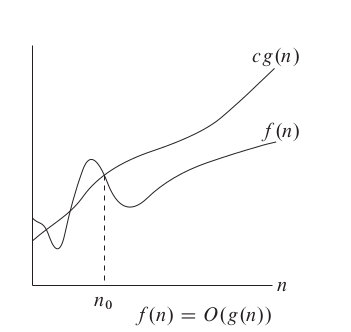
    - cu alte cuvinte, de la un $n_0$ incolo functia $g$ va fi mai mare decat $f$ (de cele mai multe ori cu o constanta in fata)
    - de exemplu $\frac{1}{2}n ^ 3 + 100n + 100000 \in O(n ^ 3)$, adica este marginita superior de $O(n ^ 3)$ de la un n incolo
    - de asemenea, avem si ca $n ^ 2 \in O(n ^ 3)$
    - in cazul in care limita nu este stransa, adica in cazul de mai sus, se va nota $o(n)$; **Atentie: chiar daca $n ^ 2 \in o(n^3)$, $n ^ 2 \notin o(n ^ 2)$!!! $f$ trebuie sa fie strict mai mica**
  1. **Big $\Omega$**
    - fiind data o functie $g(n)$, $f(n) \in \Omega(g(n))$ daca si numai daca $\exists c, n_0 \gt 0 \space astfel \space incat \space 0 \le cg(n) \le f(n), \forall n \ge n_0$
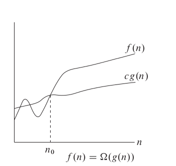
    - cu alte cuvinte, de la un $n_0$ incolo functia $g$ va fi mai mica decat $f$ (de cele mai multe ori cu o constanta in fata)
    - de exemplu $\frac{4}{11}n ^ 3 + 4n ^ 2 \in \Omega(n ^ 3)$, adica este marginita inferior de $O(n ^ 3)$ de la un $n$ incolo
    - de asemenea, avem si ca $n ^ 2 \in \Omega(n)$
    - in cazul in care limita nu este stransa, adica in cazul de mai sus, se va nota $\omega(n)$; **Atentie: chiar daca $n ^ 2 \in \omega(n)$, $n ^ 2 \notin \omega(n^2)$!!! $f$ trebuie sa fie strict mai mare**
  1. **Big $\Theta$**
    - fiind data o functie $g(n)$, $f(n) \in \Theta(g(n))$ daca si numai daca $\exists c_1, c_2, n_0 \gt 0 \space astfel \space incat \space c_1g(n) \le f(n) \le c_2g(n), \forall n \ge n_0$
    - in alte cuvinte, clasa de functii $\Theta$ reprezinta toate functiile $f$ care sunt marginite si superior si inferior de functia $g$ (deseori folosindu-se constante in fata)
    - de exemplu, $100n ^ 3 + 4n ^ 2 + 1000 \in \Theta(n ^ 3)$, dar $100n ^ 3 + 4n ^ 2 + 1000 \notin \Theta(n ^ 4) \space sau \space \Theta(n ^ 2)$

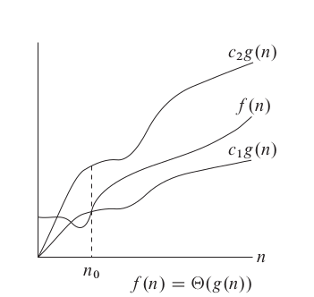

- **FOARTE IMPORTANT**: desi functia $g(n)$ are constante in fata de cele mai multe ori, observati ca in descrierea clasei ele nu exista, adica **CONSTANTELE SUNT IGNORATE ATUNCI CAND DESCRIEM CLASE DE COMPLEXITATI**; in particular, daca o functie a unui algoritm este constanta, de exemplu daca itereaza prin numerele de la $1$ la $100000$ mereu ca sa vada cate sunt divizibile cu un numar $x$ dat, ea apartine claselor $\Theta(1)$, $\Omega(1)$ si $O(1)$ (ultima fiind cea mai folosita)
- Probabil va intrebati de ce exista 3 clase de complexitate. Ce, doar $\Theta$ nu era suficienta? Ei bine, in multe cazuri, nu putem spune exact ca un algoritm este intr-una din clasele date de $\Theta$, ci putem doar demonstra ca este mai eficient decat o anumita functie, adica $f(n)$ este marginita doar superior sau stim sigur $f(n)$ este mai mare decat o alta functie, deci este marginita inferior
- De exemplu, in cazul algoritmului de Insertion Sort, daca sirul dat este sortat algoritmul are complexitatea $\Theta(n)$, iar in cazul in care este sortat descrescator algoritmul va fi in $\Theta(n ^ 2)$
- Totusi, daca vrem sa descriem general algoritmul, nu putem spune ca este in $\Theta(n ^ 2)$, decat daca analizam doar cel mai rau caz
- In exemplul prezentat, Insertion Sort va fi in $\Omega(n)$ si in $O(n^2)$, care reprezinta si limitele cele mai stranse (the most tight bounds)
- **Exercitiu:** Dati exemplu de un algoritm aflat in $\Theta(n ^ 3)$
- Complexitate de spatiu ocupat se face similar si este intuitiva dupa ce ati inteles-o pe cea de timp, de multe ori fiind cea mai usoara de aflat; un exemplu ar fi ca daca in cadrul programului avem o matrice de dimensiune $n ^ 2$ si un vector de dimensiune $10n$ atunci algoritmul va fi in $O(n ^ 2)$, chiar $\Theta(n ^ 2)$; daca sirul avea dimensiunea $m$ atunci complexitate finala era $O(n ^ 2 + m)$, la fel ca la timp ;)

---

## 3 - Teorema master
- Algoritmii se clasifica in 2 clase: cei iterativi si cei recursivi
- Pentru cei iterativi deseori nu este complicat sa aflam complexitatile, mai ales ca sunt mai usor de urmarit
- Pentru cei recursivi insa, trebuie sa tinem cont de mai multi factori, inclusiv de cate apeluri sunt facute si de ce complexitate au operatiile efective
- 

- Algoritmi si complexitati
  - Analiza recursivitatii: metode si teorema Master
  - Analiza probabilistica: secretary problem, birthday paradox
  - Lower and Upper Bound Theory (sorting, generalisation)

- Structuri de date elementare
  - C++ equivalents and OOP
  - liste (3 tipuri) & implementare OOP
  - stive
  - cozi
  - deque
 
---

## 4 - Algoritmi de sortare

* ### <ins>4.1. Bubble Sort</ins>

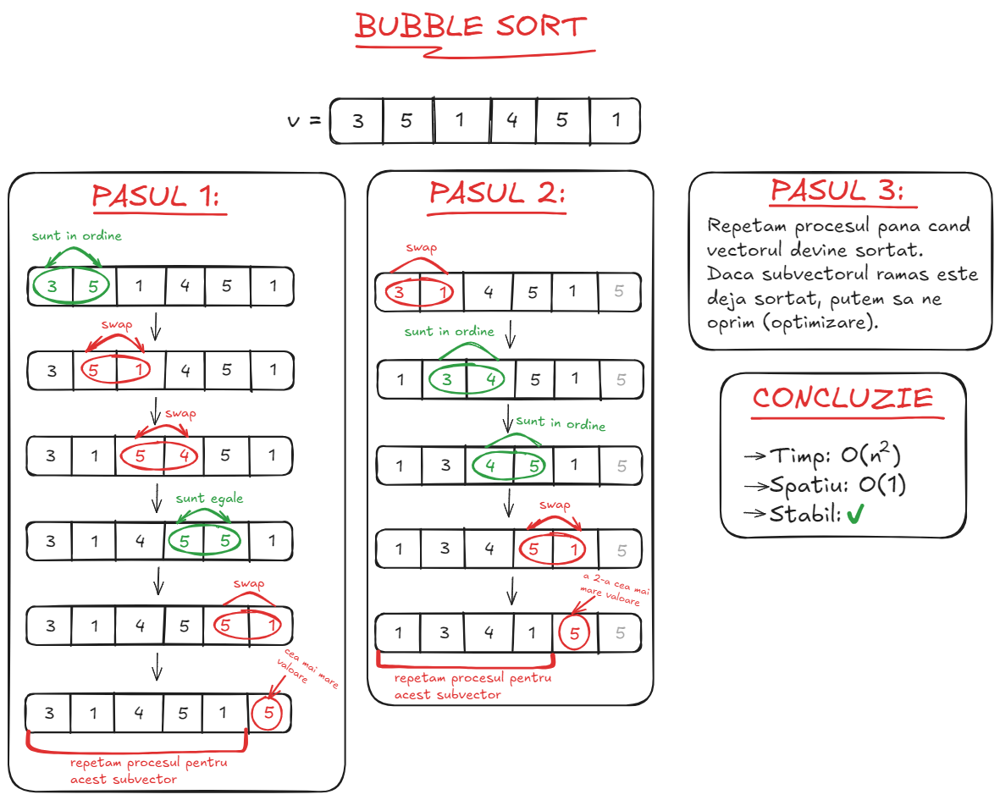

```cpp
void bubbleSort(std::vector<int> &t) {
    const int n = t.size();
    for (int i = 0; i < n - 1; ++i) {
        bool ok = false;
        for (int j = 0; j < n - i - 1; ++j) {
            if (t[j] > t[j + 1]) {
                std::swap(t[j], t[j + 1]);
                ok = true;
            }
        }
        if (!ok) {
            return;
        }
    }
}
```

* ### <ins>4.2. Count Sort<ins> 

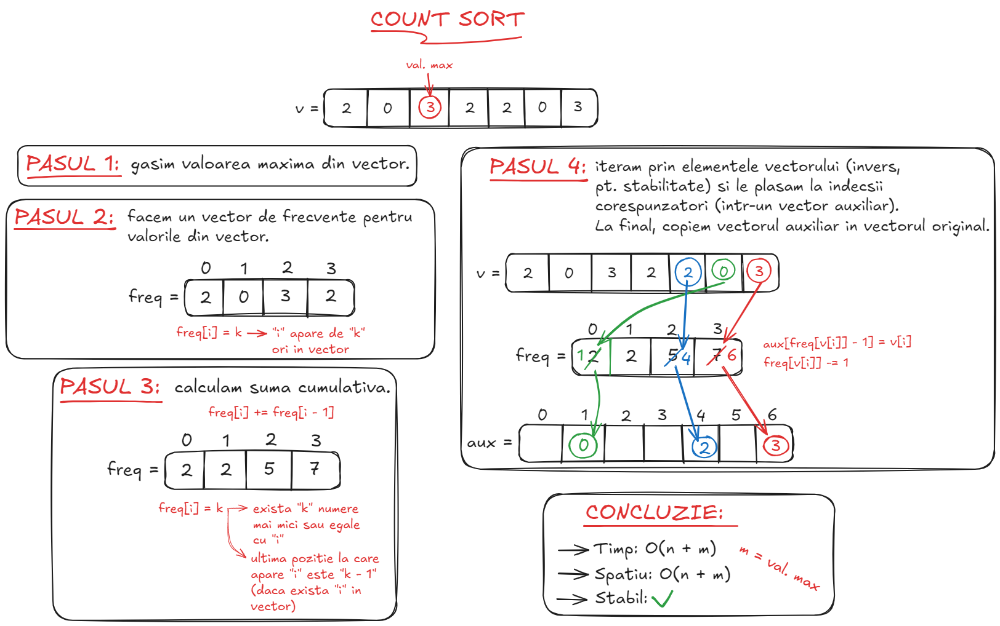

```cpp
void countSort(std::vector<int> &t) {
    const int n = t.size();
    int maxValue = t[0];
    for (int i = 1; i < n; ++i) {
        if (t[i] > maxValue) {
            maxValue = t[i];
        }
    }

    std::vector count(maxValue + 1, 0);
    for (const auto &x: t) {
        ++count[x];
    }

    for (int i = 1; i <= maxValue; ++i) {
        count[i] += count[i - 1];
    }

    std::vector<int> aux(n);
    for (int i = n - 1; i >= 0; --i) {
        aux[count[t[i]] - 1] = t[i];
        --count[t[i]];
    }
    t = aux;
}
```

* ### <ins>4.3. Select Sort</ins>

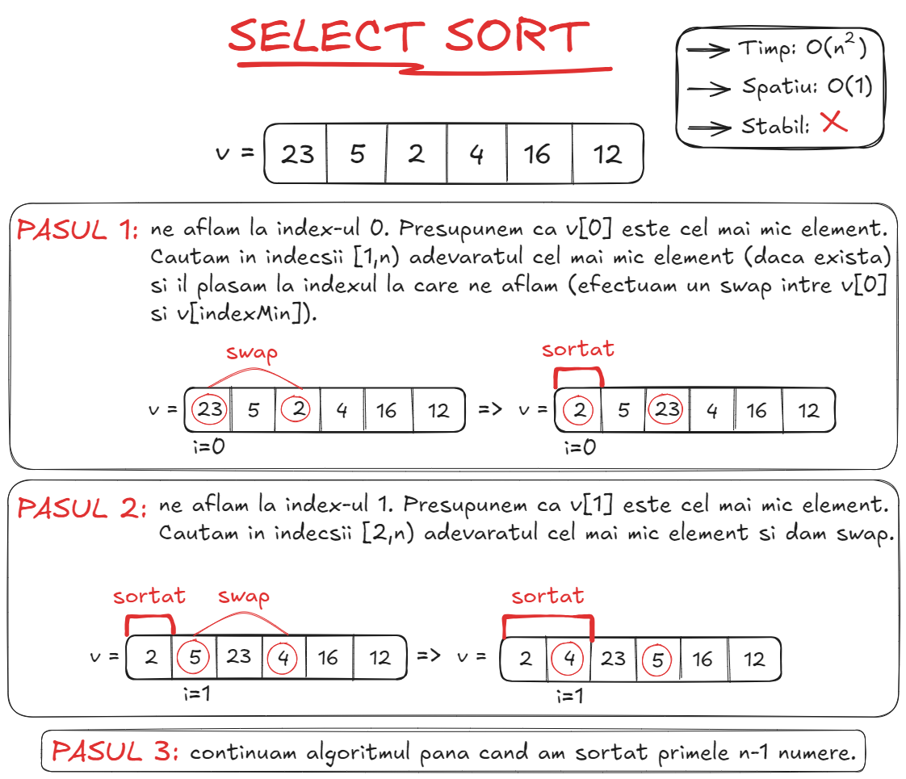

```cpp
void selectSort(std::vector<int> &t) {
    const int n = t.size();
    for (int i = 0; i < n - 1; ++i) {
        int minIndex = i;
        for (int j = i + 1; j < n; ++j) {
            if (t[j] < t[minIndex]) {
                minIndex = j;
            }
        }
        std::swap(t[i], t[minIndex]);
    }
}
```


* ### <ins>4.4. Insert Sort</ins>

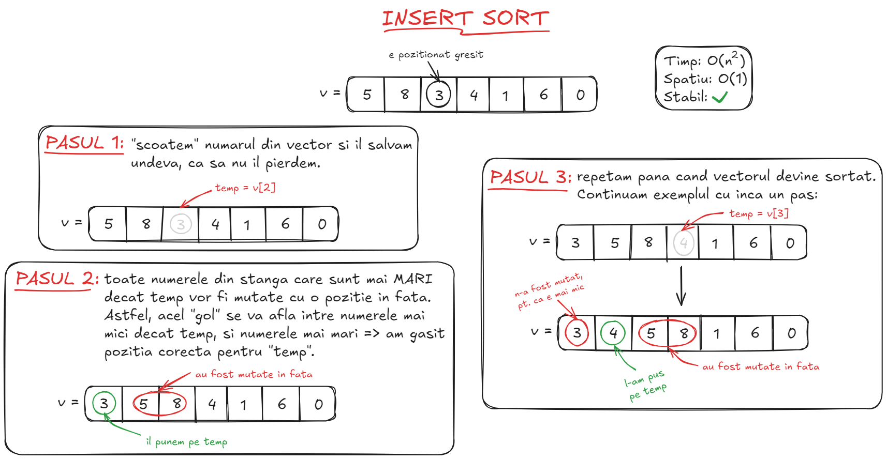

```cpp 
void insertSort(std::vector<int> &t) {
    for (int i = 1; i < t.size(); ++i) {
        int j = i - 1;
        const int aux = t[i];
        while (j >= 0 && aux <= t[j]) {
            t[j + 1] = t[j];
            --j;
        }
        t[j + 1] = aux;
    }
}
```

* ### <ins>4.5. Quick Sort (discutie pe pivot)</ins>

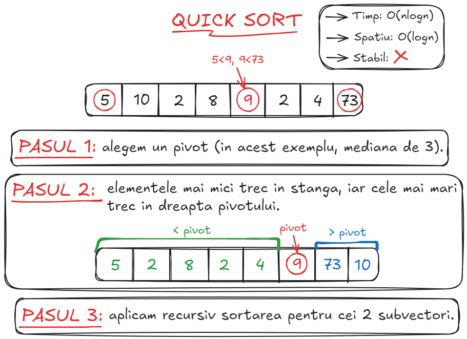

```cpp
int medianThree(std::vector<int> &t, const int i, const int j, const int k) {
    // XOR TRICK
    if ((t[i] > t[j]) ^ (t[i] > t[k]))
        return i;
    if ((t[j] < t[i]) ^ (t[j] < t[k]))
        return j;
    return k;
}

int partition(std::vector<int> &t, const int left, const int right) {
    const int middle = (right - left) / 2 + left; // anti overflow
    const int pivot = medianThree(t, left, right, middle);
    std::swap(t[pivot], t[right]);

    int i = left - 1;
    for (int j = left; j < right; ++j) {
        if (t[j] < t[right]) {
            std::swap(t[++i], t[j]);
        }
    }
    std::swap(t[i + 1], t[right]);
    return i + 1;
}

void quickSort(std::vector<int> &t, const int left, const int right) {
    if (left < right) {
        const int index = partition(t, left, right);
        quickSort(t, left, index);
        quickSort(t, left + 1, right);
    }
}
```

* ### <ins>4.6. Merge Sort</ins>

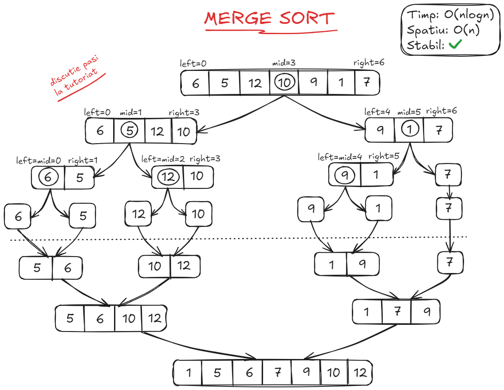

```cpp 
void merge(std::vector<int> &t, const int left, const int mid, const int right) {
    const int n1 = mid - left + 1; // include mijlocul
    const int n2 = right - mid;
    std::vector<int> leftArray, rightArray;

    for (int i = 0; i < n1; ++i) {
        leftArray.push_back(t[left + i]);
    }
    for (int j = 0; j < n2; ++j) {
        rightArray.push_back(t[j + mid + 1]);
    }

    int i = 0, j = 0, k = left;
    while (i < n1 && j < n2) {
        if (leftArray[i] <= rightArray[j]) {
            t[k++] = leftArray[i++];
        } else {
            t[k++] = rightArray[j++];
        }
    }
    while (i < n1) {
        t[k++] = leftArray[i++];
    }
    while (j < n2) {
        t[k++] = rightArray[j++];
    }
}

void mergeSort(std::vector<int> &t, const int left, const int right) {
    if (left < right) {
        const int mid = (right - left) / 2 + left;
        mergeSort(t, left, mid);
        mergeSort(t, mid + 1, right);
        merge(t, left, mid, right);
    }
}
```

* ### <ins>4.7. Heap Sort</ins>

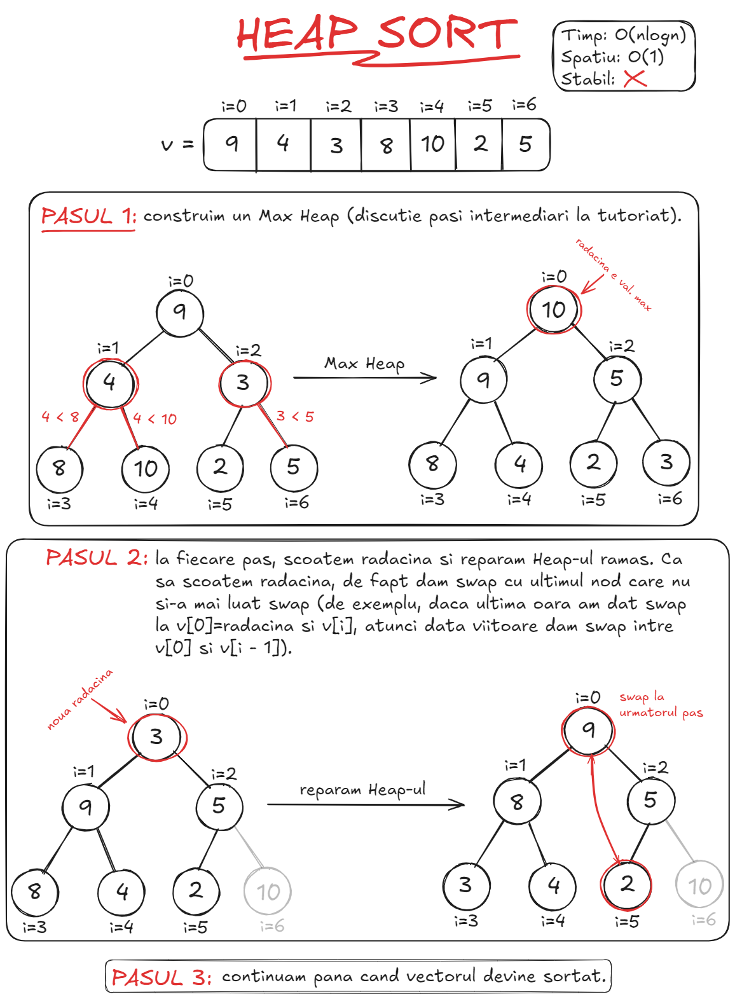

```cpp
void heapify(std::vector<int> &t, const int n, const int node) {
    int largest = node;
    const int left = 2 * node + 1;
    const int right = 2 * node + 2;

    if (left < n && t[left] > t[largest]) {
        largest = left;
    }
    if (right < n && t[right] > t[largest]) {
        largest = right;
    }
    if (largest != node) {
        std::swap(t[largest], t[node]);
        heapify(t, n, largest);
    }
}

void heapSort(std::vector<int> &t) {
    const int n = t.size();
    for (int i = n / 2 - 1; i >= 0; --i) {
        heapify(t, n, i);
    }
    for (int i = n - 1; i > 0; --i) {
        std::swap(t[0], t[i]);
        heapify(t, i, 0);
    }
}
```


* ### <ins>4.8. Bucket Sort</ins>

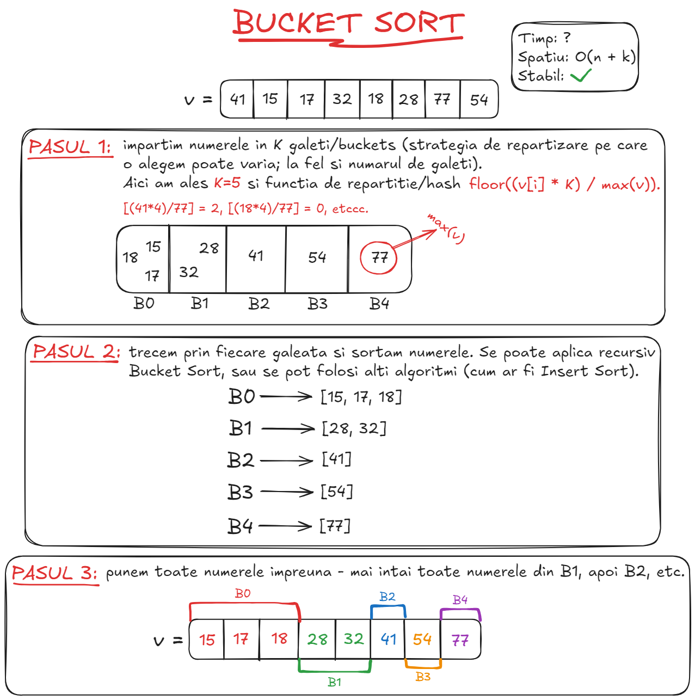

```cpp
void bucketSort(std::vector<double> &t) {
    std::vector<std::vector<double> > buckets(10);

    double maxValue = t[0];
    for (int i = 1; i < t.size(); ++i) {
        if (t[i] > maxValue) {
            maxValue = t[i];
        }
    }

    for (const auto &x: t) {
        buckets[static_cast<int>((x * 10) / maxValue) - 1].push_back(x);
    }

    // aici poate intra orice algoritm de sortare stabil
    for (int i = 0; i < 10; ++i) {
        std::ranges::sort(buckets[i]);
    }

    int j = 0;
    for (int i = 0; i < 10; ++i) {
        for (const auto &x: buckets[i]) {
           t[j++] = x;
        }
    }
}
```

* ### <ins>4.9. Radix Sort (MSD/LSD)</ins>

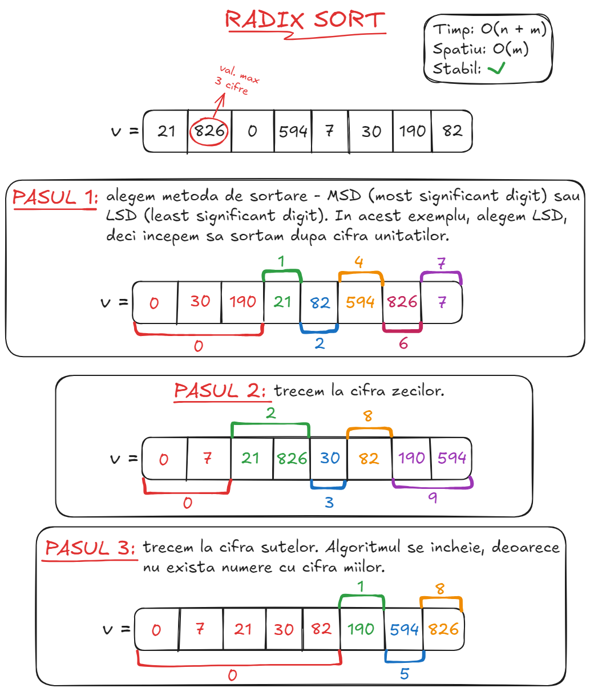

```cpp
void countSortAux(std::vector<int> &t, int &n, const int exp) {
    std::vector count(10, 0);
    std::vector<int> aux(n);

    for (const auto &x: t) {
        ++count[(x / exp) % 10];
    }

    for (int i = 1; i < 10; ++i) {
        count[i] += count[i - 1];
    }

    for (int i = t.size() - 1; i >= 0; --i) {
        aux[count[(t[i] / exp) % 10] - 1] = t[i];
        --count[(t[i] / exp) % 10];
    }
    t = aux;
}

void radixSort(std::vector<int> &t) {
    int maxValue = t[0];
    for (const auto &x: t) {
        if (x > maxValue) {
            maxValue = x;
        }
    }
    int n = t.size();
    for (int exp = 1; maxValue / exp > 0; exp *= 10) {
        countSortAux(t, n, exp);
    }
}
```

* ### <ins>4.10. Block Sort</ins>

* ### <ins>4.11. Shell Sort</ins>

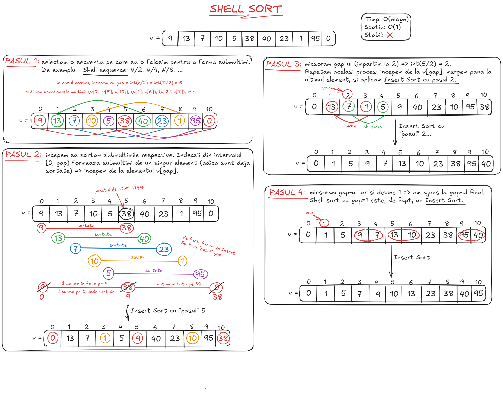

```cpp
void shellSort(std::vector<int>& t) {
    const int n = t.size();
    for (int gap = n / 2; gap > 0; gap /= 2) {
        for (int i = gap; i < n; ++i) {
            const int aux = t[i];
            int j;
            for (j = i; j >= gap && t[j - gap] > aux; j -= gap) {
                t[j] = t[j - gap];
            }
            t[j] = aux;
        }
    }
}
```

* ### <ins>4.12. Intro Sort</ins>

* ### <ins>4.13. Tim Sort</ins>
