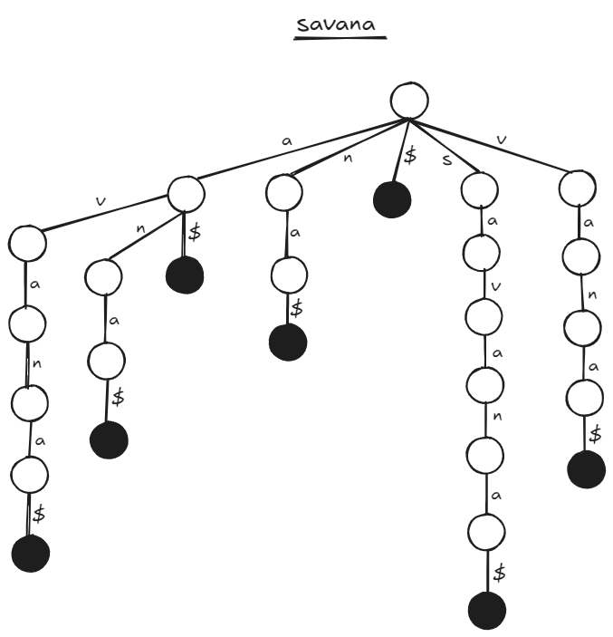
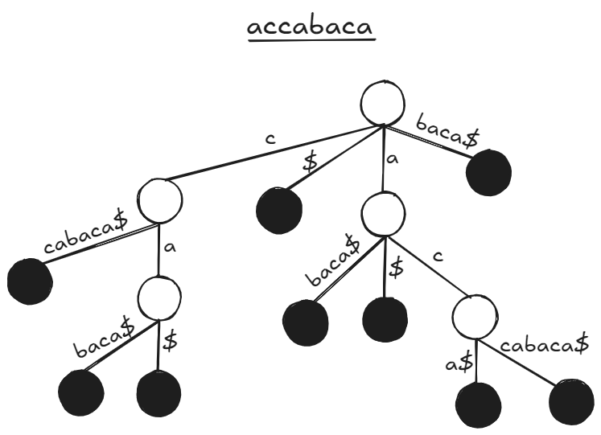

# Table of contents
- [1 - Suffix Tries](#1---suffix-tries)
- [2 - Suffix Trees](#2---suffix-trees)
- [3 - Suffix Arrays](#3---suffix-arrays)

---

## <ins>1 - Suffix Tries</ins>
### <ins>1.1 - Introducere</ins>
- Un **Suffix Trie** este un tip de arbore care permite stocarea sufixelor unui sir.
- Muchiile reprezinta **litere**, iar nodurile terminale (frunzele) reprezinta **cuvinte** (obtinute prin concatenarea literelor de pe lantul care porneste din radacina si ajunge in frunza curenta). Pentru a marca finalul unui cuvant, folosim o muchie cu caracterul **$**, care se duce intr-o frunza.
- Numarul de frunze (numarul de cuvinte) este dat de numarul de sufixe al sirului original. Daca un sir are **n** caractere (si consideram ca sirul gol este un sufix), avem **n+1** sufixe/frunze.
- **Observatie**: pentru un sir **S**, fiecare subsir al lui **S** este prefixul unui sufix din **S**. De exemplu, pentru sirul **s="masina"**, luam orice subsir: **"asi"** este prefixul sufixului **"asina"**, **"n"** este prefixul sufixului **"na"**, etc.
- Am inclus o poza cu reprezentarea sufixelor sirului **savana**.

### <ins>1.2 - Aplicatii
- Folosind **Suffix Tries**, putem rezolva urmatoarele exercitii:
  - **Determinati daca T este sau nu subsir in S**: incepem din radacina si urmarim literele cuvantului - daca am epuizat toate literele, cuvantul este subsir; altfel, daca nu am epuizat literele dar nu avem o muchie pentru litera curenta, cuvantul **nu** este subsir. 
  - **Determinati daca T este sufix pentru S**: incepem din radacina si urmarim literele cuvantului. Daca am epuizat toate literele si am ajuns intr-o frunza, cuvantul este sufix; altfel, **nu** este sufix.
  - **De cate ori apare T in S?** Incepand din radacina, urmarim drumul pentru literele lui **T**. Daca am reusit sa ajungem intr-un nod epuizand toate literele din **T**, atunci numarul de aparitii este dat de numarul de copii pentru nodul curent.
  - **Care este cel mai lung subsir care se repeta de cel putin doua ori in S?** Gasim nodul cu cel putin doi copii care are cea mai mare adancime. Lungimea cuvantului este data de adancimea in arbore (deci vrem adancime maxima), iar numarul de copii reprezinta numarul de subsiruri care incep cu subsirul respectiv (deci vrem sa aiba minim doi copii).
  - **Gasiti primul sufix al sirului S din punct de vedere alfabetic**: incepand din radacina, urmarim mereu cea mai adecvata litera din punct de vedere lexicografic. De exemplu - daca ne aflam in radacina si avem la dispozitie muchiile cu valorile **e**, **o** si **d**, vom alege muchia **d**.

---

## <ins>2 - Suffix Trees</ins>
### <ins>2.1 - Introducere</ins>
- Un **Suffix Tree** este un tip de arbore folosit pentru a reprezenta sufixele unui sir. Diferenta fata de **Suffix Tries** este ca muchiile pot reprezenta grupuri de litere, nu doar cate o singura litera => economisim memorie.
- TODO cel mai lung subsir comun + ukkonen's algorithm?

---

## <ins>3 - Suffix Arrays</ins>
### <ins>3.1 - Introducere</ins>
- Un **Suffix Array** este un vector care retine pozitiile la care incep toate sufixele unui sir, sortate lexicografic dupa sufixe. De exemplu - pentru sirul **abcba** avem sufixele **{0:abcba, 1:bcba, 2:cba, 3:ba, 4:a}**. Odata ce le sortam, obtinem **{4:a, 0:abcba, 3:ba, 1:bcba, 2:cba}**. Astfel, suffix array-ul pentru sirul **abcba** este **{4, 0, 3, 1, 2}**.
- TODO metode de constructie?

---

#### <ins>Notes</ins>
- **Seria 14**: Suffix Tries, Suffix Trees, Suffix Arrays.
