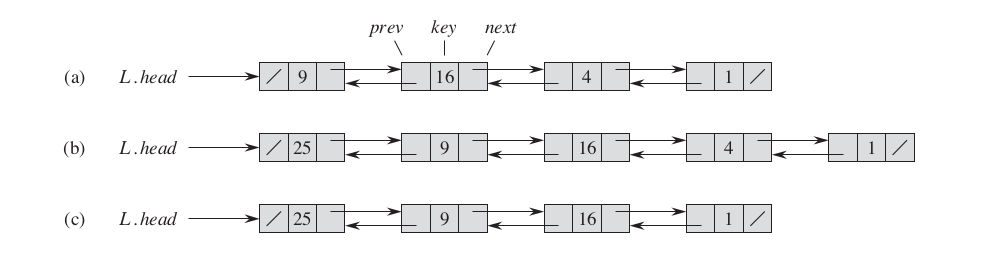
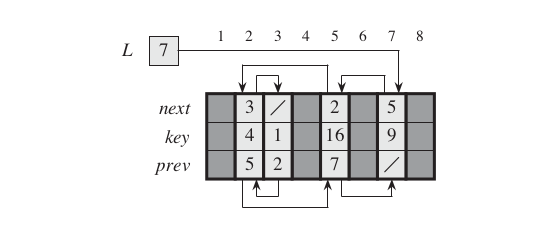
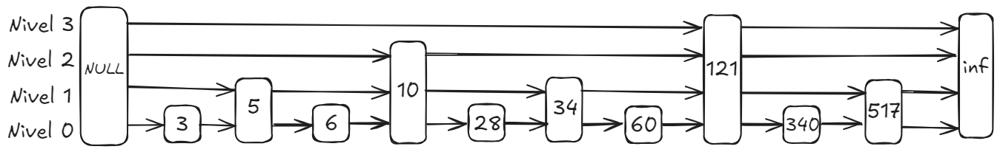
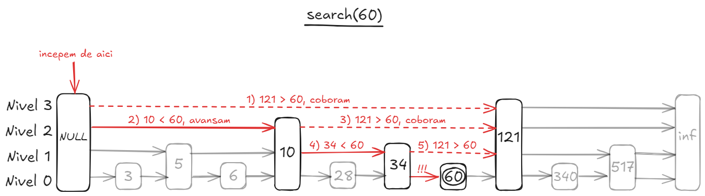
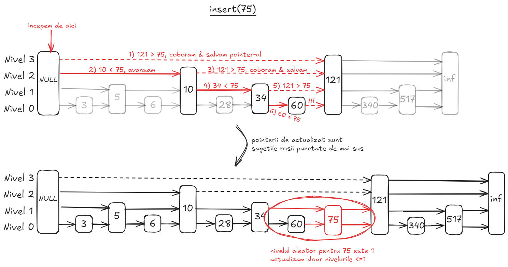
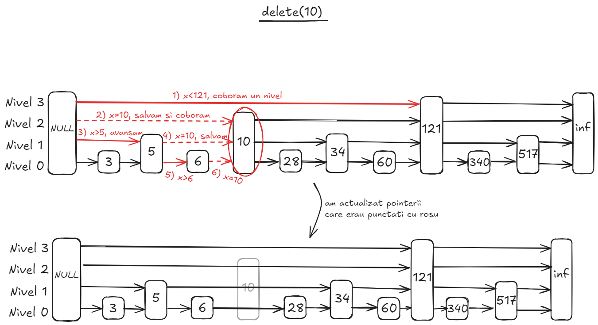
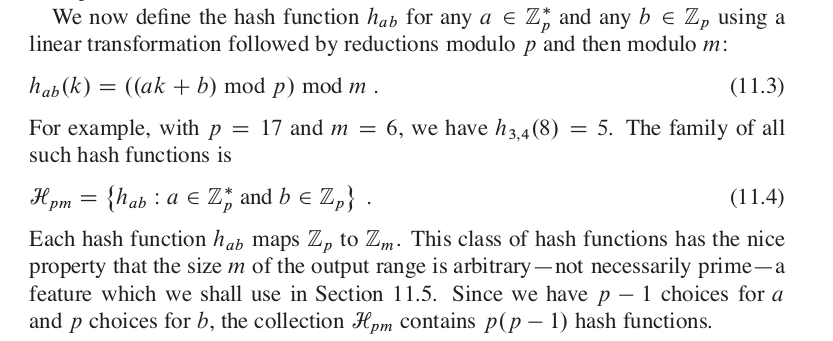
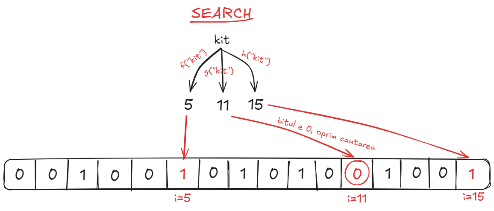
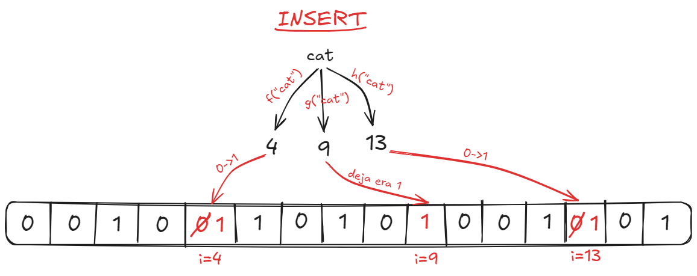

# Table of contents
- [Table of contents](#table-of-contents)
  - [1 - Linked Lists](#1---linked-lists)
      - [Lista simplu inlantuita](#lista-simplu-inlantuita)
      - [Listele dublu inlantuite](#listele-dublu-inlantuite)
      - [Listele circulare](#listele-circulare)
  - [2 - Skip Lists](#2---skip-lists)
    - [2.1 - Introducere](#21---introducere)
    - [2.2 - Search](#22---search)
    - [2.3 - Insert](#23---insert)
    - [2.4 - Delete](#24---delete)
  - [3 - Hash Tables](#3---hash-tables)
    - [Introducere](#introducere)
    - [Functia de hash](#functia-de-hash)
    - [Coliziunile](#coliziunile)
      - [Chaining](#chaining)
      - [Open addressing](#open-addressing)
      - [Perfect hashing](#perfect-hashing)
    - [Implementari C++](#implementari-c)
  - [Exercitiu: Least recently used algorithm (LRU)](#exercitiu-least-recently-used-algorithm-lru)
  - [4 - Bloom Filters](#4---bloom-filters)
    - [4.1 - Introducere](#41---introducere)
    - [4.2 - Search](#42---search)
    - [4.3 - Insert](#43---insert)
  - [5 - Exercitii examen](#5---exercitii-examen)
    - [Seria 13](#seria-13)
    - [Seria 13 - rezolvari](#seria-13---rezolvari)
    - [Seria 14](#seria-14)
    - [Seria 14 - rezolvari](#seria-14---rezolvari)
    - [Seria 15](#seria-15)
    - [Seria 15 - rezolvari](#seria-15---rezolvari)
      - [Notes](#notes)

---

## <ins>1 - Linked Lists</ins>
- Listele sunt structuri de date ce presupun o inlantuire de elemente in asa fel incat accesarea sa poata fi facuta direct **doar** dintr-un element vecin (predecesor sau succesor); **elementele nu se pot accesa print indecsi** ca la vectori
- In cazul in care un element poate fi accesat doar dinspre predecesorul sau, atunci lista este **simplu inlantuita**, altfel, daca se poate accesa si dinspre predecesor si dinspre succesor, atunci se numeste **dublu inlantuita**
- Conventia generala este ca, atunci cand un element nu are un succesor sau predecesor, in locul lui valoarea default este **NULL / NIL**; de multe ori insa, pentru claritatea codului, se utilizeaza un element numit **santinela (engleza: sentinel)** ce pointeaza catre inceputul listei si catre finalul ei (in cazul in care este dublu inlantuita)

- Operatii pe liste inlantuite:
  - Cautarea unui element de pe o pozitie k / cu o valoare k: cum nu putem accesa elementele dupa indexul lor, atunci nu putem obtine direct elementul, respectiv, nu putem realiza cautare binara daca lista ar fi sortata; ca urmare suntem nevoiti sa parcurgem de fiecare data lista pentru a afla elementul dorit, ceea ce ne duce intr-o complexitate de $O(n)$
  - Inserarea in lista pe o pozitie data k: analog cazului de mai sus, suntem nevoiti sa cautam respectiva pozitie, deci vom avea $O(n)$; in particular, daca vrem sa adaugam la inceputul sau finalul listei atunci complexitatea va fi $O(1)$ pentru ca doar modificam un numar constant de pointeri in functie de natura listei; aici se poate observa o optimizare fata de vectori, caci acolo inserarea la inceput avea complexitatea $O(n)$
  - Stergerea unui element de pe o pozitie data: desi stergerea este in $O(1)$, cautarea elementului pe care dorim sa-l stergem este $O(n)$, deci complexitatea finala este $O(n)$
- Implementari in C++ (cu pointeri):

#### <ins>Lista simplu inlantuita</ins>
```cpp
class SinglyLinkedList {
private:
    struct Node {
        int data;
        Node* next;
        Node(int val) : data(val), next(nullptr) {} // OOP-like struct initialization
    };

    Node* head;

public:
    SinglyLinkedList() : head(nullptr) {}

    ~SinglyLinkedList() { clear(); }

    void insert(int val) {
        Node* newNode = new Node(val);
        newNode->next = head;
        head = newNode;
    }

    void display() {
        Node* temp = head;

        while (temp) {
            std::cout << temp->data << " -> ";
            temp = temp->next;
        }

        std::cout << "NULL\n";
    }

    void clear() {
        while (head) {
            Node* temp = head;
            head = head->next;
            delete temp;
        }
    }
};
```

#### <ins>Listele dublu inlantuite</ins>
```cpp
class DoublyLinkedList {
private:
    struct Node {
        int data;
        Node* next;
        Node* prev;
        Node(int val) : data(val), next(nullptr), prev(nullptr) {}
    };

    Node* head;

public:
    DoublyLinkedList() : head(nullptr) {}

    ~DoublyLinkedList() { clear(); }

    void insert(int val) {
        Node* newNode = new Node(val);
        newNode->next = head;
        if (head) head->prev = newNode;
        head = newNode;
    }

    void display() {
        Node* temp = head;

        while (temp) {
            std::cout << temp->data << " <-> ";
            temp = temp->next;
        }

        std::cout << "NULL\n";
    }

    void clear() {
        while (head) {
            Node* temp = head;
            head = head->next;
            delete temp;
        }
    }
};
```

#### <ins>Listele circulare</ins>

```cpp
class CircularLinkedList {
private:
    struct Node {
        int data;
        Node* next;
        Node(int val) : data(val), next(nullptr) {}
    };

    Node* tail;

public:
    CircularLinkedList() : tail(nullptr) {}

    ~CircularLinkedList() { clear(); }

    // Inserarea se face mereu pe la final, ca urmare vom fi nevoiti sa actualizam mereu tail-ul
    void insert(int val) {
        Node* newNode = new Node(val);

        if (!tail) {
            tail = newNode;
            tail->next = tail;
        } else {
            newNode->next = tail->next;
            tail->next = newNode;
            tail = newNode;
        }
    }

    void display() {
        if (!tail) return;

        Node* temp = tail->next;

        do {
            std::cout << temp->data << " -> ";
            temp = temp->next;
        } while (temp != tail->next);

        std::cout << "(circular back to head)\n";
    }

    void clear() {
        if (!tail) return;

        Node* temp = tail->next;

        while (temp != tail) {
            Node* nextNode = temp->next;
            delete temp;
            temp = nextNode;
        }

        delete tail;
        tail = nullptr;
    }
};
```

- Utilizare:
```cpp
int main() {
    SinglyLinkedList sll;
    sll.insert(10);
    sll.insert(20);
    sll.insert(30);
    sll.display();
    
    DoublyLinkedList dll;
    dll.insert(40);
    dll.insert(50);
    dll.insert(60);
    dll.display();
    
    CircularLinkedList cll;
    cll.insert(70);
    cll.insert(80);
    cll.insert(90);
    cll.display();
    
    return 0;
}
```

- Optional: in situatiile in care limbajul nu are implementari pentru pointeri, vom folosi 3 vectori si vom simula adresele din memorie cu pozitiile din sir:

- **In C++ exista deja o implementare STL pentru liste, anume `std::list`, despre care puteti afla mai multe [aici](https://en.cppreference.com/w/cpp/container/list).**

---

## <ins>2 - Skip Lists</ins>
### <ins>2.1 - Introducere</ins>
- Un **Skip List** este o structura de date **probabilista** (in alte cuvinte, are niste functionalitati bazate pe randomizare), reprezentand o colectie de liste inlantuite, fiecare lista fiind plasata pe un nivel.
- La nivelul de baza (nivelul **0**) exista o lista inlantuita ce contine toate elementele. Numarul de elemente se injumatateste fata de nivelul anterior de fiecare data cand urcam. Astfel, la nivelul **0** avem o lista cu **n** elemente, la nivelul **1** avem o lista cu **n/2** elemente si asa mai departe => numarul de noduri de pe nivelul **k** este **n/2<sup>k</sup>**, iar numarul de niveluri este aproximativ **log(n)**. 
- Daca un nod se afla pe nivelul **k**, asta inseamna ca se afla pe fiecare nivel din intervalul **[0, k]**.
- Aceasta structura a nodurilor este utila pentru operatii rapide; cand cautam un element, putem sari peste majoritatea elementelor (folosind nivelurile din varf), ajungand la destinatie din cateva sarituri.
- **Observatie**: ca sa decidem nivelul maxim al unui nod, ne folosim de randomizare si incercam sa ne apropiem cat mai mult de o distributie cat mai echilibrata a nodurilor (nu putem controla acest lucru in intregime, dar incercam sa ne apropiem de statisticile mentionate anterior).
- **Skip Listurile** sunt o alternativa buna pentru arborii echilibrati (deoarece sunt mai usor de implementat), iar operatiile sunt rapide, complexitatea de timp find **O(logn)** in medie.



### <ins>2.2 - Search</ins>
- Sa presupunem ca vrem sa gasim nodul **A**.
- **Pasul 1**: incepem de la cel mai inalt nivel, din **head=NULL** (primul nod).
- **Pasul 2**: verificam daca urmatorul nod de pe nivelul curent, pe care il notam cu **B**, este mai mare, mai mic, sau egal cu nodul **A**.
    - **B > A**: nu putem sa mergem in **B**, deoarece am sari peste **A**; trebuie sa coboram un nivel si reluam recursiv pasul 2.
    - **B < A**: putem merge in **B** (astfel sarind peste niste noduri), deoarece nu sarim peste **A**. Mergem in **B** si reluam recursiv pasul 2.
    - **B = A**: am gasit nodul pe care il cautam; oprim cautarea.
- **Pasul 3**: daca ajungem in **inf** (capatul listei) pe nivelul **0**, atunci nodul respectiv nu exista.



### <ins>2.3 - Insert</ins>
- Cand inseram un nod, va trebui sa modificam pointeri de pe mai multe niveluri. Notam nodul de inserat cu **A**.
- **Pasul 1**: incepem de la cel mai inalt nivel, din **head=NULL** (primul nod).
- **Pasul 2**: verificam daca urmatorul nod de pe nivelul curent, pe care il notam cu **B**, este mai mare, mai mic, sau egal cu nodul **A**.
    - **B > A**: salvam pointerul respectiv si coboram un nivel.
    - **B < A**: mergem in continuare in **B**.
    - **B = A**: putem anula inserare, deoarece nu dorim duplicate.
- **Pasul 3**: odata ce am ajuns la nivelul **0** la un pointer care indica o valoare mai mare decat **A**, oprim "cautarea".
- **Pasul 4**: generam un numar aleator de niveluri. Adaugam nodul pe nivelurile respective, actualizand pointerii pe care i-am salvat anterior (doar pointerii pana la care ajunge nodul, deoarece ar putea avea un nivel mic).



### <ins>2.4 - Delete</ins>
- Cand stergem un nod, va trebui sa modificam pointerii de pe fiecare nivel care pointeaza catre nodul respectiv. Notam nodul pe care vrem sa il stergem cu **A**.
- **Pasul 1**: incepem de la cel mai inalt nivel, din **head=NULL** (primul nod).
- **Pasul 2**: verificam daca urmatorul nod de pe nivelul curent, pe care il notam cu **B**, este mai mare, mai mic, sau egal cu nodul **A**.
    - **B > A**: coboram un nivel.
    - **B < A**: mergem in continuare in **B**.
    - **B = A**: salvam pointerul respectiv si coboram un nivel.
- **Pasul 3**: daca am ajuns in **inf** pe nivelul **0**, inseamna ca nodul **A** nu exista. Altfel, trecem prin toti pointerii pe care i-am salvat si ii modificam corespunzator.



---

## <ins>3 - Hash Tables</ins>
### <ins>Introducere</ins>
- Un **hash table** este o structura de date ce consta in perechi (key, value) si care permite accesarea, stergerea si inserarea elementelor, foarte eficient, intr-un mod similar unui dictionar
- Informal, ea reprezinta o generalizare a vectorilor in sensul ca, in loc sa se acceseze cu indexul pozitiei la care se afla, elementele sunt acesate in functie de o cheie, care poate fi un numar, un simbol sau chiar o alta structura de date, pastrandu-se, in general, complexitatile de accesare; deci, se poate observa ca au o aplicabilitate mult mai larga decat vectorii, desi vin la pachet cu anumite probleme, care le fac utilizabile doar in anumite cazuri, pe care le vom analiza mai jos
- O prima idee de a implementa o astfel de structura de date ar fi sa estimam care ar putea fi toate valorile posibile de chei si sa cream un tabel suficient de mare sa incapa toate; evident, nu este prea practica aceasta metoda, caci de multe ori spatiul teoretic este mult prea mare si nu este necesar a fi folosit tot mereu, deci avem si **memory waste**
- Ca urmare, suntem nevoiti sa cream un spatiu in care se vor afla cheile mai mic ca sa nu avem memory waste, dar indeajuns de mare, astfel incat sa stim ca, **in medie**, sa nu avem problemele legate de complexitate, asta deoarece vom avea un set de elemente din **universul cheilor** care vor avea acelasi loc alocat
- Ca sa fie eficienta, aceasta procedura trebuie sa tina cont de 2 lucruri: managementul coliziunilor si functia de hash

### <ins>Functia de hash</ins>
- **Functia de hash** reprezinta functia care se ocupa cu gasirea unui slot pentru un element dat astfel incat sa se minimizeze spatiul ocupat (deci sa gaseasca un loc liber) si sa se minimizeze si timpul de accesare (sa aiba complexitatea cat mai mica)
- De exemplu, cea mai simpla functie de hash este cea care cauta primul loc liber in tabel si il returneaza; evident nu este prea eficienta
- Alta ar fi ceva random, insa asa nu putem garanta ca pentru acelasi element avem acelasi hash, ceea ce nu este util mai ales ca vrem sa si cautam elemente, nu doar sa le inseram
- In cele mai multe cazuri, dorim sa avem **uniform hashing**, adica cheilor sa le fie alocate un slot din tabel in mod cat mai egal si independent
- Din cauza faptului ca nu exista o functie hash care se minimizeze si spatiul si timpul simultan, s-au folosit diverse euristici (observatii practice) pe baza comportamentelor diferitelor functii de hash. In continuare vom prezenta astfel de euristici care incearca sa indeplineasca conditiile de **uniform hashing**
- **Division method**: Aceasta metoda presupune utilizarea functiei de modulo. Concret, vom converti cheile in numere si, avand la dispozitie doar un tabel de dimensiune $M$, definim o functie de hash ar putea fi $h(x) = transformToNumber(x) \space mod \space M$ (de cele mai multe ori $M$ este numar prim pentru a preveni orice posibilitate de tipar ale cheilor)
- **Multiplication method**: Vom inmulti numarul cu o constanta subunitara $0 < A < 1$, iar apoi vom inmulti cu $M$ partea fractionara a ei. Altfel spus, functia de hash este $h(x) = M \cdotp \lfloor(xA \space mod \space 1) \rfloor$. Din considerente matematice, $A$ este recomandat sa fie $\approx\frac{\sqrt{5} - 1}{2}$
- **Universal hashing**: Desi destul de eficiente, metodele prezentate mai sus au o problema: daca s-ar afla functia de hash, atunci o persoana rau intentionata ar putea genera un input care sa faca operatiile pe hash table sa ruleze in $O(n)$, incetinind foarte mult aplicatia. Pentru aceasta, vom folosi randomizarea: se va alege o multime de $K$ functii hash asemanatoare cu cele de mai sus astfel incat probabilitatea de coliziune a unei perechi de chei $(s, t)$ este $\approx \frac{1}{M}$ (se demonstreaza matematic); multimea de functii de hash se va alege dupa forma urmatoare:


### <ins>Coliziunile</ins>
- O problema care apare atunci cand vom adauga un element este ca, fie functia de adaugare va returna un mesaj ca nu exista loc liber pentru el, fie pe locul care va fi gasit de **functia de hash** se va afla un alt element, deci va aparea o **coliziune**.

#### <ins>Chaining</ins>
- Un prim mod de a gestiona aceste coliziuni, este sa reprezentam fiecare slot din tabel in care se afla cheile ca un **pointer** la o **lista simplu inlantuita**; deci, atunci cand dorim sa adaugam un element si avem coliziune, vom parcurge lista de la pozitia la care a avut loc ultima coliziune si vom pune elementul la inceputul / finalul listei respective
- Complexitatea unei astfel de abordari depinde de modul in care este implementata functia de hash, insa, daca presupunem ca, teoretic, avem **uniform hashing**, atunci vom avea complexitatea de $O(1 + \alpha)$, unde $\alpha = \frac{n}{m}$, deci foarte aproape de constant
- Totusi, acest mod de a rezolva coliziunile este dependenta foarte mult de felul cum este implementata functia de hash

#### <ins>Open addressing</ins>
- De multe ori, insa, stim ca niciodata nu vom avea mai multe chei decat marimea hash table-ului, ca urmare putem evita chaining-ul. Totusi, aceasta procedura in care fiecare element din hash table este fie `NULL` fie are un singur element, care se numeste **open addressing**, implica o cautare secventiala eficienta a slot-urilor libere pentru chei, cautare care se mai numeste **probing**, pe care se bazeaza atat inserarile cat si accesarile efective ale elementelor tinandu-se cont de pozitiile curente (**exemplificare**).
- De aceea, o problema cu aceste open address hash table-uri este ca nu se poate sterge un element pur si simplu punandu-se `NULL` pe pozitia lui, caci acest lucru ar perturba accesarile si va da un **false negative** (adica elementul este in tabel, insa nu este gasit), ci se va marca elementul ca **DELETED** (**exemplificare**)
- Cum pentru fiecare cheie este nevoie de o secventa de probe, ideal ar fi sa avem **uniform hashing** pentru a genera secventa in mod aleator, insa nu se poate implementa eficient acest lucru, deoarece avem nevoie de o permutare de $m$ elemente. Ca urmare, au fost create niste metode de **probing** implementabile ce incearca sa se apropie de ea:
- **Linear probing**: $h(k, i) = (h'(k) + i) \space mod \space M$
- **Quadratic probing**: $h(k, i) = (h'(k) + c_1i + c_2i^2) \space mod \space M$
- **Double probing**: $h(k, i) = (h_1(k) + i \cdotp h_2(k)) \space mod \space M$
- **Intrebari**:
  - De ce nu putem folosi ceva random?
  - De ce facem cautare secventiala?

#### <ins>Perfect hashing<ins>
- Totusi, o limitare la **open addressing** reprezinta situatia in care tabelul se va umple, caz in care nu mai putem face nimic
- Ca urmare, cum ambele variante de mai sus au beneficii si dezavantaje, folosite individual, ce-ar fi sa le combinam sa le minimizam dezavantajele?
- Intrebari: care sunt dezavantajele chaining-ului? Dar ale open addressing-ului?
- Altfel spus, ce-ar fi sa avem un hash table care gestioneaza coliziunile in stil **chaining** in care fiecare slot reprezinta un alt hash table in care fiecare coliziunile se gestioneaza in stil **open address**, iar functiile hash ale amandurora sa fie aproape de **uniform hashing**? In acest fel avem optimizarea memoriei alocate dar si timpul de accesare fata de simplul chaining, dar si prevenirea blocajelor (atunci cand se umple tabelul) si timpul prea mare de cautare in anumite situatii de la **open addressing** (coliziunile din fiecare hash table de pe nivelul 2 sunt prevenite generandu-se dimensiuni speciale pentru hash table-uri; ele sunt bazate pe demonstratii matematice astfel incat sa nu creeze probleme cu memoria si, in acelasi timp, sa previna cu adevarat coliziunile)

### <ins>Implementari C++</ins>
- In C++, hash table-ul este implementat sub numele de `std::unordered_map`. Mai multe detalii [aici](https://en.cppreference.com/w/cpp/container/unordered_map)

## <ins>Exercitiu: Least recently used algorithm (LRU)</ins>
- Problema: dorim sa simulam cat mai bine un cache, adica sa cream un algoritm care sa foloseasca anumite structuri de date ce imita cat mai bine functionalitatile unui cache: atunci cand cautam un element, fie il gasim si punem elementul la inceput, fie nu il gasim, caz in care il adaugam si stergem cel mai nefolosit element daca se depaseste dimensiunea fixa a cache-ului.
- **Incercari si intuitie**
- Solutie: se va folosi o lista simplu inlantuita de dimensiune fixa pentru a reprezenta cache-ul efectiv si pentru a avea O(1) la stergere efectiva + inserare la inceput. De asemenea, se va mai folosi un hash table pentru a stoca ca valori pointerii din lista inlantuita pentru a putea fi accesati in $O(1)$ atunci cand dorim sa stergem un element.
- **Intrebare: de ce nu putem folosi doar hash table-ul?**
- Implementare C++:
```cpp
#include <iostream>
#include <unordered_map>
#include <list>

class LRUCache {
private:
    int capacity;
    std::list<std::pair<int, int>> cacheList; // Doubly Linked List (stores {key, value})
    std::unordered_map<int, std::list<std::pair<int, int>>::iterator> cacheMap; // HashMap for O(1) lookup

public:
    LRUCache(int cap) {
        capacity = cap;
    }

    int get(int key) {
        if (cacheMap.find(key) == cacheMap.end()) {
            return -1; // Key not found
        }

        // Move the accessed item to the front (most recently used)
        auto it = cacheMap[key];
        int value = it->second;
        cacheList.erase(it);
        cacheList.push_front({key, value});
        cacheMap[key] = cacheList.begin(); // Update map

        return value;
    }

    void put(int key, int value) {
        if (cacheMap.find(key) != cacheMap.end()) {
            // Key already exists, update value and move to front
            auto it = cacheMap[key];
            cacheList.erase(it);
        } else if (cacheList.size() >= capacity) {
            // Cache is full, remove the least recently used item (from the back)
            auto last = cacheList.back();
            cacheMap.erase(last.first); // Remove from map
            cacheList.pop_back();
        }

        // Insert the new key-value pair at the front
        cacheList.push_front({key, value});
        cacheMap[key] = cacheList.begin();
    }

    void display() {
        for (auto& pair : cacheList) {
            std::cout << pair.first << ":" << pair.second << " ";
        }
        std::cout << "\n";
    }
};

int main() {
    LRUCache cache(3); // Capacity 3

    cache.put(1, 10);
    cache.put(2, 20);
    cache.put(3, 30);
    cache.display(); // 3:30 2:20 1:10

    cache.get(2); // Access key 2, move it to front
    cache.display(); // 2:20 3:30 1:10

    cache.put(4, 40); // Adds 4, removes least recently used (1)
    cache.display(); // 4:40 2:20 3:30

    return 0;
}

```

## <ins>4 - Bloom Filters</ins>
### <ins>4.1 - Introducere</ins>
- Un **Bloom Filter** este o structura de date probabilista (deoarece exista sanse de 
**false positives**). Este adecvat pentru scenariile unde este in regula sa avem **false 
positives**, dar ar fi o problema sa avem **false negatives**; de exemplu - nu este o
problema sa avem o alarma falsa pentru un eveniment care nu are loc, dar ar putea fi o problema
majora sa ignoram un eveniment care se intampla, cum ar fi un incendiu.
- **Bloom Filterul** se foloseste de **hashing functions** si **bit-arrays**.
- **Nu se pot sterge valori!** Se pot cauta valori (existand sanse de **false positives**)
si se pot insera valori.
- Complexitatile de timp si de spatiu depind de functiile de hashing si de dimensiunea
bit array-ului.

### <ins>4.2 - Search</ins>
- **Pasul 1**: se primeste un input - de exemplu, stringul **"kit"**.
- **Pasul 2**: se aplica toate functiile de hashing pe inputul respectiv. De exemplu, daca
avem functiile **f**, **g** si **h**, sa presupunem ca obtinem valorile **f("kit") = 5**,
**g("kit") = 11** si **h("kit") = 15**.
- **Pasul 3**: valorile obtinute in urma hashingului vor fi folosite ca si indecsi in bit array. 
Daca toti bitii gasiti au valoarea **1**, cel mai probabil exista valoarea respectiva (dar 
ar putea sa nu existe). Daca cel putin unul din biti are valoarea **0**, atunci 
este cert faptul ca nu exista valoarea.



### <ins>4.3 - Insert</ins>
- **Pasul 1**: se primeste un input - de exemplu, stringul **cat**.
- **Pasul 2**: se aplica toate functiile de hashing pe inputul respectiv. De exemplu, 
daca avem functiile **f**, **g** si **h**, sa presupunem ca obtinem valorile **f("cat") = 4**,
**g("cat") = 9** si **h("cat") = 13**.
- **Pasul 3**: valorile obtinute in urma hashing-ului vor fi folosite ca si indecsi
in bit array. In cazul in care un bit are valoarea **0**, il setam sa fie **1**, iar daca 
un bit are deja valoarea **1**, nu il schimbam.



---

## <ins>5 - Exercitii examen</ins>

### <ins>Seria 13</ins>
1. Se considera urmatoarele elemente: <b>(4322, 1334, 1471, 9679, 1989, 6171, 6173, 4199)</b> si functia de hash <b>h(x) = x mod 100</b>. Care dintre urmatoarele afirmatii sunt adevarate?
    -  <b>1471, 6171</b> produc o coliziune.
    -  <b>9679, 1989, 4199</b> se mapeaza pe aceeasi valoare.
    -  Toate elementele se mapeaza pe valori distincte.
    -  Incarcarea tabelei este de <b>7%</b>.
2. Cand numarul de slot-uri intr-un hash table se tripleaza, iar numarul de elemente se dubleaza, ce se intampla cu load factor-ul ei?
    - Creste la <b>3/2</b> din cel initial.
    - Scade la <b>2/3</b> din cel initial.
    - Ramane la fel.
    - Raspunsurile de mai sus nu sunt corecte.
3. Un skip list are elementele <b>1, 2, 3, 5, 8, 13, 21, 44</b>. In al catalea nod vom gasi elementul <b>8</b>?
    - Primul nod.
    - Al doilea nod.
    - Al patrulea nod.
    - Al optulea nod.
    - Raspunsurile de mai sus nu sunt corecte.
4. Care dintre urmatoarele afirmatii sunt adevarate intr-un <b>Skip List</b>?
    - Probabilitatea ca un nod sa aiba cel putin doi pointeri este exact <b>1/4</b>.
    - Elementele sunt sortate in ordine crescatoare.
    - Nivelurile sunt spatiate in mod egal.
    - Raspunsurile de mai sus nu sunt corecte.
5. Sa presupunem ca modificam un <b>Skip List</b> ca sa putem face salturi inainte si inapoi, folosind intuitiv liste dublu inlantuite pe fiecare nivel. Ne vom limita la patru nivele de pointeri. Nivelul unui nod va fi ales in mod obisnuit. Numarul total mediu de pointeri in aceasta varianta de implementare este:
    - Θ(n).
    - Θ(nlogn).
    - Θ(n<sup>2</sup>).
    - Raspunsurile de mai sus nu sunt corecte.
6. Sa consideram o schema de double hashing care mapeaza elementele unui univers <b>U</b> pe multimea de indecsi <b>{0, 1, ..., m-1}</b> via functia <b>h(x,i) = (h1(x) + i * h2(x)) (mod m)</b>, unde <b>m</b> este marimea tabelei, iar <b>h1</b> si <b>h2</b> sunt niste functii de hashing. Sa consideram functiile <b>H1(x,i) = (h2(x) + i * h1(x)) (mod m)</b> si <b>H2(x,i) = (h2(x) - 1 + i * (h1(x) + 1)) (mod m)</b>. Care dintre functiile <b>H1, H2</b> sunt potrivite, in principiu, in loc de <b>h</b> pentru <b>double hashing</b>?
    - Doar <b>H1</b>.
    - Doar <b>H2</b>.
    - <b>H1</b> si <b>H2</b>.
    - Niciuna.
7. Ce face urmatorul cod?
    - Printeaza toate valorile listei.
    - Printeaza toate valorile listei in ordine inversa.
    - Printeaza valorile cu index par ale listei.
    - Printeaza valorile cu index par ale listei in ordine inversa.

```cpp
void f(struct node* head) {
    if (!head) {
        return;
    }
    f(head->next);
    std::cout<<head->data;
}
```

### <ins>Seria 13 - rezolvari</ins>
1. Analizam fiecare raspuns:
    - <b>1471</b> si <b>6171</b> produc o coliziune: <b>ADEVARAT</b>, deoarece <b>1471 % 100 = 71</b> si <b>6171 % 100 = 71</b>.
    - <b>9679</b>, <b>1989</b> si <b>4199</b> se mapeaza pe aceeasi valoare: <b>FALS</b>, deoarece <b>9679 mod 100 = 79</b> si <b>1989 mod 100 = 89</b>.
    - Toate elementele se mapeaza pe valori distincte: <b>FALS</b>, deoarece se contrazice cu prima varianta de raspuns, care este adevarata.
    - Incarcarea tabelei este de <b>7%</b>: <b>ADEVARAT</b>; aplicam functia pe fiecare element si vom vedea ca se ocupa slot-urile cu indecsii <b>{22, 34, 71, 79, 89, 73, 99}</b>. Functia este <b>mod 100</b> => avem indecsii de la <b>0</b> la <b>99</b> (<b>100</b> slot-uri) => <b>load factor-ul</b> este <b>7 / 100 = 7%</b>.
2. Load factor-ul este <b>x</b>. Se tripleaza numarul de slot-uri => devine <b>x/3</b>. Se dubleaza numarul de elemente => devine <b>2x/3</b> => al doilea raspuns.
3. Raspunsurile nu sunt corecte (ar fi al 5-lea nod).
4. Probabilitatea ca un nod sa aiba un singur pointer (sa fie pe primul nivel) este de <b>100%</b>. Probabilitatea sa ajunga pe urmatorul nivel este de <b>1/2</b>, adica <b>50%</b>; asadar, prima varianta e gresita. A doua varianta este corecta, deoarece Skip List-urile sunt mereu sortate crescator. a treia varianta nu este corecta, deoarece, nivelurile nodurilor fiind alese probabilistic, spatierea dintre ele nu este garantata niciodata.
5. Raspunsul corect este $\Theta(n)$, deoarece in cel mai rau caz sunt toate cele 4 niveluri pline, iar in cel mai bun caz doar un singur nivel.
6. $H_1$ este foarte similara cu $h$ asa ca s-ar comporta la fel, spre deosebire de $H_2$ care are cateva modificari ce ar putea imbunatati hashing-ul. Deci raspunsul este **Doar $H_2$**.
7. Afiseaza toate valorile listei in ordine inversa (a doua varianta). 

### <ins>Seria 14</ins>
1. Se dau <b>n</b> numere intre <b>0</b> si <b>k</b>. Descrieti un algoritm care preproceseaza input-ul in timp <b>O(n + k)</b> si raspunde in <b>O(1)</b> la intrebari de forma: "Se citesc 2 numere <b>0 <= a, b <= k</b>. Cate din cele <b>n</b> numere date ca input se gasesc in intervalul <b>[a..b]</b>?".
2. Scrieti un algoritm in pseudocod care sa rezolve urmatoarea problema: se da o multime <b>S</b> ce contine <b>n</b> numere naturale distincte si un numar natural <b>x</b>. Decideti daca numarul <b>x</b> poate fi exprimat ca suma de 2 numere distincte din <b>S</b>. Pentru un algoritm <b>O(n<sup>2</sup>)</b>, se primesc 0,25p; pentru <b>O(nlogn)</b> sau <b>O(n)</b>, se primeste punctaj intreg.

### <ins>Seria 14 - rezolvari</ins>
1. Se va folosi un vector de frecvente $f$ de lungime $k$, astfel incat $f_i$ reprezinta numarul de elemente egale cu $i$ din sirul dat. Aceasta preprocesare este in $O(n)$. Dupa aceea, vom folosi tehnica de sume partiale pentru a afla numarul de numere din sir mai mici sau egale decat $i$ in $f_i$ iterand prin sirul $f$ cu $i$ de la 1 la n si calculand noul $f$ cu formula $f_i = f_i + f_{i - 1}$. Aceasta preprocesare are complexitatea $O(k)$. Astfel, pentru a afla raspunsul la o interogare de tipul $(a, b)$ cu formula $f_b - f_{a - 1}$.
2. Pentru o solutie in timp liniar: trecem prin vectorul de numere. Pentru elementul curent <b>nums[i]</b>, il stocam intr-o structura de date care permite cautari rapide (<b>std::unordered_set</b>, <b>std::unordered_map</b>). Stim ca mai avem nevoie de numarul <b>target - nums[i]</b> ca sa putem avea suma respectiva; verificam daca am gasit pana acum elementul <b>target - nums[i]</b> (facem un search in structura noastra de date).

```cpp
std::vector<int> twoSum(std::vector<int>& nums, int target) {
        std::unordered_map<int, int> t;
        std::vector<int> result(2);
        
        for (int i = 0; i < nums.size(); ++i) {
            // exemplu: target-ul este 10 si elementul curent este 3
            // mai avem nevoie de elementul target-nums[i] = 10-3 = 7
            const int aux = target - nums[i];
            
            // daca avem elementul respectiv, afisam indicii celor 2 elemente
            if (t.contains(aux)) {
                result[0] = t[aux];
                result[1] = i;
                break;
            }
            
            // nu am avut elementul respectiv; stocam indicele elementului curent
            t[nums[i]] = i;
        }
        
        return result;
    }
```

### <ins>Seria 15</ins>
1. Inserati intr-un <b>Hash Table</b> valorile <b>{19, 20, 4, 23, 1, 42, 81, 67, 219, 192, 87}</b> folosind functia de dispersie <b>h(x) = x % 20</b> si <b>adresare directa</b> pentru rezolvarea coliziunilor.
2. Inserati intr-un <b>Skip List</b> urmatoarele valori: <b>{6, 29, 3, 15, 7, 14, 22, 19, 14}</b>. Aruncati cu banul si obtineti valorile <b>{B, S, S, B, S, S, B, S, B, S, S, S, B, S, S, S, S, S, B, S, B, B, S, S, S, S, B}</b>. Cand dati <b>B</b>, va opriti si inserati la nivelul respectiv; altfel, continuati.
3. Rezolvati (in pseudocod) urmatoarea problema: se dau niste litere acceptate si o lista de cuvinte. Ce cuvinte din lista au doar litere acceptate?

### <ins>Seria 15 - rezolvari</ins>
1. TODO
2. Am atasat rezolvarea:


3. TODO 

---

#### <ins>Notes</ins> 
* <b>Seria 13</b>: Linked Lists, Skip Lists, Hash Tables, Bloom Filters.
* <b>Seria 14</b>: Heapsort (<b>Tutoriat 1</b>), BST (<b>Tutoriat 3</b>).
* <b>Seria 15</b>: Stack/Queue/Deque (<b>Tutoriat 1</b>), Linked Lists.
