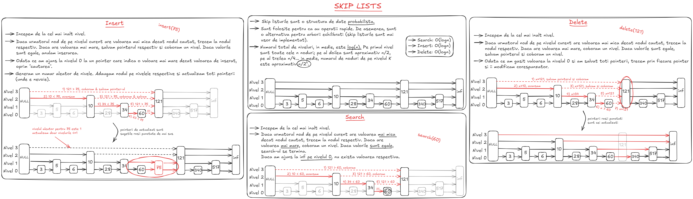
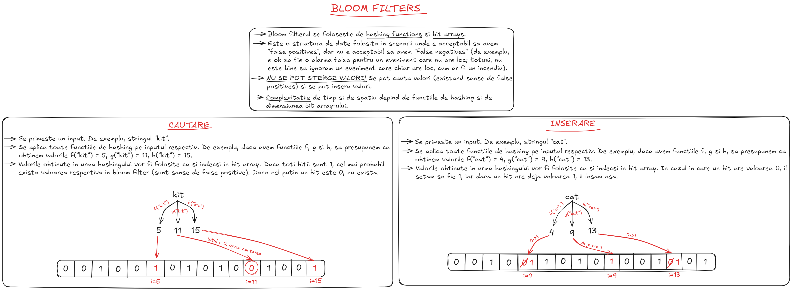

# Table of contents
- [Table of contents](#table-of-contents)
  - [1 - Linked Lists](#1---linked-lists)
      - [Lista simplu inlantuita](#lista-simplu-inlantuita)
      - [Listele dublu inlantuite](#listele-dublu-inlantuite)
      - [Listele circulare](#listele-circulare)
  - [2 - Skip Lists](#2---skip-lists)
  - [3 - Hash Tables](#3---hash-tables)
    - [Functia de hash](#functia-de-hash)
    - [Coliziunile](#coliziunile)
      - [1. Chaining](#1-chaining)
      - [2. Open addressing](#2-open-addressing)
      - [3. Perfect hashing](#3-perfect-hashing)
  - [4 - Bloom Filters](#4---bloom-filters)
  - [](#)
      - [Notes](#notes)

---

## 1 - Linked Lists
- Listele sunt structuri de date ce presupun o inlantuire de elemente in asa fel incat accesarea sa poata fi facuta direct **doar** dintr-un element vecin (predecesor sau succesor); **elementele nu se pot accesa print indecsi** ca la vectori
- In cazul in care un element poate fi accesat doar dinspre predecesorul sau, atunci lista este **simplu inlantuita**, altfel, daca se poate accesa si dinspre predecesor si dinspre succesor, atunci se numeste **dublu inlantuita**
- Conventia generala este ca, atunci cand un element nu are un succesor sau predecesor, in locul lui valoarea default este **NULL / NIL**; de multe ori insa, pentru claritatea codului, se utilizeaza un element numit **santinela (engleza: sentinel)** ce pointeaza catre inceputul listei si catre finalul ei (in cazul in care este dublu inlantuita)

- Operatii pe liste inlantuite:
  - Cautarea unui element de pe o pozitie k / cu o valoare k: cum nu putem accesa elementele dupa indexul lor, atunci nu putem obtine direct elementul, respectiv, nu putem realiza cautare binara daca lista ar fi sortata; ca urmare suntem nevoiti sa parcurgem de fiecare data lista pentru a afla elementul dorit, ceea ce ne duce intr-o complexitate de $O(n)$
  - Inserarea in lista pe o pozitie data k: analog cazului de mai sus, suntem nevoiti sa cautam respectiva pozitie, deci vom avea $O(n)$; in particular, daca vrem sa adaugam la inceputul sau finalul listei atunci complexitatea va fi $O(1)$ pentru ca doar modificam un numar constant de pointeri in functie de natura listei; aici se poate observa o optimizare fata de vectori, caci acolo inserarea la inceput avea complexitatea $O(n)$
  - Stergerea unui element de pe o pozitie data: desi stergerea este in $O(1)$, cautarea elementului pe care dorim sa-l stergem este $O(n)$, deci complexitatea finala este $O(n)$
- Implementari in C++ (cu pointeri):

#### Lista simplu inlantuita
```cpp
class SinglyLinkedList {
private:
    struct Node {
        int data;
        Node* next;
        Node(int val) : data(val), next(nullptr) {} // OOP-like struct initialization
    };

    Node* head;

public:
    SinglyLinkedList() : head(nullptr) {}

    ~SinglyLinkedList() { clear(); }

    void insert(int val) {
        Node* newNode = new Node(val);
        newNode->next = head;
        head = newNode;
    }

    void display() {
        Node* temp = head;

        while (temp) {
            std::cout << temp->data << " -> ";
            temp = temp->next;
        }

        std::cout << "NULL\n";
    }

    void clear() {
        while (head) {
            Node* temp = head;
            head = head->next;
            delete temp;
        }
    }
};
```

#### Listele dublu inlantuite
```cpp
class DoublyLinkedList {
private:
    struct Node {
        int data;
        Node* next;
        Node* prev;
        Node(int val) : data(val), next(nullptr), prev(nullptr) {}
    };

    Node* head;

public:
    DoublyLinkedList() : head(nullptr) {}

    ~DoublyLinkedList() { clear(); }

    void insert(int val) {
        Node* newNode = new Node(val);
        newNode->next = head;
        if (head) head->prev = newNode;
        head = newNode;
    }

    void display() {
        Node* temp = head;

        while (temp) {
            std::cout << temp->data << " <-> ";
            temp = temp->next;
        }

        std::cout << "NULL\n";
    }

    void clear() {
        while (head) {
            Node* temp = head;
            head = head->next;
            delete temp;
        }
    }
};
```

#### Listele circulare

```cpp
class CircularLinkedList {
private:
    struct Node {
        int data;
        Node* next;
        Node(int val) : data(val), next(nullptr) {}
    };

    Node* tail;

public:
    CircularLinkedList() : tail(nullptr) {}

    ~CircularLinkedList() { clear(); }

    // Inserarea se face mereu pe la final, ca urmare vom fi nevoiti sa actualizam mereu tail-ul
    void insert(int val) {
        Node* newNode = new Node(val);

        if (!tail) {
            tail = newNode;
            tail->next = tail;
        } else {
            newNode->next = tail->next;
            tail->next = newNode;
            tail = newNode;
        }
    }

    void display() {
        if (!tail) return;

        Node* temp = tail->next;

        do {
            std::cout << temp->data << " -> ";
            temp = temp->next;
        } while (temp != tail->next);

        std::cout << "(circular back to head)\n";
    }

    void clear() {
        if (!tail) return;

        Node* temp = tail->next;

        while (temp != tail) {
            Node* nextNode = temp->next;
            delete temp;
            temp = nextNode;
        }

        delete tail;
        tail = nullptr;
    }
};
```

- Utilizare:
```cpp
int main() {
    SinglyLinkedList sll;
    sll.insert(10);
    sll.insert(20);
    sll.insert(30);
    sll.display();
    
    DoublyLinkedList dll;
    dll.insert(40);
    dll.insert(50);
    dll.insert(60);
    dll.display();
    
    CircularLinkedList cll;
    cll.insert(70);
    cll.insert(80);
    cll.insert(90);
    cll.display();
    
    return 0;
}
```

- Optional: in situatiile in care limbajul nu are implementari pentru pointeri, vom folosi 3 vectori si vom simula adresele din memorie cu pozitiile din sir:

- **In C++ exista deja o implementare STL pentru liste, anume `std::list`, despre care puteti afla mai multe [aici](https://en.cppreference.com/w/cpp/container/list).**

---

## 2 - Skip Lists



---

## 3 - Hash Tables
- Un **hash table** este o structura de date ce consta in perechi (key, value) si care permite accesarea, stergerea si inserarea elementelor, foarte eficient, intr-un mod similar unui dictionar
- Informal, ea reprezinta o generalizare a vectorilor in sensul ca, in loc sa se acceseze cu indexul pozitiei la care se afla, elementele sunt acesate in functie de o cheie, care poate fi un numar, un simbol sau chiar o alta structura de date, pastrandu-se, in general, complexitatile de accesare; deci, se poate observa ca au o aplicabilitate mult mai larga decat vectorii, desi vin la pachet cu anumite probleme, care le fac utilizabile doar in anumite cazuri, pe care le vom analiza mai jos
- O prima idee de a implementa o astfel de structura de date ar fi sa estimam care ar putea fi toate valorile posibile de chei si sa cream un tabel suficient de mare sa incapa toate; evident, nu este prea practica aceasta metoda, caci de multe ori spatiul teoretic este mult prea mare si nu este necesar a fi folosit tot mereu, deci avem si **memory waste**
- Ca urmare, suntem nevoiti sa cream un spatiu in care se vor afla cheile mai mic ca sa nu avem memory waste, dar indeajuns de mare, astfel incat sa stim ca, **in medie**, sa nu avem problemele legate de complexitate, asta deoarece vom avea un set de elemente din **universul cheilor** care vor avea acelasi loc alocat
- Ca sa fie eficienta, aceasta procedura trebuie sa tina cont de 2 lucruri: managementul coliziunilor si functia de hash

### Functia de hash
- **Functia de hash** reprezinta functia care se ocupa cu gasirea unui slot pentru un element dat astfel incat sa se minimizeze spatiul ocupat (deci sa gaseasca un loc liber) si sa se minimizeze si timpul de accesare (sa aiba complexitatea cat mai mica)
- De exemplu, cea mai simpla functie de hash este cea care cauta primul loc liber in tabel si il returneaza; evident nu este prea eficienta
- Alta ar fi ceva random, insa asa nu putem garanta ca pentru acelasi element avem acelasi hash, ceea ce nu este util mai ales ca vrem sa si cautam elemente, nu doar sa le inseram
- In cele mai multe cazuri, dorim sa avem **uniform hashing**, adica cheilor sa le fie alocate un slot din tabel in mod cat mai egal si independent
- Din cauza faptului ca nu exista o functie hash care se minimizeze si spatiul si timpul simultan, s-au folosit diverse euristici (observatii practice) pe baza comportamentelor diferitelor functii de hash. In continuare vom prezenta astfel de euristici care incearca sa indeplineasca conditiile de **uniform hashing**
- **Division method**: Aceasta metoda presupune utilizarea functiei de modulo. Concret, vom converti cheile in numere si, avand la dispozitie doar un tabel de dimensiune $M$, definim o functie de hash ar putea fi $h(x) = transformToNumber(x) \space mod \space M$ (de cele mai multe ori $M$ este numar prim pentru a preveni orice posibilitate de tipar ale cheilor)
- **Multiplication method**: Vom inmulti numarul cu o constanta subunitara $0 < A < 1$, iar apoi vom inmulti cu $M$ partea fractionara a ei. Altfel spus, functia de hash este $h(x) = M \cdotp \lfloor(xA \space mod \space 1) \rfloor$. Din considerente matematice, $A$ este recomandat sa fie $\approx\frac{\sqrt{5} - 1}{2}$
- **Universal hashing**: Desi destul de eficiente, metodele prezentate mai sus au o problema: daca s-ar afla functia de hash, atunci o persoana rau intentionata ar putea genera un input care sa faca operatiile pe hash table sa ruleze in $O(n)$, incetinind foarte mult aplicatia. Pentru aceasta, vom folosi randomizarea: se va alege o multime de $K$ functii hash asemanatoare cu cele de mai sus astfel incat probabilitatea de coliziune a unei perechi de chei $(s, t)$ este $\approx \frac{1}{M}$ (se demonstreaza matematic); multimea de functii de hash se va alege dupa forma urmatoare:


### Coliziunile
- O problema care apare atunci cand vom adauga un element este ca, fie functia de adaugare va returna un mesaj ca nu exista loc liber pentru el, fie pe locul care va fi gasit de **functia de hash** se va afla un alt element, deci va aparea o **coliziune**
#### 1. Chaining
- Un prim mod de a gestiona aceste coliziuni, este sa reprezentam fiecare slot din tabel in care se afla cheile ca un **pointer** la o **lista simplu inlantuita**; deci, atunci cand dorim sa adaugam un element si avem coliziune, vom parcurge lista de la pozitia la care a avut loc ultima coliziune si vom pune elementul la inceputul / finalul listei respective
- Complexitatea unei astfel de abordari depinde de modul in care este implementata functia de hash, insa, daca presupunem ca, teoretic, avem **uniform hashing**, atunci vom avea complexitatea de $O(1 + \alpha)$, unde $\alpha = \frac{n}{m}$, deci foarte aproape de constant
- Totusi, acest mod de a rezolva coliziunile este dependenta foarte mult de felul cum este implementata functia de hash

#### 2. Open addressing
- De multe ori, insa, stim ca niciodata nu vom avea mai multe chei decat marimea hash table-ului, ca urmare putem evita chaining-ul. Totusi, aceasta procedura in care fiecare element din hash table este fie `NULL` fie are un singur element, care se numeste **open addressing**, implica o cautare secventiala eficienta a slot-urilor libere pentru chei, cautare care se mai numeste **probing**, pe care se bazeaza atat inserarile cat si accesarile efective ale elementelor tinandu-se cont de pozitiile curente (**exemplificare**).
- De aceea, o problema cu aceste open address hash table-uri este ca nu se poate sterge un element pur si simplu punandu-se `NULL` pe pozitia lui, caci acest lucru ar perturba accesarile si va da un **false negative** (adica elementul este in tabel, insa nu este gasit), ci se va marca elementul ca **DELETED** (**exemplificare**)
- Cum pentru fiecare cheie este nevoie de o secventa de probe, ideal ar fi sa avem **uniform hashing** pentru a genera secventa in mod aleator, insa nu se poate implementa eficient acest lucru, deoarece avem nevoie de o permutare de $m$ elemente. Ca urmare, au fost create niste metode de **probing** implementabile ce incearca sa se apropie de ea:
- **Linear probing**: $h(k, i) = (h'(k) + i) \space mod \space M$
- **Quadratic probing**: $h(k, i) = (h'(k) + c_1i + c_2i^2) \space mod \space M$
- **Double probing**: $h(k, i) = (h_1(k) + i \cdotp h_2(k)) \space mod \space M$
- **Intrebari**:
  - De ce nu putem folosi ceva random?
  - De ce facem cautare secventiala?

#### 3. Perfect hashing
- Totusi, o limitare la **open addressing** reprezinta situatia in care tabelul se va umple, caz in care nu mai putem face nimic
- Ca urmare, cum ambele variante de mai sus au beneficii si dezavantaje, folosite individual, ce-ar fi sa le combinam sa le minimizam dezavantajele?
- Altfel spus, ce-ar fi sa avem un hash table care gestioneaza coliziunile in stil **chaining** in care fiecare slot reprezinta un alt hash table in care fiecare coliziunile se gestioneaza in stil **open address**, iar functiile hash ale amandurora sa fie aproape de **uniform hashing**. In acest fel avem optimizarea memoriei fata de simplul chaining, dar si prevenirea blocajelor (atunci cand se umple tabelul) si timpul prea mare de cautare in anumite situatii de la **open addressing** (coliziunile din fiecare hash table de pe nivelul 2 sunt prevenite generandu-se dimensiuni speciale pentru hash table-uri; ele sunt bazate pe demonstratii matematice astfel incat sa nu creeaze probleme cu memoria si, in acelasi timp, sa previna cu adevarat coliziunile)

- Hash tables
  - Hash function: Open Addressing, Double Hashing, Perfect Hashing
  - LRU
  - C++ STL equivalents
  - Implementari OOP

---

## 4 - Bloom Filters


---

#### Notes 
* <b>Seria 13</b>: Linked Lists, Skip Lists, Hash Tables, Bloom Filters.
* <b>Seria 14</b>: Heapsort, BST? (facem data viitoare).
* <b>Seria 15</b>: Stack, Queue, Deque, Linked Lists.
