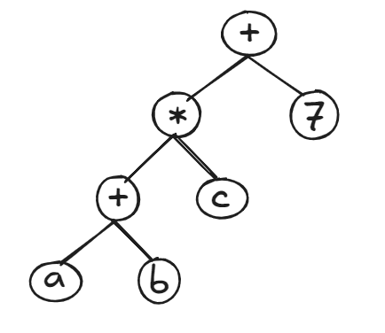
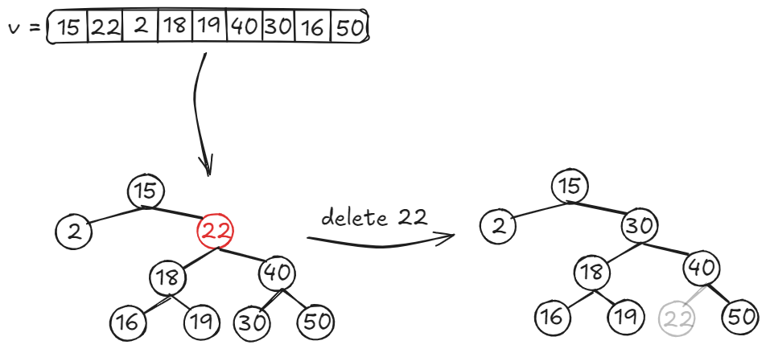
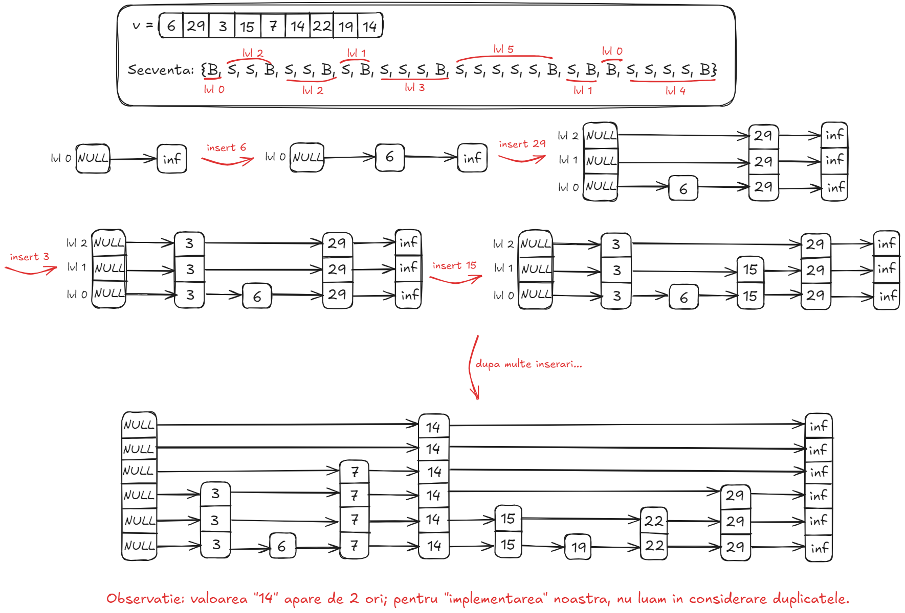
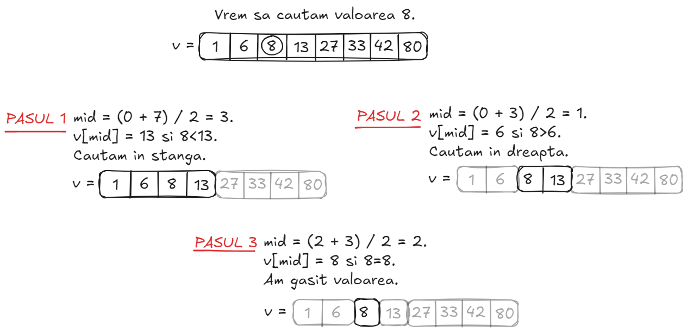

# Table of contents
- [Limite inferioare pentru sortare](#1---limite-inferioare-pentru-sortare)
- [Grafuri](#2---grafuri)
    - [Introducere](#21---introducere)
    - [Arbori binari si binomiali](#22---arbori-binari-si-binomiali)
- [Binary Search Trees](#3---binary-search-trees)
- [Exercitii examen](#4---exercitii-examen)
    - [Seria 13](#seria-13)
    - [Seria 13 (rezolvari)](#seria-13---rezolvari)
    - [Seria 14](#seria-14)
    - [Seria 14 (rezolvari)](#seria-14---rezolvari)
    - [Seria 15](#seria-15)
    - [Seria 15 (rezolvari)](#seria-15---rezolvari)

---

## 1 - Limite inferioare pentru sortare


---

## 2 - Grafuri

### 2.1 - Introducere

Un graf este format dintr-o multime de noduri <b>V</b> si o multime de muchii/arce <b>E</b>. Grafurile <b>neorientate</b> contin muchii (sunt bidirectionale), iar cele <b>orientate</b> contin arce (un arc este unidirectional).

Un <b>lant</b> intr-un <b>graf neorientat</b> este o succesiune de noduri unite prin muchii. Lanturile pot fi <b>simple</b>(nu se repeta muchii)/<b>compuse</b>(se pot repeta muchii) si <b>elementare</b>(nu se repeta varfuri)/<b>neelementare</b>(se pot repeta varfuri). Un <b>ciclu</b> este un <b>lant simplu</b>, in care nodul final coincide cu nodul de start; acestea pot fi, la randul lor, <b>elementare</b> sau <b>neelementare</b>. Un <b>drum</b> intr-un <b>graf orientat</b> este ca un lant intr-un graf neorientat, dar in loc de muchii avem arce (drumurile pot fi <b>simple/compuse/elementare/neelementare</b>). Un <b>circuit</b> este un <b>drum simplu</b>, in care primul si ultimul nod coincid (circuitele pot fi <b>elementare/neelementare</b>).

Un <b>graf neorientat</b> se numeste <b>conex</b>, daca exista un lant de la orice nod <b>X</b> la orice nod <b>Y</b>. Definitia echivalenta pentru <b>grafuri orientate</b> este <b>tare conexitatea</b>, unde trebuie sa existe un drum de la orice nod <b>X</b> la orice nod <b>Y</b>. De asemenea, la grafuri orientate exista si notiunea de <b>slab conexitate</b> - daca inlocuim toate arcele cu muchii si obtinem un <b>graf neorientat conex</b>, atunci graful orientat respectiv este <b>slab conex</b>.


### 2.2 - Arbori binari si binomiali
Un arbore este un <b>graf conex aciclic</b>; astfel, un arbore cu <b>N</b> noduri va avea mereu <b>N-1</b> muchii. Arborii au o <b>radacina</b> - un nod din care pleaca toate drumurile; putem alege orice nod sa fie radacina, iar in functie de nodul pe care il alegem, inaltimea arborelui variaza (<b>inaltimea unui arbore</b> = numarul maxim de muchii de pe un lant de la radacina la orice frunza).

Un <b>arbore binar</b> este un arbore in care fiecare nod are maxim <b>2</b> copii - <b>left child(L), right child(R)</b>. Un arbore binar se numeste <b>complet</b> daca fiecare nivel este complet (are numar maxim de noduri), in afara de ultimul nivel (care, de obicei, este completat de la stanga la dreapta).

Un <b>arbore binar balansat</b> (<b>AVL Trees</b>, vom face in Tutoriatul 4) este un arbore binar, unde, pentru orice nod, diferenta de inaltime dintre subarborele stang si subarborele drept este de maxim un nod.

Un <b>arbore binomial</b> de ordin <b>0</b> este un singur nod (radacina). Un arbore binomial de ordin <b>K</b> este o reuniune a doi arbori binomiali de ordin <b>K-1</b>, unde unul din arborii respectivi este fiul stang al celuilalt arbore. Un arbore binomial are exact <b>2<sup>K</sup></b> noduri si inaltimea <b>k</b>. Arborii binomiali sunt folositi la <b>heapuri binomiale</b>, pe care le vom discuta in Tutoriatul 4.


---

## 3 - Binary Search Trees


---

## 4 - Exercitii examen

###  <ins>Seria 13</ins>

1. Traversarea in <b>postordine</b> a unui arbore binar de cautare este <b>15, 10, 23, 25, 20, 35, 42, 39, 30</b>. Care este traversarea in <b>inordine</b> pentru acelasi arbore?
2. Urmatoarele numere sunt inserate succesiv intr-un arbor binar de cautare gol: <b>1, 3, 5, 10, 15, 12, 16</b>. Care este inaltimea arborelui la final?
3. Se considera urmatoarele elemente: <b>(4322, 1334, 1471, 9679, 1989, 6171, 6173, 4199)</b> si functia de hash <b>h(x) = x mod 100</b>. Care dintre urmatoarele afirmatii sunt adevarate?
    -  <b>1471, 6171</b> produc o coliziune.
    -  <b>9679, 1989, 4199</b> se mapeaza pe aceeasi valoare.
    -  Toate elementele se mapeaza pe valori distincte.
    -  Incarcarea tabelei este de <b>7%</b>.
4. Care din urmatoarele secvente <b>NU</b> este una din traversarile in <b>preordine</b> sau <b>postordine</b> ale unui arbore binar de cautare in care s-au inserat valorile <b>(10, 20, 5, 30, 8, 25, 6, 4, 9)</b>?
    - <b>4, 5, 6, 8, 9, 10, 20, 25, 30</b>.
    - <b>10, 5, 8, 4, 6, 9, 20, 25, 30</b>.
    - <b>10, 5, 20, 4, 8, 30, 6, 9, 25</b>.
    - Raspunsurile de mai sus nu sunt corecte.
5. Care din urmatoarele secvente de operatii este <b>imposibila</b> intr-o stiva cu <b>4</b> elemente?
    - PUSH, POP, POP, POP, POP, PUSH.
    - PUSH, POP, POP, POP, PUSH, POP, POP.
    - PUSH, POP, POP, POP, POP, POP, PUSH, POP.
    - PUSH, PUSH, PUSH, PUSH, PUSH, PUSH.
    - POP, POP, POP, POP, POP, POP, POP.
6. Cand numarul de slot-uri intr-un hash table se tripleaza, iar numarul de elemente se dubleaza, ce se intampla cu load factor-ul ei?
    - Creste la <b>3/2</b> din cel initial.
    - Scade la <b>2/3</b> din cel initial.
    - Ramane la fel.
    - Raspunsurile de mai sus nu sunt corecte.
7. Sa presupunem ca vrem sa afisam in ordine descrescatoare elementele unui arbore binar de cautare. Care dintre urmatoarele metode ar fi potrivite?
    - Parcurgem arborele in <b>inordine</b> punand nodurile intr-o stiva. La sfarsit, le printam pe masura ce le scoatem din stiva.
    - Parcurgem arborele in <b>preordine</b> punand nodurile intr-o coada. La sfarsit, le printam pe masura ce le scoatem din coada.
    - Parcurgem arborele recursiv cu ordinea <b>RIGHT-VERTEX-LEFT</b>.
    - Raspunsurile de mai sus nu sunt corecte.
8. Vrem sa reprezentam multimea <b>S = {1, 2, 3}</b> cu un arbore binar de cautare. In cate moduri distincte putem face acest lucru?
    - <b>1</b> mod.
    - <b>2</b> moduri.
    - <b>3</b> moduri.
    - <b>8</b> moduri.
    - Raspunsurile de mai sus nu sunt corecte.
9. Un skip list are elementele <b>1, 2, 3, 5, 8, 13, 21, 44</b>. In al catalea nod vom gasi elementul <b>8</b>?
    - Primul nod.
    - Al doilea nod.
    - Al patrulea nod.
    - Al optulea nod.
    - Raspunsurile de mai sus nu sunt corecte.
10. Se da o expresie aritmetica reprezentata ca un arbore sintactic (imagine). Care este ordinea in care sunt evaluate nodurile pentru a calcula valoarea expresiei?
    - <b>a,+,b,*,c,root(+),7</b>.
    - <b>7,a,b,c,+,*,root(+)</b>.
    - <b>a,b,+,c,*7,root(+)</b>.
    - Raspunsurile de mai sus nu sunt corecte.
    


11. Pentru algoritmul <b>Heap Sort</b>, numarul minim de swap-uri de elemente se atinge cand:
    - Secventa initiala este sortata crescator.
    - Secventa initiala este sortata descrescator.
    - Secventa este una aleatoare.
    - Raspunsurile de mai sus nu sunt corecte.
12. In cate moduri putem pune numerele <b>1,2,3,4</b> intr-un vector, astfel incat vectorul rezultat sa poata fi vazut drept un min-heap?
    - <b>2</b> moduri.
    - <b>3</b> moduri.
    - <b>7</b> moduri.
    - Raspunsurile de mai sus nu sunt corecte.
13. Sa presupunem ca numerele <b>7,5,1,8,3,6,0,9,4,2</b> sunt inserate in aceasta ordine intr-un arbore binar de cautare. Care este lista elementelor in postordine?
    - <b>7 5 1 0 3 2 4 6 8 9</b>.
    - <b>0 2 4 3 1 6 5 9 8 7</b>.
    - <b>0 1 2 3 4 5 6 7 8 9</b>.
    - <b>9 8 6 4 2 3 0 1 5 7</b>.
14. Pentru a efectua o stergere intr-un arbore binar de cautare pentru un nod cu 2 copii, trebuie sa ii gasim succesorul (in inordine). Care dintre urmatoarele afirmatii este adevarata?
    - Succesorul este intotdeauna un nod frunza.
    - Succesorul este intotdeauna fie un nod frunza, fie un nod fara copil stang.
    - Succesorul poate fi un stramos al nodului.
    - Succesorul este intotdeauna fie un nod frunza, fie un nod fara copil drept.
15. Care dintre urmatoarele afirmatii sunt adevarate intr-un <b>Skip List</b>?
    - Probabilitatea ca un nod sa aiba cel putin doi pointeri este exact <b>1/4</b>.
    - Elementele sunt sortate in ordine crescatoare.
    - Nivelurile sunt spatiate in mod egal.
    - Raspunsurile de mai sus nu sunt corecte.
16. Sa presupunem ca modificam algoritmul de parcurgere in latime (<b>BFS</b>) a unui arbore binar in felul urmator: in loc de o coada, folosim o coada dubla (<b>deque</b>); cand scoatem primul nod din coada, mai intai il vizitam, iar vecinii nodului respectiv ii adaugam in varful cozii duble. Modificarea astfel descrisa este echivalenta cu o parcurgere a arborelui:
    - In preordine.
    - In inordine.
    - In postordine.
    - In adancime.
    - Raspunsurile de mai sus nu sunt corecte.
17. Sa presupunem ca modificam un <b>Skip List</b> ca sa putem face salturi inainte si inapoi, folosind intuitiv liste dublu inlantuite pe fiecare nivel. Ne vom limita la patru nivele de pointeri. Nivelul unui nod va fi ales in mod obisnuit. Numarul total mediu de pointeri in aceasta varianta de implementare este:
    - Θ(n).
    - Θ(nlogn).
    - Θ(n<sup>2</sup>).
    - Raspunsurile de mai sus nu sunt corecte.
18. Sa consideram o schema de double hashing care mapeaza elementele unui univers <b>U</b> pe multimea de indecsi <b>{0, 1, ..., m-1}</b> via functia <b>h(x,i) = (h1(x) + i * h2(x)) (mod m)</b>, unde <b>m</b> este marimea tabelei, iar <b>h1</b> si <b>h2</b> sunt niste functii de hashing. Sa consideram functiile <b>H1(x,i) = (h2(x) + i * h1(x)) (mod m)</b> si <b>H2(x,i) = (h2(x) - 1 + i * (h1(x) + 1)) (mod m)</b>. Care dintre functiile <b>H1, H2</b> sunt potrivite, in principiu, in loc de <b>h</b> pentru <b>double hashing</b>?
    - Doar <b>H1</b>.
    - Doar <b>H2</b>.
    - <b>H1</b> si <b>H2</b>.
    - Niciuna.
19. Ce face urmatorul cod?
    - Printeaza toate valorile listei.
    - Printeaza toate valorile listei in ordine inversa.
    - Printeaza valorile cu index par ale listei.
    - Printeaza valorile cu index par ale listei in ordine inversa.

```cpp
void f(struct node* head) {
    if (!head) {
        return;
    }
    f(head->next);
    std::cout<<head->data;
}
```

### <ins>Seria 13 - rezolvari</ins>
1. Deoarece este un arbore binar de cautare, traversarea in <b>inordine</b> mereu va genera valorile in ordine crescatoare. Astfel, informatia despre <b>postordine</b> este irelevanta, iar raspunsul este: <b>{10, 15, 20, 23, 25, 30, 35, 39, 42}</b>.
2. Inaltimea este <b>5</b>.
3. Analizam fiecare raspuns:
    - <b>1471</b> si <b>6171</b> produc o coliziune: <b>ADEVARAT</b>, deoarece <b>1471 % 100 = 71</b> si <b>6171 % 100 = 71</b>.
    - <b>9679</b>, <b>1989</b> si <b>4199</b> se mapeaza pe aceeasi valoare: <b>FALS</b>, deoarece <b>9679 mod 100 = 79</b> si <b>1989 mod 100 = 89</b>.
    - Toate elementele se mapeaza pe valori distincte: <b>FALS</b>, deoarece se contrazice cu prima varianta de raspuns, care este adevarata.
    - Incarcarea tabelei este de <b>7%</b>: <b>ADEVARAT</b>; aplicam functia pe fiecare element si vom vedea ca se ocupa slot-urile cu indecsii <b>{22, 34, 71, 79, 89, 73, 99}</b>. Functia este <b>mod 100</b> => avem indecsii de la <b>0</b> la <b>99</b> (<b>100</b> slot-uri) => <b>load factor-ul</b> este <b>7 / 100 = 7%</b>.
4. Prima varianta este o parcurgere in <b>inordine</b>, iar celelalte 2 sunt aleatoare. Asadar, toate cele 3 raspunsuri sunt corecte. Am atasat rezolvarea:


5. Ultima varianta.
6. Load factor-ul este <b>x</b>. Se tripleaza numarul de slot-uri => devine <b>x/3</b>. Se dubleaza numarul de elemente => devine <b>2x/3</b> => al doilea raspuns.
7. Prima si a treia varianta.
8. Raspunsurile nu sunt corecte. Am atasat rezolvarea:


9. Raspunsurile nu sunt corecte (ar fi al 5-lea nod).
10. A treia varianta.
12. In <b>3</b> moduri. Am atasat rezolvarea:


13. A doua varianta.
14. A doua varianta.
15. Probabilitatea ca un nod sa aiba un singur pointer (sa fie pe primul nivel) este de <b>100%</b>. Probabilitatea sa ajunga pe urmatorul nivel este de <b>1/2</b>, adica <b>50%</b>; asadar, prima varianta e gresita. A doua varianta este corecta, deoarece Skip List-urile sunt mereu sortate crescator. a treia varianta nu prea stiu ce inseamna?? :) 
19. Afiseaza toate valorile listei in ordine inversa (a doua varianta). 

### <ins>Seria 14</ins>

1. Exprimati functiile urmatoare in notatie Θ:
    - <b>log(sqrt(n))</b>.
    - <b>(n + 2<sup>200</sup>)<sup>500</sup></b>.
    - <b>n<sup>4</sup> - n<sup>4</sup>/2 + 10000 * n + 10</b>.
    - <b>ln(ln n) + ln n</b>.
    - <b>n<sup>3</sup>/2000 + n<sup>2</sup> * 2<sup>100000</sup> + 10000 * n + 10</b>.
    - <b>ln<sup>2</sup>n + sqrt(n)</b>.
2. <b>o(f(n)) INTERSECT ω(f(n))</b> = ?
3. Cate muchii are un arbore binar complet cu <b>n</b> noduri?
4. Sa se construiasca un <b>min-heap</b> obtinut prin insertia pe rand a urmatoarelor chei: <b>{40, 22, 2, 18, 19, 5, 3}</b>. Apoi, sa se extraga radacina din heap-ul rezultat.
5. Sa se construiasca arborele binar obtinut prin insertia pe rand a urmatoarelor chei: <b>{15, 22, 2, 18, 19, 40, 30, 16, 50}</b>. Sa se stearga nodul <b>22</b>.
6. Demonstrati ca orice algoritm de sortare bazat pe comparatii intre chei efectueaza <b>Ω(nlogn)</b> comparatii.
7. Rezolvati urmatoarele recurente si demonstrati: 
    - <b>T(n) = T(n/4) + T(3n/4) + logn</b>.
    - <b>T(n) = T(n/100) + T(99n/100) + n</b>.
    - <b>T(n) = T(n - 1) + n</b>.
8. Demonstrati ca <b>logn = o(sqrt(n))</b>.
9. Se da un arbore binar cu <b>n</b> noduri in urmatorul format: se specifica radacina, iar pentru fiecare nod se dau fiul stang si fiul drept, daca acestia exista. De asemenea, fiecarui nod ii este asociat un numar intreg. Sa se decida daca acest arbore binar este <b>arbore binar de cautare</b>. Timp de rulare: <b>O(n<sup>2</sup>)</b>=0,5p, <b>O(nlogn)</b>=1p, <b>O(n)</b>=1,5p.
10. Care este numarul minim si numarul maxim de noduri intr-un <b>Heap</b> de inaltime <b>h</b>?
11. Este adevarat ca <b>f(n) + g(n) = Θ(max{f(n), g(n)})</b>? Demonstrati.
12. Demonstrati ca orice algoritm care construieste un arbore binar de cautare cu <b>n</b> numere ruleaza in timp <b>Ω(n)</b>.
13. Cum se poate implementa o <b>coada</b> folosind un <b>heap</b>? Dar o <b>stiva</b>?
14. Se dau <b>n</b> numere intre <b>0</b> si <b>k</b>. Descrieti un algoritm care preproceseaza input-ul in timp <b>O(n + k)</b> si raspunde in <b>O(1)</b> la intrebari de forma: "Se citesc 2 numere <b>0 <= a, b <= k</b>. Cate din cele <b>n</b> numere date ca input se gasesc in intervalul <b>[a..b]</b>?".
15. Cum putem sorta <b>n</b> numere in intervalul <b>[0..(n<sup>3</sup> - 1)]</b> in timp <b>O(n)</b>?
16. Desenati un arbore binar complet cu <b>7</b> noduri si desenati matricea de adiacenta corespunzatoare.
17. Se dau urmatoarele structuri de date: o stiva <b>S</b> si doua cozi <b>C1, C2</b> ce contin caractere. Cele trei structuri sunt initial vide si se considera de capacitate infinita. Cozile se considera cu capatul pentru inserare in dreapta si cel pentru stergere in stanga, iar stiva are capatul pentru inserare si stergere in dreapta. Se considera urmatoarele operatii: <b>(1)</b> daca <b>S</b> e nevida, se extrage un element si se introduce <b>C1</b>; altfel, nu se face nimic. <b>(2)</b> Daca <b>S</b> e nevida, se extrage un element si se introduce <b>C2</b>; altfel, nu se face nimic. <b>(3)</b> Daca <b>C1</b> e nevida, se extrage un element si se introduce in <b>C2</b>; altfel, nu se face nimic. <b>(4)</b> Daca <b>C2</b> e nevida, se extrage un element si se introduce in <b>S</b>; altfel, nu se face nimic.
    - Sa se scrie continutul stivei <b>S</b> si al cozilor <b>C1, C2</b> dupa executarea urmatoarei secvente de operatii: <b>C 1 3 K 2 S T A Q U 1 2 U N 1 1 E U 2 2 4 4</b>.
    - Sa se scrie o secventa de operatii care are ca rezultat cuvantul <b>"ROSU"</b> in stiva <b>S</b>, cuvantul <b>VERDE</b> in coada <b>C2</b>, iar <b>C1</b> este vida.
18. Demonstrati ca <b>ln(n!) = Θ(n * ln n)</b>.
19. Fie <b>T</b> un arbore binar de cautare si <b>x</b> un nod care are doi copii. Demonstrati ca succesorul lui <b>x</b> nu are fiu stang, iar predecesorul lui <b>x</b> nu are fiu drept.
20. Scrieti un algoritm in pseudocod care sa rezolve urmatoarea problema: se da o multime <b>S</b> ce contine <b>n</b> numere naturale distincte si un numar natural <b>x</b>. Decideti daca numarul <b>x</b> poate fi exprimat ca suma de 2 numere distincte din <b>S</b>. Pentru un algoritm <b>O(n<sup>2</sup>)</b>, se primesc 0,25p; pentru <b>O(nlogn)</b> sau <b>O(n)</b>, se primeste punctaj intreg.

### <ins>Seria 14 - rezolvari</ins>
4. Am atasat rezolvarea:


5. Am atasat rezolvarea:



10. Un heap este un <b>arbore binar complet</b> => pe nivelul <b>k</b> avem maxim <b>2<sup>k</sup></b> noduri, si minim <b>1</b> nod. Daca heap-ul este de inaltime <b>H</b>, atunci pana la nivelul <b>H</b> o sa avem <b>2<sup>0</sup> + 2<sup>1</sup> + ... + 2<sup>H-1</sup> = 2<sup>H</sup> - 1</b> noduri. Daca vrem numar <b>minim</b> de noduri, consideram ca avem un singur nod pe nivelul <b>H</b> => <b>2<sup>H</sup> - 1 + 1 = 2<sup>H</sup></b> noduri in total; altfel, daca vrem numar <b>maxim</b> de noduri, o sa avem <b>2<sup>H</sup></b> noduri pe ultimul nivel => <b>2<sup>H</sup> - 1 + 2<sup>H</sup> = 2 * 2<sup>H</sup> - 1 = 2<sup>H+1</sup></b> noduri in total.

### <ins>Seria 15</ins>

1. Dintre inserare, cautare si stergerea minimului, ce operatie are complexitatea cea mai mare intr-un <b>min-heap</b> si ce complexitate are? Explicati cum se face aceasta operatie si daca este uzuala pentru heap-uri.
2. Intr-un arbore binar de cautare, se fac urmatoarele operatii: <b>{I(5), I(3), I(14), I(11), I(31), del(3), I(7), del(11), I(9), I(8), I(16), I(17), del(14)}</b>. Aratati arborele dupa fiecare 2 operatii.
3. Inserati intr-un <b>Hash Table</b> valorile <b>{19, 20, 4, 23, 1, 42, 81, 67, 219, 192, 87}</b> folosind functia de dispersie <b>h(x) = x % 20</b> si <b>adresare directa</b> pentru rezolvarea coliziunilor.
4. Ce inaltime poate sa aiba un heap cu <b>30</b> de elemente? Desenati schita arborelui de inaltime minima si schita pentru cel de inaltime maxima.
5. Construiti un arbore binar cu <b>12</b> noduri si diametrul <b>5</b>.
6. Exemplificati cum functioneaza <b>Merge Sort</b> pe vectorul <b>{16, 14, 9, 23, 3, 141, 19, 11}</b>.
7. Exemplificati cum functioneaza <b>Radix Sort (MSD)</b> in baza 10 pe vectorul <b>{16, 14, 39, 23, 3, 141, 19, 911, 151, 91, 209, 49, 206}</b>.
8. Daca vrem sa sortam <b>10<sup>6</sup></b> numere reale mai mici sau egale cu <b>245859</b>, ce algoritm ar fi bine sa folosim? De ce?
9. Cat ne costa sa gasim cel mai mic element dintr-un <b>Deque</b>? Cum il gasim?
10. Inserati intr-un <b>Skip List</b> urmatoarele valori: <b>{6, 29, 3, 15, 7, 14, 22, 19, 14}</b>. Aruncati cu banul si obtineti valorile <b>{B, S, S, B, S, S, B, S, B, S, S, S, B, S, S, S, S, S, B, S, B, B, S, S, S, S, B}</b>. Cand dati <b>B</b>, va opriti si inserati la nivelul respectiv; altfel, continuati.
11. Cati arbori binari distincti cu valorile <b>{1,2,3,4,5,6}</b> putem avea?
12. Desenati un <b>Max-Heap</b> in care un element aflat la distanta <b>3</b> fata de radacina este mai mare decat un element aflat la distanta <b>1</b> fata de radacina.
13. Exemplificati cum functioneaza <b>cautarea binara</b> pe un vector de 8 elemente, ales de voi.
14. Rezolvati (in pseudocod) urmatoarea problema: se dau niste litere acceptate si o lista de cuvinte. Ce cuvinte din lista au doar litere acceptate?
15. Rezolvati (in pseudocod): se da un vector. Pentru fiecare element, spuneti care este primul element din stanga mai mare decat el.
16. Rezolvati (in pseudocod): se da un vector; pentru fiecare element, spuneti cate elemente din dreapta sa sunt mai mici decat el.
17. Ce inaltime poate sa aiba un arbore binar cu <b>24</b> de elemente? Desenati arborele de inaltime minima si cel de inaltime maxima.
18. Se da un arbore binar. Gasiti suma maxima a unor elemente care nu se invecineaza.
19. Cat ne costa sa aflam al doilea cel mai mic element dintr-un <b>Min-Heap</b>?
20. Se da un vector cu valori intregi. Eliminati duplicatele.

### <ins>Seria 15 - rezolvari</ins>
1. <b>(Heap-urile au fost facute in Tutoriatul 2)</b> Inserarea are complexitate <b>O(logn)</b>, cautarea are complexitate <b>O(n)</b> si stergerea minimului are complexitate <b>O(logn)</b>. Asadar, cea mai costisitoare operatie este <b>cautarea</b>. Proprietatile Heap-urilor nu permit cautare eficienta - daca, de exemplu, avem un <b>Min-Heap</b> cu radacina <b>10</b> si copiii <b>5</b> si <b>8</b>, nu stim in ce subarbore trebuie sa mergem ca sa gasim valoarea <b>3</b>, deci ar trebui sa verificam toate valorile. Totusi, exista un mic truc pentru eficientizare: daca ar trebui sa cautam valoarea <b>7</b>, evident nu o sa fie in subarborele stang (nu poate fi in subarborele lui <b>5</b>, pentru ca <b>7</b> e mai mare).
2. Am atasat rezolvarea:


4. Inaltimea minima si cea maxima coincid. Pe fiecare nivel <b>k</b> avem <b>2<sup>k</sup></b> noduri => <b>1 + 2 + 4 + 8 + 15 = 30</b> noduri; ultimul nivel este <b>4</b>.
6. Verificati exemplul grafic de la <b>Merge Sort</b> din <b>Tutoriatul 1</b>!
7. Am atasat rezolvarea: 


9. Complexitatea este <b>O(n)</b>, deoarece trebuie sa trecem prin toate elementele ca sa gasim minimul. Elementele dintr-un <b>Deque</b> nu au vreo proprietate/ordine care sa ne ajute la cautare.
10. Am atasat rezolvarea:



12. Am atasat rezolvarea:


13. Am atasat rezolvare:



15. EXPLICATIE: ne folosim de o <b>stiva</b>, in care punem ultimul element din vector. Apoi, trecem prin celelalte elemente (de la indexul <b>n-2</b> la <b>0</b>): cat timp elementul curent este mai mic decat varful stivei, afisam perechea (dintre element si varful stivei) si scoatem un element de pe stiva. Odata ce stiva devine goala sau elementul curent devine mai mare, il adaugam pe stiva si trecem la urmatorul element. La final, este posibil sa fi ramas elemente in plus pe stiva, care nu au un element mai mic spre stanga; le scoatem si le afisam cu <b>-1</b> sau orice alta valoare sugestiva.

```cpp
#include <iostream>
#include <vector>
#include <stack>

int main() {
    const std::vector t = {3, 5, 1, 8, 10, 6, 4, 9, 2, 0};
    const int n = t.size();
    std::stack<int> s;
    s.push(t[n - 1]);
    for (int i = n - 2; i >= 1; --i) {
        while (!s.empty() && t[i] < s.top()) {
            std::cout << "(" << s.top() << "," << t[i] << ") ";
            s.pop();
        }
        s.push(t[i]);
    }
    while (!s.empty()) {
        std::cout << "(" << s.top() << "," << -1 << ") ";
        s.pop();
    }
    return 0;
}
```

17. Proprietatea arborilor binari: orice nod are maxim <b>2</b> copii. Daca vrem un arbore de inaltime <b>maxima</b>, vrem sa folosim toate nodurile sa mergem cat mai mult in jos => inaltimea maxima este <b>23</b>. Daca vrem un arbore de inaltime <b>minima</b>, punem cat mai multe noduri pe fiecare nivel. Pe nivelul <b>i</b> exista <b>2<sup>i</sup></b> noduri; <b>2<sup>0</sup> + 2<sup>1</sup> + 2<sup>2</sup> + 2<sup>3</sup> < 23 < 2<sup>0</sup> + 2<sup>1</sup> + 2<sup>2</sup> + 2<sup>3</sup> + 2<sup>4</sup></b> => inaltimea minima este <b>4</b>.
20. In <b>C++</b>, se poate folosi <b>std::unordered_set</b> (multimile nu au duplicate). <b>Atentie</b>: e posibil ca ordinea initiala a elementelor sa nu se pastreze!

```cpp
std::vector<int> t = {1, 4, 2, 2, 4, 1, 5, 6, 1};
std::unordered_set<int> aux(t.begin(), t.end());
t = std::vector<int>(aux.begin(), aux.end());
```

---

#### Notes 
- <b>Seria 13</b>: BSTs (Binary Search Trees).
- <b>Seria 14</b>: Sortari in timp liniar (Count Sort, Bucket Sort, Radix Sort; toate discutate la Tutoriat 1), limite inferioare pentru sortare.
- <b>Seria 15</b>: Hash Tables (discutate la Tutoriat 2), introducere in grafuri (notiuni de baza + arbori binari si binomiali).