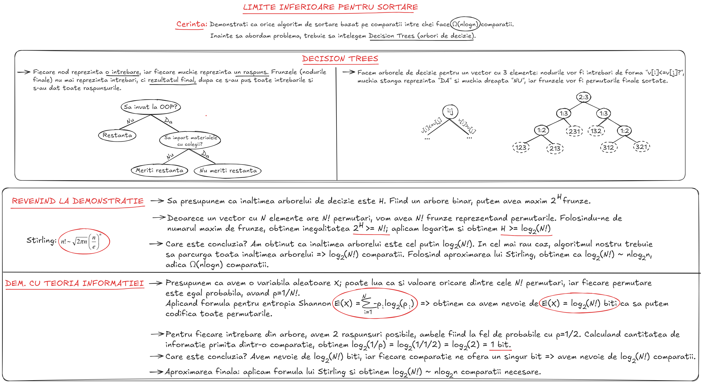
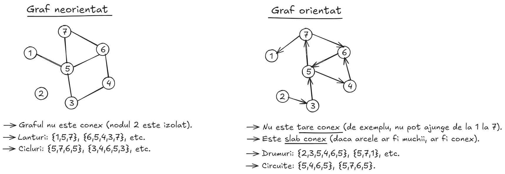
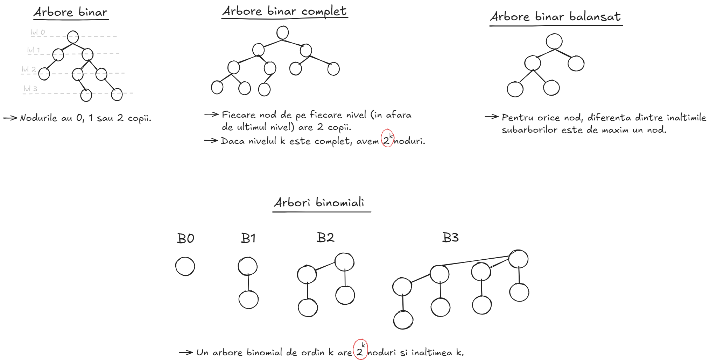
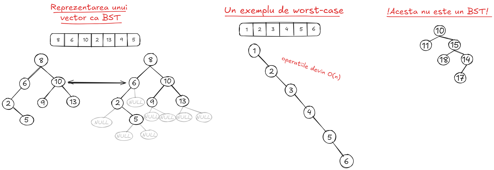
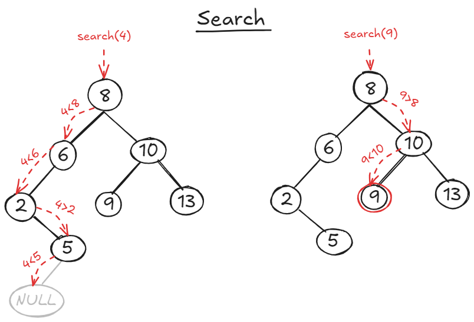
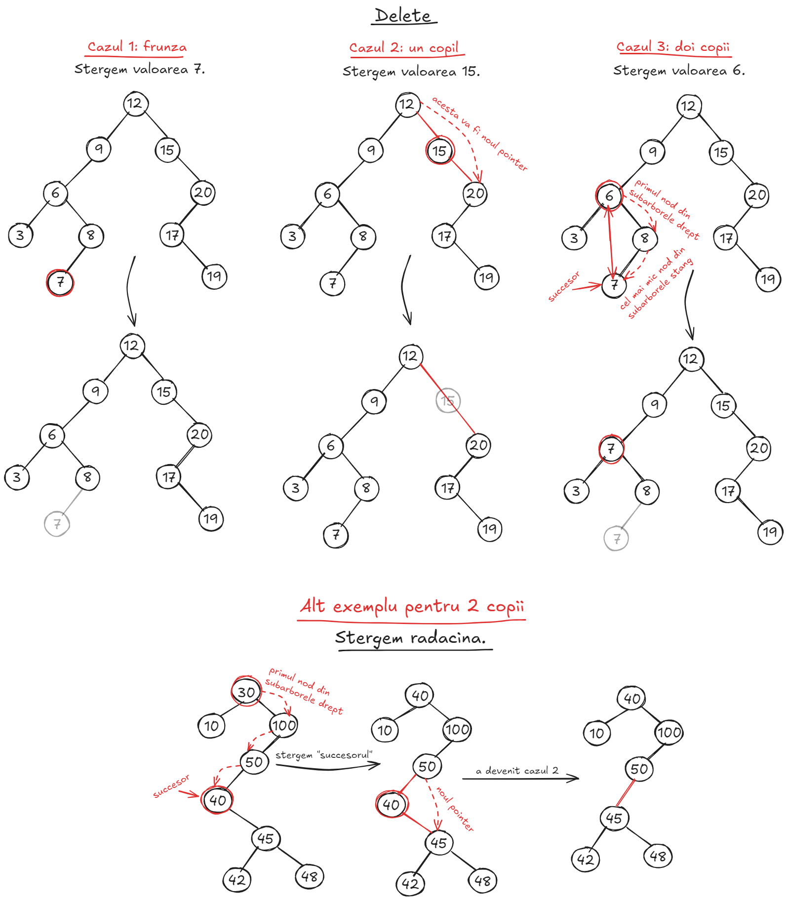
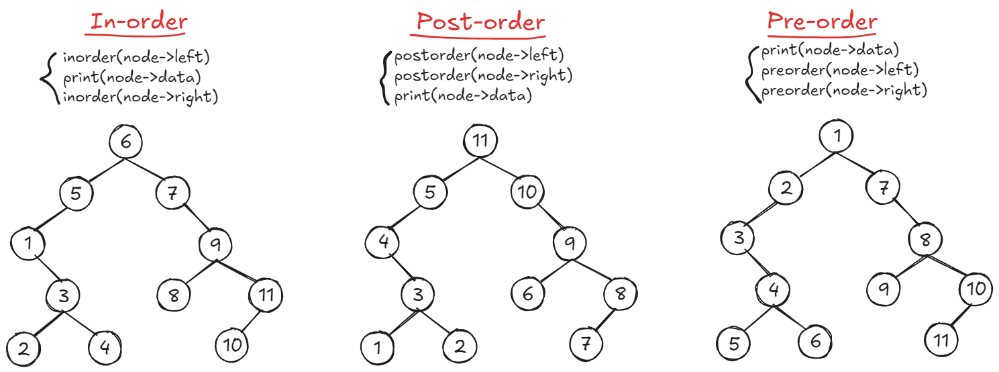
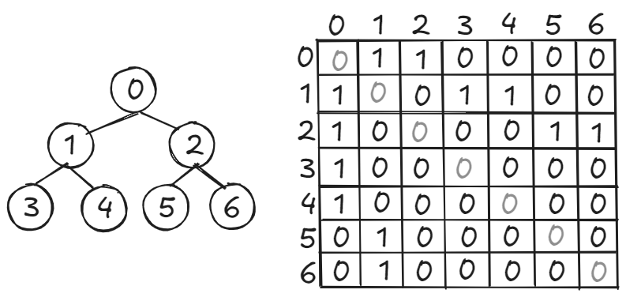
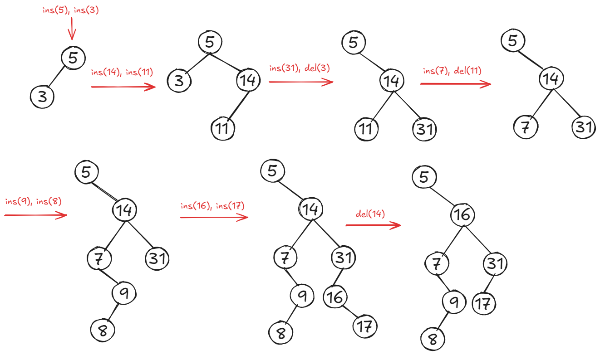
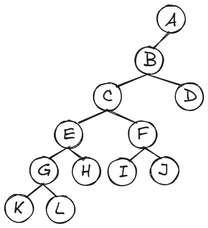

# Table of contents
- [Table of contents](#table-of-contents)
  - [1 - Limite inferioare pentru sortare](#1---limite-inferioare-pentru-sortare)
  - [2 - Grafuri](#2---grafuri)
    - [2.1 - Introducere](#21---introducere)
    - [2.2 - Arbori binari si binomiali](#22---arbori-binari-si-binomiali)
  - [3 - Binary Search Trees](#3---binary-search-trees)
    - [3.1 - Introducere](#31---introducere)
    - [3.2 - Search](#32---search)
    - [3.3 - Insert](#33---insert)
    - [3.4 - Delete](#34---delete)
    - [3.5 - Tree walks](#35---tree-walks)
  - [4 - Exercitii examen](#4---exercitii-examen)
    - [Seria 13](#seria-13)
    - [Seria 13 - rezolvari](#seria-13---rezolvari)
    - [Seria 14](#seria-14)
    - [Seria 14 - rezolvari](#seria-14---rezolvari)
    - [Seria 15](#seria-15)
    - [Seria 15 - rezolvari](#seria-15---rezolvari)

---

## <ins>1 - Limite inferioare pentru sortare</ins>



---

## <ins>2 - Grafuri</ins>

### <ins>2.1 - Introducere</ins>

Un graf este format dintr-o multime de noduri <b>V</b> si o multime de muchii/arce <b>E</b>. Grafurile <b>neorientate</b> contin muchii (sunt bidirectionale), iar cele <b>orientate</b> contin arce (un arc este unidirectional).

Un <b>lant</b> intr-un <b>graf neorientat</b> este o succesiune de noduri unite prin muchii. Lanturile pot fi <b>simple</b>(nu se repeta muchii)/<b>compuse</b>(se pot repeta muchii) si <b>elementare</b>(nu se repeta varfuri)/<b>neelementare</b>(se pot repeta varfuri). Un <b>ciclu</b> este un <b>lant simplu</b>, in care nodul final coincide cu nodul de start; acestea pot fi, la randul lor, <b>elementare</b> sau <b>neelementare</b>. Un <b>drum</b> intr-un <b>graf orientat</b> este ca un lant intr-un graf neorientat, dar in loc de muchii avem arce (drumurile pot fi <b>simple/compuse/elementare/neelementare</b>). Un <b>circuit</b> este un <b>drum simplu</b>, in care primul si ultimul nod coincid (circuitele pot fi <b>elementare/neelementare</b>).

Un <b>graf neorientat</b> se numeste <b>conex</b>, daca exista un lant de la orice nod <b>X</b> la orice nod <b>Y</b>. Definitia echivalenta pentru <b>grafuri orientate</b> este <b>tare conexitatea</b>, unde trebuie sa existe un drum de la orice nod <b>X</b> la orice nod <b>Y</b>. De asemenea, la grafuri orientate exista si notiunea de <b>slab conexitate</b> - daca inlocuim toate arcele cu muchii si obtinem un <b>graf neorientat conex</b>, atunci graful orientat respectiv este <b>slab conex</b>.



### <ins>2.2 - Arbori binari si binomiali</ins>
Un arbore este un <b>graf conex aciclic</b>; astfel, un arbore cu <b>N</b> noduri va avea mereu <b>N-1</b> muchii. Arborii au o <b>radacina</b> - un nod din care pleaca toate drumurile; putem alege orice nod sa fie radacina, iar in functie de nodul pe care il alegem, inaltimea arborelui variaza (<b>inaltimea unui arbore</b> = numarul maxim de muchii de pe un lant de la radacina la orice frunza).

Un <b>arbore binar</b> este un arbore in care fiecare nod are maxim <b>2</b> copii - <b>left child(L), right child(R)</b>. Un arbore binar se numeste <b>complet</b> daca fiecare nivel este complet (are numar maxim de noduri), in afara de ultimul nivel (care, de obicei, este completat de la stanga la dreapta).

Un <b>arbore binar balansat</b> (<b>AVL Trees</b>, vom face in Tutoriatul 4) este un arbore binar, unde, pentru orice nod, diferenta de inaltime dintre subarborele stang si subarborele drept este de maxim un nod.

Un <b>arbore binomial</b> de ordin <b>0</b> este un singur nod (radacina). Un arbore binomial de ordin <b>K</b> este o reuniune a doi arbori binomiali de ordin <b>K-1</b>, unde unul din arborii respectivi este fiul stang al celuilalt arbore. Un arbore binomial are exact <b>2<sup>K</sup></b> noduri si inaltimea <b>k</b>. Arborii binomiali sunt folositi la <b>heapuri binomiale</b>, pe care le vom discuta in Tutoriatul 4.



---

## <ins>3 - Binary Search Trees</ins>
### <ins>3.1 - Introducere</ins>
- Un **BST (Binary Search Tree)** este un **arbore binar** (fiecare nod are maxim 
**2** copii) cu o proprietate in plus: pentru orice nod, subarborele stang contine
valori strict mai mici, iar subarborele drept contine valori strict mai mari decat
nodul respectiv.
- Orice nod va avea urmatoarele campuri/atribute/proprietati:
    - **key**: cheia nodului.
    - **val**: valoarea nodului.
    - **left**: pointer catre copilul stang.
    - **right**: pointer catre copilul drept.
- Ideea principala este ca inaltimea arborelui va fi in medie **log(n)**, iar 
operatiile **search/insert/delete** depind in mod direct de inaltimea arborelui => 
complexitatile operatiilor sunt, in medie, **O(logn)**. 



### <ins>3.2 - Search</ins>
- **Pasul 1**: incepem cautarea din radacina.
- **Pasul 2**: comparam valoarea nodului curent cu valoarea pe care o cautam. Exista 3 cazuri:
    - sunt egale => am gasit valoarea.
    - valoarea pe care o cautam este mai mica => cautam recursiv in subarborele stang.
    - valoarea pe care o cautam este mai mare => cautam recursiv in subarborele drept.
- **Pasul 3**: daca ajungem intr-un nod **NULL**, valoarea cautata nu exista.
- **Complexitate O(logn)**.



### <ins>3.3 - Insert</ins>
- **Pasul 1**: aplicam algoritmul de **search** ca sa gasim pozitia unde ar trebui
sa fie inserata valoarea. Daca gasim valoarea respectiva, nu inseram deoarece nu vrem
duplicate. Daca ajungem intr-un nod **NULL**, continuam cu inserarea.
- **Pasul 2**: adaugam noul nod in arbore la pozitia gasita (actualizam pointerii).
- **Complexitate O(logn)**.


### <ins>3.4 - Delete</ins>
- **Pasul 1**: aplicam algoritmul de **search** ca sa gasim nodul respectiv.
- **Pasul 2**: daca valoarea pe care vrem sa o stergem exista, trebuie sa identificam cati copii
are nodul. Exista 3 cazuri:
    - **0 copii**: nodul este o frunza => il putem sterge direct.
    - **1 copil**: pointerul parintelui nodului va fi actualizat sa indice catre copilul nodului,
    dupa care stergem nodul.
    - **2 copii**: gasim succesorul nodului (cea mai mica valoare din arbore, care este
    mai mare decat valoarea noastra). Mergem in radacina subarborelui drept, iar apoi
    incontinuu spre stanga (pana cand nu mai putem) ca sa obtinem succesorul. Nodul pe
    care vrem sa il stergem o sa preia valoarea succesorului si aplicam recursiv stergerea
    pe succesor (care o sa fie un nod cu **0** sau **1** copii).
- **Complexitate O(logn)**.



### <ins>3.5 - Tree walks</ins>
- Exista mai multe moduri utile de a parcurge un **BST** - pentru a obtine valorile
intr-o anumita ordine (de exemplu, ordine crescatoare), sau pentru a traversa efectiv
nodurile intr-un anumit fel (daca vrem sa stergem, mai intai scapam de frunze).
- **Parcurgere in inordine**:
    - Aplicam recursiv parcurgerea pe subarborele stang.
    - Afisam valoarea curenta.
    - Aplicam recursiv parcurgerea pe subarborele drept.
- **Parcurgere in preordine**:
    - Afisam valoarea curenta.
    - Aplicam recursiv parcurgerea pe subarborele stang.
    - Aplicam recursiv parcurgerea pe subarborele drept.
- **Parcurgere in postordine** (pentru stergere):
    - Aplicam recursiv parcurgerea pe subarborele stang.
    - Aplicam recursiv parcurgerea pe subarborele drept.
    - Afisam valoarea curenta.
- **Complexitate O(n)** - deoarece trecem prin toate nodurile.



---

## <ins>4 - Exercitii examen</ins>

### <ins>Seria 13</ins>

1. Traversarea in <b>postordine</b> a unui arbore binar de cautare este <b>15, 10, 23, 25, 20, 35, 42, 39, 30</b>. Care este traversarea in <b>inordine</b> pentru acelasi arbore?
2. Urmatoarele numere sunt inserate succesiv intr-un arbor binar de cautare gol: <b>1, 3, 5, 10, 15, 12, 16</b>. Care este inaltimea arborelui la final?
3. Care din urmatoarele secvente <b>NU</b> este una din traversarile in <b>preordine</b> sau <b>postordine</b> ale unui arbore binar de cautare in care s-au inserat valorile <b>(10, 20, 5, 30, 8, 25, 6, 4, 9)</b>?
    - <b>4, 5, 6, 8, 9, 10, 20, 25, 30</b>.
    - <b>10, 5, 8, 4, 6, 9, 20, 25, 30</b>.
    - <b>10, 5, 20, 4, 8, 30, 6, 9, 25</b>.
    - Raspunsurile de mai sus nu sunt corecte.
4. Sa presupunem ca vrem sa afisam in ordine descrescatoare elementele unui arbore binar de cautare. Care dintre urmatoarele metode ar fi potrivite?
    - Parcurgem arborele in <b>inordine</b> punand nodurile intr-o stiva. La sfarsit, le printam pe masura ce le scoatem din stiva.
    - Parcurgem arborele in <b>preordine</b> punand nodurile intr-o coada. La sfarsit, le printam pe masura ce le scoatem din coada.
    - Parcurgem arborele recursiv cu ordinea <b>RIGHT-VERTEX-LEFT</b>.
    - Raspunsurile de mai sus nu sunt corecte.
5. Vrem sa reprezentam multimea <b>S = {1, 2, 3}</b> cu un arbore binar de cautare. In cate moduri distincte putem face acest lucru?
    - <b>1</b> mod.
    - <b>2</b> moduri.
    - <b>3</b> moduri.
    - <b>8</b> moduri.
    - Raspunsurile de mai sus nu sunt corecte.
6. Se da o expresie aritmetica reprezentata ca un arbore sintactic (imagine). Care este ordinea in care sunt evaluate nodurile pentru a calcula valoarea expresiei?
    - <b>a,+,b,*,c,root(+),7</b>.
    - <b>7,a,b,c,+,*,root(+)</b>.
    - <b>a,b,+,c,*7,root(+)</b>.
    - Raspunsurile de mai sus nu sunt corecte.
    


7. Sa presupunem ca numerele <b>7,5,1,8,3,6,0,9,4,2</b> sunt inserate in aceasta ordine intr-un arbore binar de cautare. Care este lista elementelor in postordine?
    - <b>7 5 1 0 3 2 4 6 8 9</b>.
    - <b>0 2 4 3 1 6 5 9 8 7</b>.
    - <b>0 1 2 3 4 5 6 7 8 9</b>.
    - <b>9 8 6 4 2 3 0 1 5 7</b>.
8. Pentru a efectua o stergere intr-un arbore binar de cautare pentru un nod cu 2 copii, trebuie sa ii gasim succesorul (in inordine). Care dintre urmatoarele afirmatii este adevarata?
    - Succesorul este intotdeauna un nod frunza.
    - Succesorul este intotdeauna fie un nod frunza, fie un nod fara copil stang.
    - Succesorul poate fi un stramos al nodului.
    - Succesorul este intotdeauna fie un nod frunza, fie un nod fara copil drept.
9. Sa presupunem ca modificam algoritmul de parcurgere in latime (<b>BFS</b>) a unui arbore binar in felul urmator: in loc de o coada, folosim o coada dubla (<b>deque</b>); cand scoatem primul nod din coada, mai intai il vizitam, iar vecinii nodului respectiv ii adaugam in varful cozii duble. Modificarea astfel descrisa este echivalenta cu o parcurgere a arborelui:
    - In preordine.
    - In inordine.
    - In postordine.
    - In adancime.
    - Raspunsurile de mai sus nu sunt corecte.

### <ins>Seria 13 - rezolvari</ins>
1. Deoarece este un arbore binar de cautare, traversarea in <b>inordine</b> mereu va genera valorile in ordine crescatoare. Astfel, informatia despre <b>postordine</b> este irelevanta, iar raspunsul este: <b>{10, 15, 20, 23, 25, 30, 35, 39, 42}</b>.
2. Inaltimea este <b>5</b>.
3. Prima varianta este o parcurgere in <b>inordine</b>, iar celelalte 2 sunt aleatoare. Asadar, toate cele 3 raspunsuri sunt corecte. Am atasat rezolvarea:


4. Prima si a treia varianta.
5. Raspunsurile nu sunt corecte. Am atasat rezolvarea:


6. A treia varianta.
7. A doua varianta.
8. A doua varianta.
9. TODO

### <ins>Seria 14</ins>
1. Cate muchii are un arbore binar complet cu <b>n</b> noduri?
2. Sa se construiasca arborele binar obtinut prin insertia pe rand a urmatoarelor chei: <b>{15, 22, 2, 18, 19, 40, 30, 16, 50}</b>. Sa se stearga nodul <b>22</b>.
3. Demonstrati ca orice algoritm de sortare bazat pe comparatii intre chei efectueaza <b>Ω(nlogn)</b> comparatii.
4. Se da un arbore binar cu <b>n</b> noduri in urmatorul format: se specifica radacina, iar pentru fiecare nod se dau fiul stang si fiul drept, daca acestia exista. De asemenea, fiecarui nod ii este asociat un numar intreg. Sa se decida daca acest arbore binar este <b>arbore binar de cautare</b>. Timp de rulare: <b>O(n<sup>2</sup>)</b>=0,5p, <b>O(nlogn)</b>=1p, <b>O(n)</b>=1,5p.
5. Demonstrati ca orice algoritm care construieste un arbore binar de cautare cu <b>n</b> numere ruleaza in timp <b>Ω(n)</b>.
6. Desenati un arbore binar complet cu <b>7</b> noduri si desenati matricea de adiacenta corespunzatoare.
7. Fie <b>T</b> un arbore binar de cautare si <b>x</b> un nod care are doi copii. Demonstrati ca succesorul lui <b>x</b> nu are fiu stang, iar predecesorul lui <b>x</b> nu are fiu drept.

### <ins>Seria 14 - rezolvari</ins>
1. Faptul ca este <b>binar</b> si <b>complet</b> este irelevant. Fiind un arbore, este un graf conex aciclic => are <b>N-1</b> muchii.
2. Am atasat rezolvarea:


3. Am facut demonstratia [aici](#1---limite-inferioare-pentru-sortare).
4. Avem 2 solutii bune, care ruleaza amandoua in timp <b>O(n)</b>:
    - <b>Interval de valori</b>: fiecare nod din arbore are un interval posibil de valori. De exemplu, radacina poate lua valori in intervalul <b>[-inf,+inf]</b>; nodul din dreapta radacinii poate lua <b>[radacina+1,+inf]</b>, iar cel din stanga acestui nod poate lua <b>[radacina+1,nod-1]</b>, etc. Asadar, folosim o functie recursiva cu 3 parametri <b>verify(node, minVal, maxVal)</b>. Verificam ca valoarea nodului curent sa fie <b>minVal <= node->key <= maxVal</b>, si apoi <b>return verify(node->left, minVal, node->key - 1) and verify(node->right, node->key + 1, maxVal)</b>.
    - <b>Traversare in inordine</b>: parcurgem arborele in inordine. Daca ar fi fost un arbore binar de cautare, atunci aceasta parcurgere ar fi generat cheile sortate crescator; verificam acest lucru.

```cpp
// Solutia 1
bool verify(Node* node, const int minVal, const int maxVal) {
    if (!node) {
        return true;
    }
    
    if (node->key < minVal || node->key > maxVal) {
        return false;
    }
    
    return verify(node->left, minVal, node->key - 1) && 
           verify(node->right, node->key + 1, maxVal);
}


// Solutia 2
bool inorder(Node* node, int& prev) {
    if (!node) {
        return true;
    }
    
    if (!inorder(node->left, prev)) {
        return false;
    }
    
    if (prev >= node->key) {
        return false;
    }
    
    prev = node->key;
    
    return inorder(node->right, prev);
}
```

5. TODO
6. Am atasat rezolvarea (si am presupus ca este neorientat):



7. Demonstratii scurte:
    - <b>Succesorul lui X nu are fiu stang</b>: ca sa ii gasim succesorul (cel mai mic nod mai mare decat X), mergem in nodul din dreapta si gasim cea mai mica valoare din subarborele stang. Prin definitie, cel mai mic nod din subarborele stang este cel mai din stanga nod => vom merge in stanga pana cand nu mai putem => succesorul nu va avea fiu stang.
    - <b>Predecesorul lui X nu are fiu drept</b>: ca sa ii gasim predecesorul (cel mai mare nod mai mic decat X), mergem in nodul din stanga si gasim cea mai mare valoare din subarborele drept. Prin definitie, cel mai mare nod din subarborele drept este cel mai din dreapta nod => vom merge in dreapta pana cand nu mai putem => predecesorul nu va avea fiu drept.

### <ins>Seria 15</ins>
1. Intr-un arbore binar de cautare, se fac urmatoarele operatii: <b>{I(5), I(3), I(14), I(11), I(31), del(3), I(7), del(11), I(9), I(8), I(16), I(17), del(14)}</b>. Aratati arborele dupa fiecare 2 operatii.
2. Construiti un arbore binar cu <b>12</b> noduri si diametrul <b>5</b>.
3. Cati arbori binari distincti cu valorile <b>{1,2,3,4,5,6}</b> putem avea?
4. Ce inaltime poate sa aiba un arbore binar cu <b>24</b> de elemente? Desenati arborele de inaltime minima si cel de inaltime maxima.
5. Se da un arbore binar. Gasiti suma maxima a unor elemente care nu se invecineaza.

### <ins>Seria 15 - rezolvari</ins>
1. Am atasat rezolvarea:



2. **Diametrul** unui arbore binar reprezinta distanta maxima dintre 2 noduri oarecare. Am atasat desenul:



3. Aplicam formula cu **numere Catalan**: numarul de arbori binari distincti cu **n** noduri este **(2n)! / ((n+1)! * n!)** => pentru **6** noduri, avem **132** de posibilitati. Pentru fiecare structura posibila, putem plasa nodurile in **6!** feluri diferite => **6! * 132 = 95 040**.
4. Proprietatea arborilor binari: orice nod are maxim <b>2</b> copii. Daca vrem un arbore de inaltime <b>maxima</b>, vrem sa folosim toate nodurile sa mergem cat mai mult in jos => inaltimea maxima este <b>23</b>. Daca vrem un arbore de inaltime <b>minima</b>, punem cat mai multe noduri pe fiecare nivel. Pe nivelul <b>i</b> exista <b>2<sup>i</sup></b> noduri; <b>2<sup>0</sup> + 2<sup>1</sup> + 2<sup>2</sup> + 2<sup>3</sup> < 23 < 2<sup>0</sup> + 2<sup>1</sup> + 2<sup>2</sup> + 2<sup>3</sup> + 2<sup>4</sup></b> => inaltimea minima este <b>4</b>.
5. Problema poate fi simplificata la 2 cazuri de baza:
    - **Cazul 1**: suma maxima pentru o frunza este valoarea frunzei respective.
    - **Cazul 2**: suma maxima pentru un nod cu 1 sau 2 copii este maximul dintre valoarea nodului si
    suma valorilor copiilor.
    - Pentru arborele dat, trebuie sa calculam maximul dintre suma obtinuta fara
    radacina si suma obtinuta cu radacina. Consideram ca functia noastra are 
    signatura <b>int getMaxSum(Node* node)</b>. Daca includem radacina in suma, nu ii
    mai putem include copiii (deoarece un nod este adiacent cu copiii sai) => suma cu
    radacina este formata din radacina si sumele maxime ale nepotilor sai, adica are formula 
    **(root->val) + getMaxSum(root->left->left) + getMaxSum(root->left->right) + 
    getMaxSum(root->right->left) + getMaxSum(root->right->right)**. Daca excludem radacina,
    suma este formata din sumele maxime ale copiilor => **getMaxSum(root->left) + 
    getMaxSum(root->right)**. Am inclus si rezolvarea in cod:

```cpp
unordered_map<Node*, int> t; // pentru optimizare (retinem sumele maxime calculate)
int getMaxSum(Node *root) {
    if (!root) {
        return 0;
    }
        
    // optimizare 1
    if (t[root]) {
        return t[root];
    }
        
    int sumWithNode = root->data;
    if (root->left) {
        sumWithNode += getMaxSum(root->left->left);
        sumWithNode += getMaxSum(root->left->right);
    }
    if (root->right) {
        sumWithNode += getMaxSum(root->right->left);
        sumWithNode += getMaxSum(root->right->right);
    }
        
    int sumWithoutNode = 0;
    sumWithoutNode += getMaxSum(root->left);
    sumWithoutNode += getMaxSum(root->right);
        
    // optimizare 2
    return t[root] = max(sumWithNode, sumWithoutNode); 
}
```

