# Table of contents
- [Table of contents](#table-of-contents)
  - [1 - AVL Trees](#1---avl-trees)
    - [1.1 - Introducere](#11---introducere)
    - [1.2 - Rotatii](#12---rotatii)
    - [1.3 - Search](#13---search)
    - [1.4 - Insert](#14---insert)
    - [1.5 - Delete](#15---delete)
    - [1.6 - Alte operatii](#16---alte-operatii)
  - [2 - Splay Trees](#2---splay-trees)
  - [3 - RMQ (Range Minimum Queries)](#3---rmq-range-minimum-queries)
  - [4 - Binomial Heaps](#4---binomial-heaps)
    - [4.1 - Introducere](#41---introducere)
    - [4.2 - Union](#42---union)
    - [4.3 - Extract min](#43---extract-min)
    - [4.4 - Decrease key (un nod ia o valoare mai mica)](#44---decrease-key-un-nod-ia-o-valoare-mai-mica)
    - [4.5 - Insert](#45---insert)
    - [4.6 - Delete](#46---delete)
  - [5 - Fibonacci Heaps](#5---fibonacci-heaps)
    - [5.1 - Introducere](#51---introducere)
    - [5.2 - Insert](#52---insert)
    - [5.3 - Find minimum](#53---find-minimum)
    - [5.4 - Union](#54---union)
    - [5.5 - Extract minimum](#55---extract-minimum)
    - [5.6 - Decrease key](#56---decrease-key)
    - [5.7 - Delete](#57---delete)
  - [6 - Exercitii examen](#6---exercitii-examen)
    - [Seria 13](#seria-13)
    - [Seria 13 - rezolvari](#seria-13---rezolvari)
    - [Seria 15](#seria-15)
    - [Seria 15 - rezolvari](#seria-15---rezolvari)

---

## 1 - AVL Trees 

### <ins>1.1 - Introducere</ins>
- Un <b>AVL Tree</b> este un <b>Binary Search Tree</b> cu o proprietate in plus: pentru orice nod, diferenta dintre inaltimea subarborelui stang si inaltimea subarborelui drept este de maxim un nod. Aceasta diferenta de inaltimi reprezinta **balance factor-ul** unui nod, care este folosit pentru a asigura faptul ca inaltimea arborelui va ramane mereu aproximativ <b>log(n)</b> => operatiile de <b>insert/search/delete</b> o sa aiba mereu complexitate <b>O(logn)</b>.
- Inserarea si stergerea de noduri pot afecta aceasta proprietate, deoarece se modifica inaltimile subarborilor; asadar, ne folosim de <b>rotatii</b> ca sa corectam fiecare nod cu un **balance factor** stricat.
- Orice nod intr-un **AVL Tree** are urmatoarele campuri/atribute:
    - **<ins>key</ins>**: cheia nodului.
    - **<ins>val</ins>**: valoarea nodului.
    - **<ins>height</ins>**: inaltimea subarborelui, care are nodul respectiv ca si radacina. Acest camp este necesar pentru a calcula **balance factor-ul**.
    - **<ins>left</ins>**: copilul stang.
    - **<ins>right</ins>**: copilul drept.
- Am atasat un exemplu de AVL Tree:
    
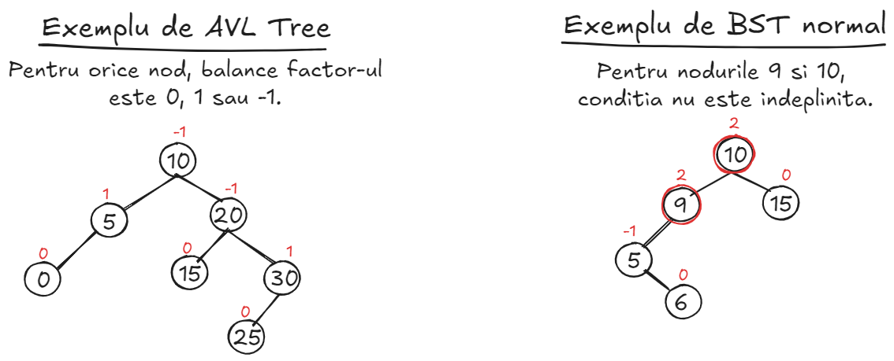

### <ins>1.2 - Rotatii</ins>
- Rotatiile inseamna schimbarea pozitionarii nodurilor, astfel incat sa fie indeplinita din nou proprietatea de arbore echilibrat. 
- Exista <b>4</b> cazuri de dezechilibru in structura arborilor, care pot fi rezolvate cu rotatii, si pe care le-am ilustrat in poza.

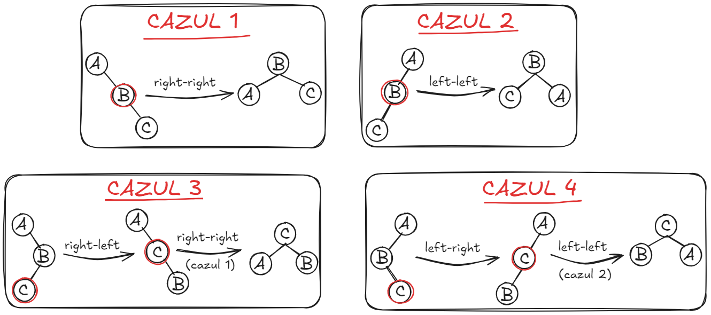

### <ins>1.3 - Search</ins>
- Nu exista nimic in plus de explicat; cautarea este <b>exact la fel</b> ca la BST-uri (vezi <b>Tutoriat 3</b>).
- <b>Complexitate O(logn)</b>.

### <ins>1.4 - Insert</ins>
- <b>Pasul 1</b>: inseram nodul ca la un BST normal (vezi <b>Tutoriat 3</b>).
- <b>Pasul 2</b>: incepand de la nodul inserat anterior, mergem in sus spre radacina, cautand primul nod care este dezechilibrat, pe care il vom nota cu <b>A</b>. Odata ce l-am localizat pe <b>A</b>, obtinem fiul, pe care il notam cu <b>B</b>, care se afla in drum spre nodul inserat. Apoi, obtinem fiul lui <b>B</b>, pe care il notam cu <b>C</b>, care se afla in drum spre nodul inserat (important sa nu ne abatem de la drum).
- <b>Pasul 3</b>: Odata ce am obtinut nodurile <b>A</b>, <b>B</b> si <b>C</b>, determinam cazul in care ne aflam si aplicam rotatiile necesare. Ne folosim de inaltimile subarborilor lui <b>A</b>:
    - <b>balance_factor > 1</b>: ne aflam in <b>Left-Left</b> sau <b>Left-Right</b>. Ca sa ne dam seama, comparam valoarea nodului inserat cu valoarea lui <b>B</b>.
    - <b>balance_factor < -1</b>: ne aflam in <b>Right-Right</b> sau <b>Right-Left</b>. Ca sa ne dam seama, comparam valoarea nodului inserat cu valoarea lui <b>B</b>.
- <b>Pasul 4</b>: am identificat cazul; aplicam una sau doua rotatii (in functie de caz), iar arborele devine din nou echilibrat.
- **Complexitate O(logn)**.

### <ins>1.5 - Delete</ins>
- **Pasul 1**: localizam nodul (daca exista) folosind operatia de **search**. 
- **Pasul 2**: in caz ca exista, aplicam operatia **delete** de la BST-uri normale (**Tutoriat 3**).
- **Pasul 3**: incepand de la parintele nodului sters (si mergand in sus catre radacina), verificam **balance factor-ul** fiecarui nod; in caz ca exista un dezechilibru, vom aplica rotatiile necesare. Exista **4** cazuri pentru acest pas:
    - **balance_factor(node) > 1**: ne aflam in **Left-Left** sau **Left-Right**. Ca sa ne dam seama:
        - **balance_factor(node->left) >= 0**: **Left-Left**.
        - **balance_factor(node->left) < 0**: **Left-Right**.
    - **balance_factor(node) < 1**: ne aflam in **Right-Right** sau **Right-Left**. Ca sa ne dam seama:
        - **balance_factor(node->right) < 0**: **Right-Right**.
        - **balance_factor(node->right) >= 0**: **Right-Left**.
- **Pasul 4**: repetam **pasul 3** pentru fiecare nod dezechilibrat, aplicand rotatiile necesare pentru a restabili echilibrul.
- **Complexitate O(logn)**.

### <ins>1.6 - Alte operatii</ins>
- Alte operatii ar mai fi **tree-walks** si **successor/predecessor**, dar acestea sunt identice cu cele de la **BST-uri**.
---

## 2 - Splay Trees 
- Un splay tree este un arbore binar de cautare (**nu este balansat!!!**) ce permite accesarea rapida a ultimelor elemente inserate.
- La fel ca ceilalti arbori binari de cautare, complexitatea accesarii, stergerii si inserarii este $O(log n)$ **in medie** (care este worst case-ul?). Totusi, ele depind foarte mult de **entropia** input-ului, adica cat de mult se vor repeta query-urile si ce pattern au ele.
- Important de precizat este ca, fata de ceilalti BST, acestia isi pot schimba structura si pe operatiile de accesare.
- Pentru a putea detalia cum se realizeaza mai exact operatiile pe arbore, trebuie sa introducem conceptul de **splaying**.
- Atunci cand un element este accesat el va fi mutat aproape de radacina prin operatia de **splay**. Aceasta consta intr-o serie de pasi ce presupun mutarea elementului respectiv, nivel dupa nivel, pana la radacina. Acesti pasi sunt de 3 tipuri, depinzand de pozitia nodului accesat (nodul $p$ este parintele nodului curent $x$):
1. $p$ este radacina (**Zig step**):
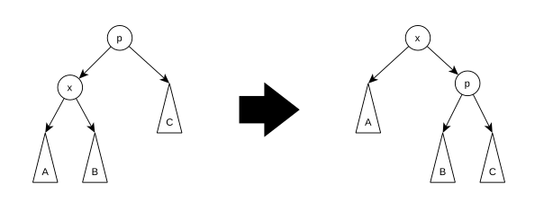
2. $p$ nu este radacina si $p$ si $x$ sunt ambii pe partea stanga / dreapta a unui nod $g$:
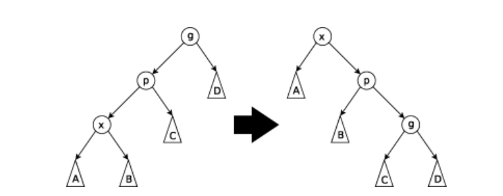
3. $p$ nu este radacina si $p$ si $x$ sunt pe aceeasi parte, insa unul este fiu stang, iar celalalt fiu drept:
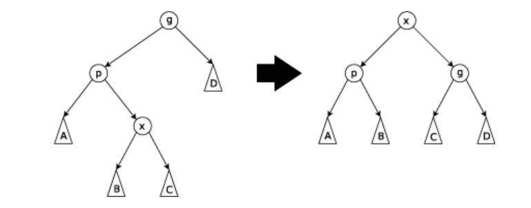
**IMPORTANT**: Exemplele descriu cazuri in care pe partea stanga se incepe operatia, insa algoritmii sunt simetrici, adica este aceeasi idee daca privim din dreapta in stanga.
> **Intrebare**: care sunt cazurile in care se va realiza **zig step**??
- **Join**: Operatia de join intre 2 splay trees $S$ si $T$, in care toate valorile nodurilor din $S$ sunt mai mici decat cele din $T$, se poate face realizand operatia de **splaying** in arborele $S$, aducandu-l pe cel mai mare in radacina (astfel avand fiul drept `null`), iar mai apoi adaugand ca fiu drept pe radacina arborelui din $T$.
- **Inserare**: Operatia de inserare se realizeaza ca intr-un BST normal, doar ca dupa ce am adaugat elementul, facem **splaying** pe el si il facem radacina
- **Stergerea**: Operatia de stergere se realizeaza ca intr-un BST, doar ca parintelui lui i se va face splaying spre radacina
> **Cerinta**: Dati exemplu de o secventa de inserari si accesari pentru care complexitatea este $O(n^2)$. Pentru a vizualiza operatiile, puteti accesa urmatorul [site](https://www.cs.usfca.edu/~galles/visualization/SplayTree.html).

## 3 - RMQ (Range Minimum Queries)
- Descriere problema: fie un sir de $n$ numere $A$ ordonate aleator. Dorim sa facem interogari pe el de forma $(a, b)$, iar rezultatul sa fie numarul minim din $A$ in intervalul determinat de pozitiile $a$ si $b$ ($a < b$).
- Pentru moment vom presupune ca nu se pot face update-uri pe elementele din sir (pentru asta va fi nevoie sa folosim niste structuri de date pe care le invatam mai tarziu sau ceva mai ineficient despre care gasiti mai multe informatii [aici](https://cp-algorithms.com/data_structures/sqrt_decomposition.html)).
- Pentru acestea vom folosi un **sparse table**. Ideea din spatele ei e intentia de a reprezenta segmente din array de tipul $[i, j]$ sub forma $min_elem[i][e_1], min_elem[i + 2 ^ {e_1}][e_2] ...$ cu semnificatia ca $min_elem[i][j]$ reprezinta valoarea minima din intervalul $[i, i + 2 ^ j - 1]$. Astfel, se poate descompune un interval in puteri de 2 si sa se inlantuiasca pana se acopera tot intervalul; in acest mod complexitatea de timp este $O(log_2(j - i))$.
- Pentru mai multe informatii si implementari consultati site-ul [asta](https://cp-algorithms.com/data_structures/sparse-table.html).

## 4 - Binomial Heaps 

### <ins>4.1 - Introducere</ins>
- Un <b>Binomial Heap</b> este o colectie de <b>arbori binomiali</b>, legati intre ei, fiecare arbore respectand proprietatea de <b>min-heap</b> (sau <b>max-heap</b>). Arborii sunt "sortati" in ordine crescatoare, dupa numarul de noduri.
- Radacinile arborilor sunt legate intre ele, ca intr-un <b>Linked List</b>.
- Un arbore binomial are <b>2k</b> noduri => ii putem privi ca fiind niste puteri de 2. Deoarece orice numar are o unica reprezentare in binar, deducem ca orice numar de noduri are o unica reprezentare ca si colectie de arbori binomiali (ca si <b>Binomial Heap</b>).
- Fiecare nod are urmatoarele campuri:
    - <ins><b>key</ins></b>: cheia/valoarea nodului respectiv.
    - <ins><b>parent</ins></b>: un pointer catre parinte.
    - <ins><b>sibling</ins></b>: un pointer catre sibling (radacinile arborilor sunt legate in acest fel; de asemenea, copiii aceluiasi parinte sunt legati intre ei).
    - <ins><b>child</ins></b>: un pointer catre copilul cel mai din stanga.
    - <ins><b>degree</ins></b>: numarul de copii.

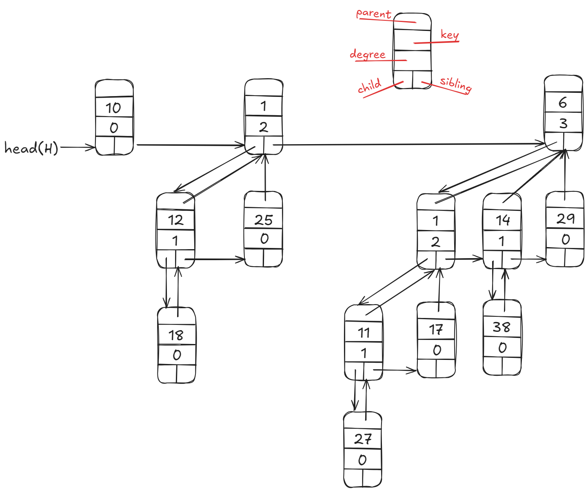

### <ins>4.2 - Union</ins>
- <b>Pasul 1</b>: unim toate radacinile arborilor din ambele heap-uri intr-o lista, <b>sortata crescator</b> dupa <b>gradul radacinii</b>.
- <b>Pasul 2</b>: exista posibilitatea de a avea perechi de cate 2 arbori cu acelasi ordin, ceea ce incalca proprietatea de a avea un singur arbore de un anumit ordin. Procedam la fel ca la o adunare in binar: <b>(01)2 + (01)2 = (10)2</b>, adica 2 arbori de ordinul <b>K</b> produc un arbore de ordin <b>K+1</b>. <b>Ce se intampla cand avem 3 arbori?</b> De exemplu - avem 2 arbori de ordinul <b>K</b> care produc un arbore de ordin <b>K+1</b>, dar mai avem si alti 2 arbori de ordin <b>K+1</b>. Idee - lasam in pace arborele pe care il avem ca si "<b>carry</b>" (arborele de ordin <b>K+1</b> obtinut anterior) si unim ceilalti 2 arbori, obtinand astfel un arbore de ordin <b>K+2</b>;  <b>(011)2 + (011)2 = (010)2 + (010)2 + (010)2 = (100)2 + (010)2 = (110)2</b>. Repetam incontinuu acest pas, pana cand ajungem la ultimul nod si nu mai avem nimic de facut.
- <b>Complexitate O(logn)</b>.

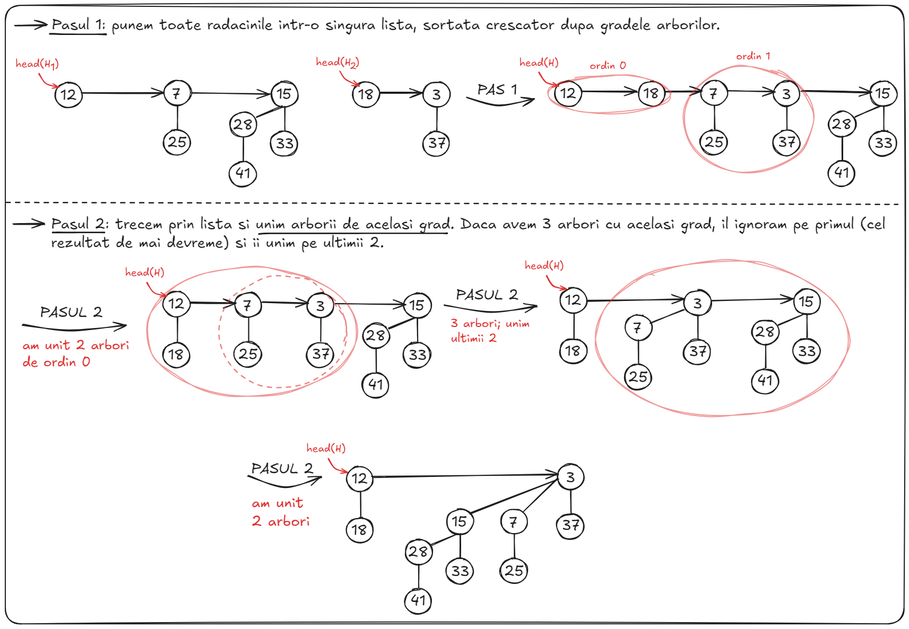

### <ins>4.3 - Extract min</ins>
- <b>Pasul 1</b>: cautam minimul. Simplu - parcurgem lista de radacini, pana cand il gasim. Complexitate? Numarul de biti necesar pentru reprezentarea in binar a unui numar <b>n</b> este <b>[log2n] + 1</b>, la fel ca numarul de arbori binomiali necesar pentru reprezentarea unui numar de noduri <b>n</b> => trecem prin <b>[log2n] + 1</b> radacini => <b>O(logn)</b>.
- <b>Pasul 2</b>: Stergem radacina gasita (atentie la toti pointerii!) si obtinem 2 heap-uri binomiale:
    - <b>H1</b> = heap-ul obtinut daca excludem arborele care contine radacina respectiva.
    - <b>H2</b> = heap-ul obtinut din toti subarborii binomiali ramasi dupa stergerea radacinii (si fara arborii din <b>H1</b>).
- <b>Pasul 3</b>: apelam <b>union(H1,H2)</b>.
- <b>Complexitate O(logn)</b>.

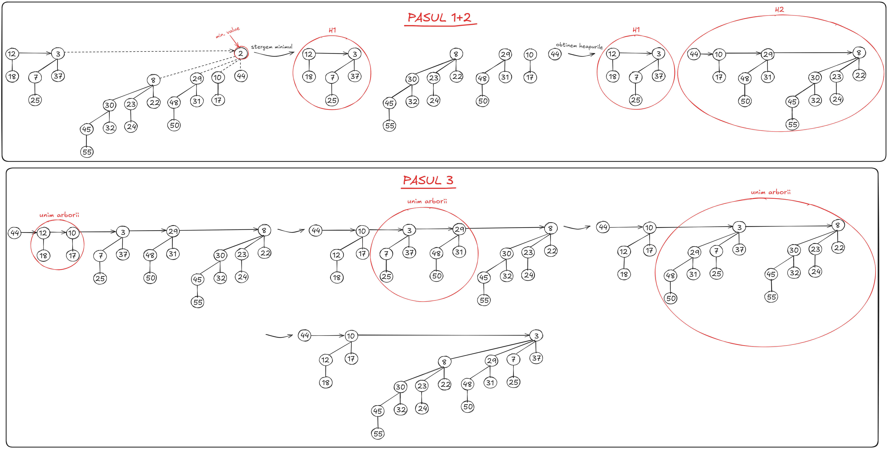

### <ins>4.4 - Decrease key (un nod ia o valoare mai mica)
- <b>Cum functioneaza operatia</b>? Actualizam valoarea unui nod, sa fie mai mica decat valoarea initiala (exemplu practic: daca pe un graf am gasit un drum mai bun intre 2 noduri, vrem sa actualizam distanta).
- <b>Pasul 1</b>: modificam valoarea nodului respectiv.
- <b>Pasul 2</b>: dam swap cu parintele, pana cand este indeplinita din nou proprietatea de <b>min/max-heap</b>.

### <ins>4.5 - Insert</ins>
- <b>Pasul 1</b>: facem un nou heap <b>H'</b>, care sa contina nodul respectiv (un singur arbore binomial de ordin 0).
- <B>Pasul 2</b>: apelam <b>union(H,H')</b>. 
- <b>Complexitate O(logn)</b>: crearea unui heap este <b>O(1)</b> si <b>union</b> este <b>O(logn)</b>.

### <ins>4.6 - Delete</ins>
- <b>Pasul 1</b>: apelam <b>decreaseKey(H,x,-inf)</b>, ca nodul respectiv sa devina radacina arborelui in care se afla si sa fie si radacina de valoare minima in acelasi timp.
- <b>Pasul 2</b>: apelam <b>extractMin(H)</b>, ca sa scoatem nodul.

---

## 5 - Fibonacci Heaps 

### <ins>5.1 - Introducere</ins>
- Un <b>Fibonacci Heap</b> este o colectie de arbori, legati intre ei, care respecta proprietatea de <b>min-heap</b> (sau <b>max-heap</b>), dar unde un nod oarecare pot avea orice numar de copii => <b>NU</b> sunt arbori binari sau binomiali.
- Orice nod are urmatoarele campuri/proprietati:
    - <b><ins>key</ins></b>: cheia nodului.
    - <b><ins>value</ins></b>: valoarea nodului.
    - <b><ins>parent</ins></b>: un pointer catre parintele nodului (<b>nullptr</b> daca nu are parinte).
    - <b><ins>child</ins></b>: un pointer catre <b>unul</b> din copii (<b>nullptr</b> daca nu are copii).
    - <b><ins>left</ins></b>: un pointer catre nodul din stanga (sau catre finalul listei, daca ne aflam la inceput si e lista circulara).
    - <b><ins>right</ins></b>: un pointer catre nodul din dreapta (sau catre inceputul listei, daca ne aflam la final si e listsa circulara).
    - <b><ins>mark</ins></b>: o valoare booleana, implicit, <b>false</b>. Daca se sterge copilul unui nod, nodul respectiv devine <b>marked</b>, adica <b>mark=true</b>.
    - <b><ins>degree</ins></b>: numarul de copii pentru un nod (implicit <b>0</b>).
- <b>IMPORTANT</B>: un arbore de ordin/grad <b>d</b> (radacina are <b>degree=d</b>) are marimea de maxim <b>log(n)</b> noduri (demonstratie naspa cu numere fibonacci).
- Am atasat un exemplu de structura pentru un Fibonacci Heap.

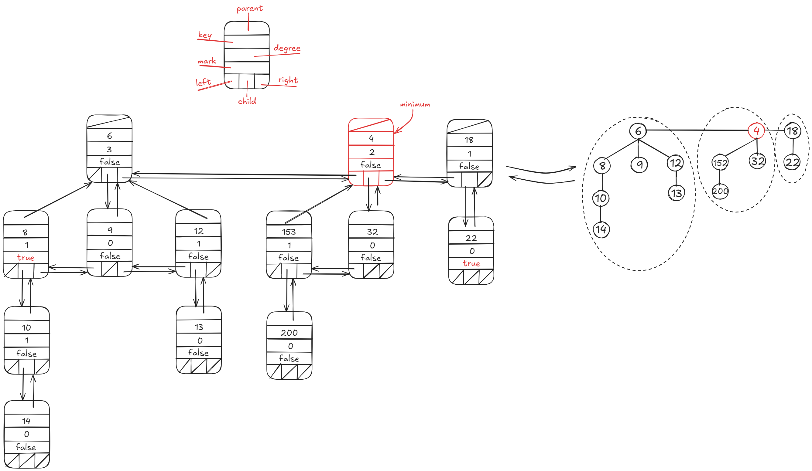

### <ins>5.2 - Insert</ins>
- <b>Pasul 1</b>: facem un nod nou cu o <b>cheie+valoare</b>, fara <b>parent/child/left/right</b>, cu <b>mark=false</b> si <b>degree=0</b> (pentru ca nu are copii). Acum avem un arbore format dintr-un singur nod (o radacina).
- <b>Pasul 2</b>: il adaugam in lista de radacini a heap-ului si actualizam pointerul de minim (daca este cazul).
- <b>Complexitate: O(1)</b>.

### <ins>5.3 - Find minimum</ins>
- Avem un pointer care retine minimul. Afisam valoarea respectiva.
- <b>Complexitate: O(1)</b>.

### <ins>5.4 - Union</ins>
- Daca avem heap-urile <b>H1</b> si <b>H2</b>, adaugam radacinile/arborii din <b>H2</b> in lista din <b>H1</b> (doar modificam niste pointeri). Este important sa actualizam pointerul de minim (daca este cazul).
- <b>Complexitate: O(1)</b>.

### <ins>5.5 - Extract minimum</ins>
- Este cea mai importanta operatie.
- <b>Pasul 1</b>: avem pointer catre minim. Stergem nodul respectiv, iar fiii sai devin arbori liberi.
- <b>Pasul 2</b>: adaugam noii arbori rezultanti in lista de radacini a heap-ului.
- <b>Pasul 3</b>: parcurgem lista de radacini. Daca gasim o radacina care are acelasi grad cu alta radacina din trecut, le unim ca sa facem un singur arbore. Avem grija sa actualizam pointerul sa arate catre noul minim.
- <b>Complexitate: O(n)</b> pentru prima extragere (deoarece toti arborii au doar radacina => este o lista dublu inlantuita cu <b>n</b> elemente). Ulterior, devine <b>O(logn)</b> (dupa ce unim arborii).

### <ins>5.6 - Decrease key</ins>
- <b>Pasul 1</b>: micsoram valoarea nodului.
- <b>Pasul 2</b>: daca noua valoare incalca proprietatea de <b>min-heap</b> fiind mai mica decat parintele (sau invers pentru <b>max-heap</b>), o aducem in lista de radacini si marcam parintele. Daca parintele era deja marcat, il aducem si pe el in lista de radacini. Avem grija sa actualizam pointerul de minim.
- <b>Complexitate: O(1) amortizat</b>.

### <ins>5.7 - Delete</ins>
- <b>Pasul 1</b>: apelam <b>decreaseKey(node, -inf)</b> ca sa micsoram valoarea nodului sa fie <b>-inf</b>.
- <b>Pasul 2</b>: apelam <b>extractMin()</b> ca sa extragem nodul respectiv.
- <b>Complexitate: O(n)</b> prima oara, <b>O(logn)</b> ulterior.

---

## 6 - Exercitii examen 

### <ins>Seria 13</ins>
1. Care este inaltimea minima a unui arbore AVL cu 5 noduri? Presupunem ca inaltimea unui arbore cu un nod este 0.
    - 1
    - 2
    - 3
    - Raspunsul corect este altul.
2. Care dintre urmatoarele afirmatii sunt adevarate intr-un arbore AVL?
    - Succesorul unui nod este intotdeauna un nod frunza.
    - Rotatiile simple sunt uneori folosite pentru a restabili invariantul AVL.
    - Rotatiile duble sunt uneori folosite pentru a restabili invariantul AVL.
    - Succesorul unui nod este intotdeauna fie un nod frunza, fie un nod fara copil drept.
3. Sa consideram urmatorul arbore binar de cautare. Dupa ce am rotit nodul 6 in jurul lui 3:
    - Nodul 1 este copilul lui 3.
    - Nodul 4 este copilul lui 3.
    - Marimea subarborelui nu se schimba, dar radacina sa da.
    - Raspunsurile de mai sus nu sunt corecte.

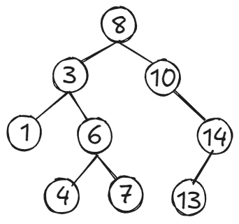

4. Care dintre urmatoarele afirmatii sunt adevarate intr-un arbore splay?
    - Subarborele din stanga si din dreapta radacinii au aceeasi inaltime.
    - Subarborele din stanga si din dreapta fiecarui nod au inaltimi care pot diferi cu cel mult 1 in valoare absoluta.
    - Raspunsurile nu sunt corecte.
5. Care este inaltimea maxima a unui arbore AVL cu 4 noduri? Presupunem ca inaltimea unui arbore cu un nod este 0.
    - 1
    - 2
    - 3
    - Raspunsul corect este altul.
6. Vrem sa reprezentam multimea **S = {1,2,3}** cu un arbore AVL. In cate moduri diferite putem face acest lucru?
    - 1
    - 2
    - 3
    - 8
    - Raspunsul corect este altul.

### <ins>Seria 13 - rezolvari</ins>
1. Inaltimea minima este **2**. Radacina pe nivelul 0, cu 2 copii pe nivelul 1 si inca 2 noduri pe nivelul 2.
2. A doua si a treia varianta. Prima si ultima sunt gresite, deoarece succesorul unui nod este intotdeauna fie o frunza, fie un nod fara copil **stang**.
3. Primele 3 variante. Am atasat rezolvarea:

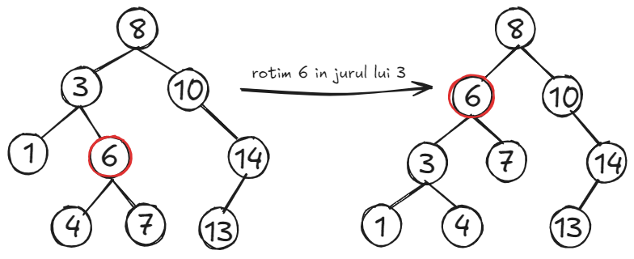

4. TODO
5. Inaltimea maxima este **2**. Radacina se afla pe nivelul 0, cu 2 copii pe nivelul 1 si inca un nod pe nivelul 2.
6. Exista un singur mod: radacina este **2**, fiul stang este **1**, iar fiul drept este **3**.

### <ins>Seria 15</ins>
1. Ce inaltime poate avea un arbore binar echilibrat cu 15 elemente? Schitati un arbore de inaltime minima si unul de inaltime maxima.
2. Intr-un heap binomial facem pe rand urmatoarele operatii: **insert(5)**, **insert(14)**, **insert(1)**, **insert(3)**, **deleteMin**, **insert(7)**, **insert(12)**, **insert(9)**, **insert(6)**, **deleteMin**, **deleteMin**. Desenati heap-ul dupa fiecare operatie.
3. Explicati ce face RMQ si aratati cum functioneaza pe vectorul **{1,235,71,8,11,3,2,9}** si intrebarile **1-7, 5-8**. Ce complexitate au query-urile?
4. Explicati cum putem raspunde cu RMQ in O(1) cu preprocesare O(nlogn) la query-urile **1-7**, respectiv **4-8** in vectorul **{1,2,3,4,0,5,-2,9,-5,11}**.

### <ins>Seria 15 - rezolvari</ins>
1. Inaltimea minima este **3**, iar cea maxima este **4**. Am atasat rezolvarea:

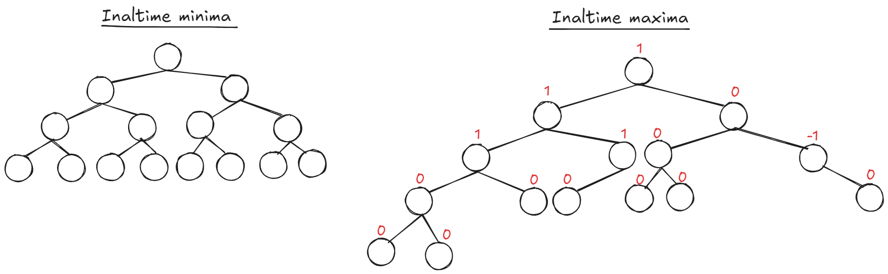

2. Am atasat rezolvarea:

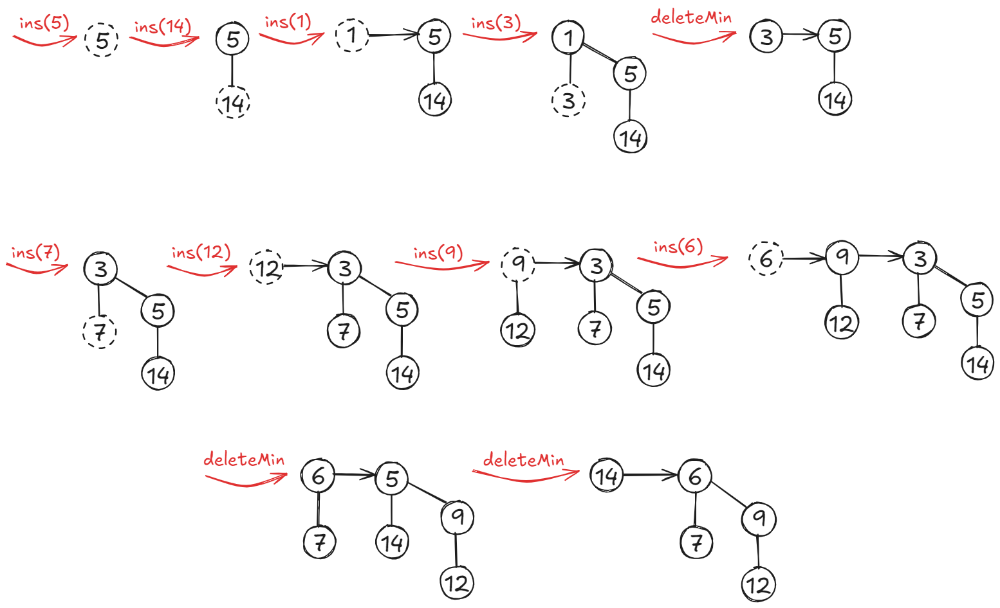

3. TODO
4. TODO

