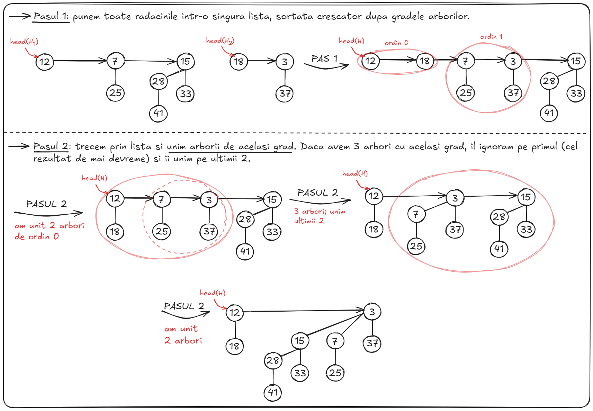

# Table of contents
- [AVL Trees](#1---avl-trees)
- [Splay Trees](#2---splay-trees)
- [RMQ (Range Minimum Queries)](#3---rmq-range-minimum-queries)
- [Binomial Heaps](#4---binomial-heaps)
- [Fibonacci Heaps](#5---fibonacci-heaps)

---

## 1 - AVL Trees 

---

## 2 - Splay Trees 

---

## 3 - RMQ (Range Minimum Queries)

---

## 4 - Binomial Heaps 

### <ins>4.1 - Ce este un Binomial Heap?</ins>
- Un <b>Binomial Heap</b> este o colectie de <b>arbori binomiali</b>, legati intre ei, fiecare arbore respectand proprietatea de <b>min-heap</b> (sau <b>max-heap</b>). Arborii sunt "sortati" in ordine crescatoare, dupa numarul de noduri.
- Radacinile arborilor sunt legate intre ele, ca intr-un <b>Linked List</b>.
- Un arbore binomial are <b>2k</b> noduri => ii putem privi ca fiind niste puteri de 2. Deoarece orice numar are o unica reprezentare in binar, deducem ca orice numar de noduri are o unica reprezentare ca si colectie de arbori binomiali (ca si <b>Binomial Heap</b>).
- Fiecare nod are urmatoarele campuri:
    - <ins><b>key</ins></b>: cheia/valoarea nodului respectiv.
    - <ins><b>parent</ins></b>: un pointer catre parinte.
    - <ins><b>sibling</ins></b>: un pointer catre sibling (radacinile arborilor sunt legate in acest fel; de asemenea, copiii aceluiasi parinte sunt legati intre ei).
    - <ins><b>child</ins></b>: un pointer catre copilul cel mai din stanga.
    - <ins><b>degree</ins></b>: numarul de copii.

### <ins>4.2 - Reuniunea a 2 Binomial Heap-uri</ins>
- <b>Pasul 1</b>: unim toate radacinile arborilor din ambele heap-uri intr-o lista, <b>sortata crescator</b> dupa <b>gradul radacinii</b>.
- <b>Pasul 2</b>: exista posibilitatea de a avea perechi de cate 2 arbori cu acelasi ordin, ceea ce incalca proprietatea de a avea un singur arbore de un anumit ordin. Procedam la fel ca la o adunare in binar: <b>(01)2 + (01)2 = (10)2</b>, adica 2 arbori de ordinul <b>K</b> produc un arbore de ordin <b>K+1</b>. <b>Ce se intampla cand avem 3 arbori?</b> De exemplu - avem 2 arbori de ordinul <b>K</b> care produc un arbore de ordin <b>K+1</b>, dar mai avem si alti 2 arbori de ordin <b>K+1</b>. Idee - lasam in pace arborele pe care il avem ca si "<b>carry</b>" (arborele de ordin <b>K+1</b> obtinut anterior) si unim ceilalti 2 arbori, obtinand astfel un arbore de ordin <b>K+2</b>;  <b>(011)2 + (011)2 = (010)2 + (010)2 + (010)2 = (100)2 + (010)2 = (110)2</b>. Repetam incontinuu acest pas, pana cand ajungem la ultimul nod si nu mai avem nimic de facut.
- <b>Complexitate O(logn)</b>.

### <ins>4.3 - Extragerea minimului</ins>
- <b>Pasul 1</b>: cautam minimul. Simplu - parcurgem lista de radacini, pana cand il gasim. Complexitate? Numarul de biti necesar pentru reprezentarea in binar a unui numar <b>n</b> este <b>[log2n] + 1</b>, la fel ca numarul de arbori binomiali necesar pentru reprezentarea unui numar de noduri <b>n</b> => trecem prin <b>[log2n] + 1</b> radacini => <b>O(logn)</b>.
- <b>Pasul 2</b>: Stergem radacina gasita (atentie la toti pointerii!) si obtinem 2 heap-uri binomiale:
    - <b>H1</b> = heap-ul obtinut daca excludem arborele care contine radacina respectiva.
    - <b>H2</b> = heap-ul obtinut din toti subarborii binomiali ramasi dupa stergerea radacinii (si fara arborii din <b>H1</b>).
- <b>Pasul 3</b>: apelam <b>union(H1,H2)</b>.
- <b>Complexitate O(logn)</b>.

### <ins>4.4 - Decrease key (un nod ia o valoare mai mica)
- <b>Cum functioneaza operatia</b>? Actualizam valoarea unui nod, sa fie mai mica decat valoarea initiala (exemplu practic: daca pe un graf am gasit un drum mai bun intre 2 noduri, vrem sa actualizam distanta).
- <b>Pasul 1</b>: modificam valoarea nodului respectiv.
- <b>Pasul 2</b>: dam swap cu parintele, pana cand este indeplinita din nou proprietatea de <b>min/max-heap</b>.

### <ins>4.5 - Inserarea unui nod</ins>
- <b>Pasul 1</b>: facem un nou heap <b>H'</b>, care sa contina nodul respectiv (un singur arbore binomial de ordin 0).
- <B>Pasul 2</b>: apelam <b>union(H,H')</b>. 
- <b>Complexitate O(logn)</b>: crearea unui heap este <b>O(1)</b> si <b>union</b> este <b>O(logn)</b>.

### <ins>4.6 - Stergerea unui nod</ins>
- <b>Pasul 1</b>: apelam <b>decreaseKey(H,x,-inf)</b>, ca nodul respectiv sa devina radacina arborelui in care se afla si sa fie si radacina de valoare minima in acelasi timp.
- <b>Pasul 2</b>: apelam <b>extractMin(H)</b>, ca sa scoatem nodul.

---

## 5 - Fibonacci Heaps 

---

#### Notes 
- <b>Seria 13</b>: AVL Trees, Splay Trees.
- <b>Seria 14</b>: Range Minimum Queries (RMQ).
- <b>Seria 15</b>: Binomial Heaps, Fibonacci Heaps.