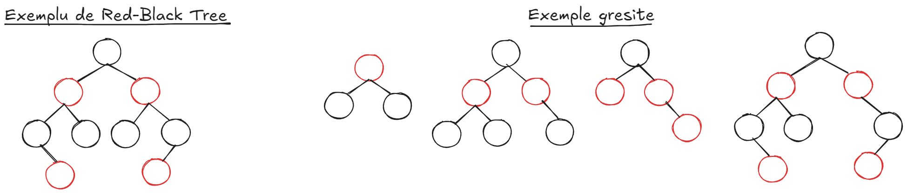
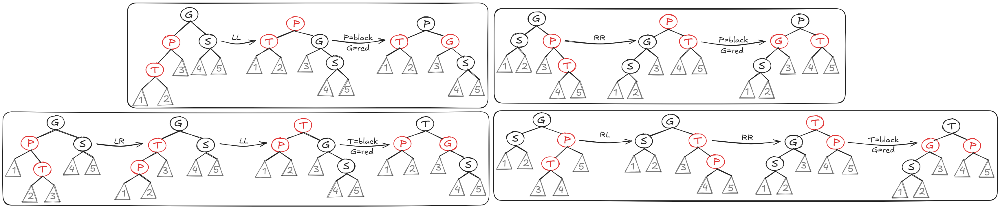
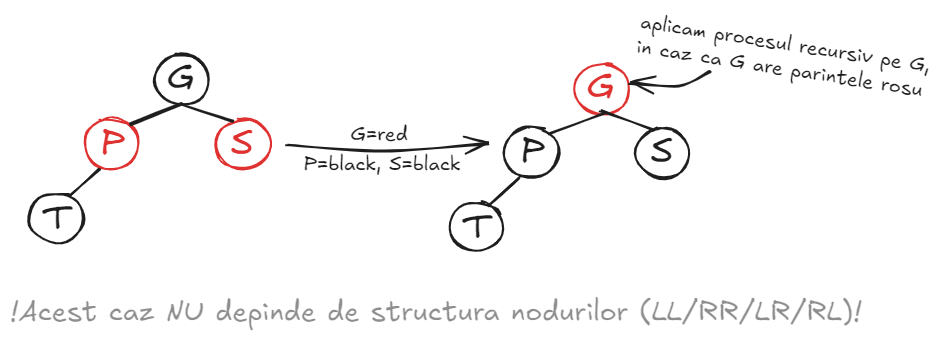
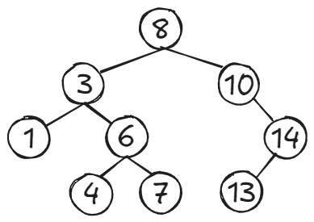

# Table of contents
- [1 - Red-Black Trees](#1---red-black-trees)
- [2 - Interval Trees](#2---interval-trees)
- [3 - Lowest Common Ancestor](#3---lowest-common-ancestor)
- [4 - Exercitii examen](#4---exercitii-examen)
    - [Seria 13](#seria-13)
    - [Seria 13 - rezolvari](#seria-13---rezolvari)
    - [Seria 14](#seria-14)
    - [Seria 14 - rezolvari](#seria-15---rezolvari)
    - [Seria 15](#seria-15)
    - [Seria 15 - rezolvari](#seria-15---rezolvari)

---

## 1 - Red-Black Trees 
### <ins>1.1 - Introducere</ins>
- Un **Red-Black Tree** este un **BST**, in care fiecare nod are o proprietate in plus: **culoarea**, care poate sa fie **red** sau **black**. Exista cateva reguli pentru colorarea nodurilor, care ne asigura ca arborele va ramane mereu "echilibrat", iar operatiile vor fi **O(logn)**.
- Orice nod va avea urmatoarele campuri/atribute/proprietati:
    - **<ins>key</ins>**: cheia nodului.
    - **<ins>val</ins>**: valoarea nodului.
    - **<ins>color</ins>**: culoarea nodului, care poate fi rosu sau negru.
    - **<ins>left</ins>**: copilul stang.
    - **<ins>right</ins>**: copilul drept.
    - **<ins>parent</ins>**: parintele nodului.
- Cum determinam culoarea unui nod?
    - **Radacina** va fi **mereu** colorata cu **negru**.
    - Orice nod **NULL** este colorat cu **negru**.
    - Daca un nod este colorat cu **rosu**, atunci **copiii** sai sunt neaparat colorati cu **negru**.
    - **Black-height**: pentru un nod oarecare, orice drum de la nodul respectiv catre o frunza **NULL** va parcurge acelasi numar de noduri colorate cu negru. Exemplu: daca din nodul **X** putem ajunge in 3 frunze diferite **F1**, **F2** si **F3**, atunci drumurile **X->F1**, **X->F2** si **X->F3** parcurg acelasi numar de noduri colorate cu negru. Aceasta este **proprietatea de echilibru**.
- **Teorema**: un RB-Tree cu **n** noduri are inaltimea maxim **2*log(n+1)**.
- Am atasat o imagine care exemplifica cum ar trebui sa arate un **RB-Tree**:

### <ins>1.2 - Search</ins>
- Este identic cu search-ul de la **BST-uri** (Tutoriat 3) si **AVL Trees** (Tutoriat 4); nu exista nimic de adaugat.
- **Complexitate O(logn)**.

### <ins>1.3 - Insert</ins>
- **Pasul 1**: inseram nodul ca intr-un BST normal.
- **Pasul 2**: notam nodul inserat cu **T**, parintele sau cu **P**, bunicul cu **G** si fratele lui **P** cu **S**. Cand inseram un nod, implicit va fi colorat cu **rosu**, iar acest lucru ar putea afecta structura arborelui. Identificam cazul si actionam corespunzator:
    - **Cazul 1**: nodul **T** este radacina => il recoloram cu **negru**.
    - **Cazul 2**: nodul **P** este colorat cu **negru** => proprietatile nu sunt incalcate.
    - **Cazul 3**: nodul **P** este colorat cu **rosu**. Exista cateva subcazuri:
        - **Cazul 3.1**: nodul **S** este colorat cu **negru** sau este **NULL**. Aplcam rotatii pe nodurile **G-P-T** in functie de caz (**LL/RR/LR/RL**); noua radacina a subarborelui o coloram cu **negru**, iar cei 2 copii vor fi colorati cu **rosu**.
        - **Cazul 3.2**: nodul **S** este colorat cu **rosu**. Coloram nodurile **P** si **S** cu negru, iar pe **G** cu **rosu**. Verificam, din nou, cazurile pe **G** in mod recursiv (deoarece parintele lui **G** ar putea fi un nod **rosu**).
    

---

### <ins>1.4 - Delete</ins>
- **Pasul 1**: stergem nodul ca intr-un BST normal.
- **Pasul 2**: notam nodul sters cu **T**, fratele sau cu **S** si parintele sau cu **P** (**OBSERVATIE**: nodul sters mereu o sa fie o frunza sau un nod cu un copil, datorita modului in care functioneaza stergerea la BST-uri). Introducem o noua notiune de **double-black (DB)**: daca am sters un nod colorat cu **negru**, se modifica **black-height-ul** arborelui si trebuie sa "plimbam" culoarea stearsa prin arbore, pana ii gasim o noua pozitie. Ca sa scapam de **DB** si sa reparam proprietatile, exista urmatoarele cazuri:
    - **Cazul 1**: nodul **T** este o **frunza rosie** => nu facem nimic, deoarece nu sunt incalcate proprietati.
    - **Cazul 2**: nodul **T** este colorat cu **rosu** si are un singur fiu => nu facem nimic, deoarece nu sunt incalcate proprietati.
    - **Cazul 3**: nodul **T** este colorat cu **negru**; astfel, devine **DB**. Exista mai multe subcazuri:
        - **Cazul 3.1**: nodul **DB** este radacina => se anuleaza **DB-ul**.
        - **Cazul 3.2**: nodul **S** este colorat cu **negru**. Exista mai multe subcazuri:
            - **Cazul 3.2.1**: copiii lui **S** sunt **NULL** sau colorati cu **negru** => **S** devine **rosu**; daca **P** este rosu, atunci va fi colorat cu **negru**; altfel,  **P** devine **DB** si apelam recursiv procesul pentru **P**.
            - **Cazul 3.2.2**: unul din copiii lui **S** este colorat cu **negru** (sau este **NULL**), iar celalalt este colorat cu **rosu**. Notam copilul rosu cu **C**. Exista 2 subcazuri:
                - **Cazul 3.2.2.1**: copilul mai apropiat de **DB** este **C** => dam swap la culorile dintre **S** si **C**. Aplicam o rotatie, ca **C** sa devina radacina subarborelui respectiv (in locul lui **S**). Apoi, aplicam **cazul 3.2.2.2** (cazul urmator).
                - **Cazul 3.2.2.2**: copilul mai indepartat de **DB** este **C** => dam swap la culorile dintre **P** si **S**. Aplicam o rotatie, ca **S** sa devina radacina (in locul lui **P**). Lasam nodul **DB** colorat cu **negru** si anulam **DB-ul**. Coloram cu **negru** copilul lui **S**.
        - **Cazul 3.3**: nodul **S** este colorat cu **rosu**.

--- 

## 2 - Interval Trees 

---

## 3 - Lowest Common Ancestor 

---

## 4 - Exercitii examen

### <ins>Seria 13</ins>
1. Care noduri sunt colorate in mod sigur in negru in arborele de mai jos, daca stim ca trebuie sa fie un arbore red-black? 
    - 1
    - 6
    - 8
    - 14

2. Vrem sa reprezentam multimea **S = {1,3,5}** cu un red-black tree. In cate moduri putem face acest lucru? Doi arbori pot difera fie prin forma, fie prin culoare.
    - 1
    - 2
    - 3
    - 8
    - Raspunsul corect este altul.

### <ins>Seria 13 - rezolvari</ins>

### <ins>Seria 14</ins>

### <ins>Seria 14 - rezolvari</ins>

### <ins>Seria 15</ins>

### <ins>Seria 15 - rezolvari</ins>

---

#### Notes 
- **Seria 13**: Red-Black Trees **(R.I.P.)**.
- **Seria 14**: RMQ (Range Minimum Queries, din nou).
- **Seria 15**: Interval Trees (arbori de intervale), LCA (Lowest Common Ancestor), RMQ (Range Minimum Queries).
    