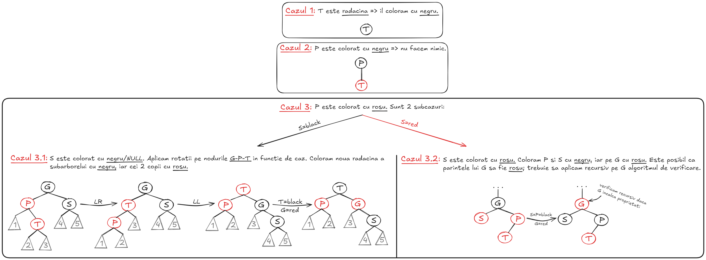
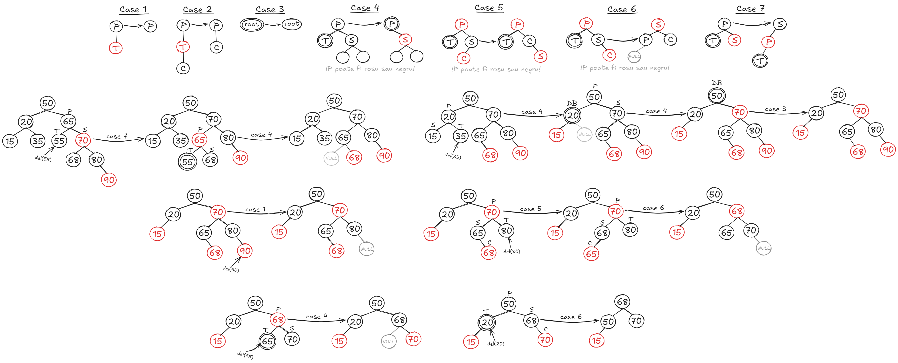
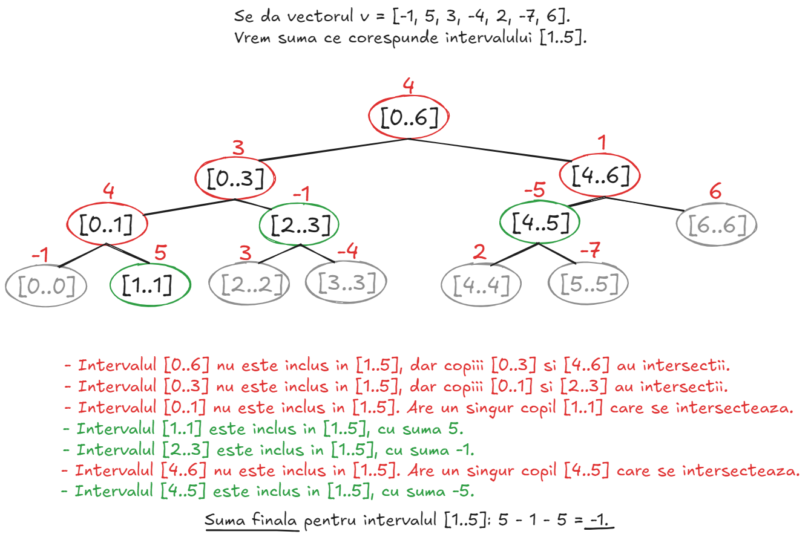
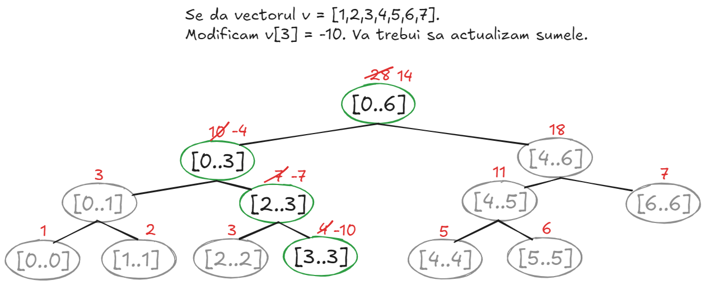
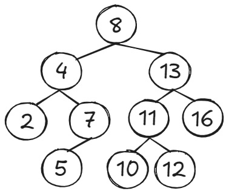
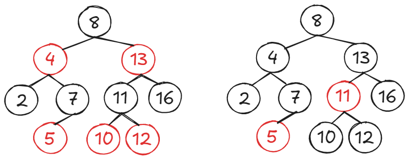
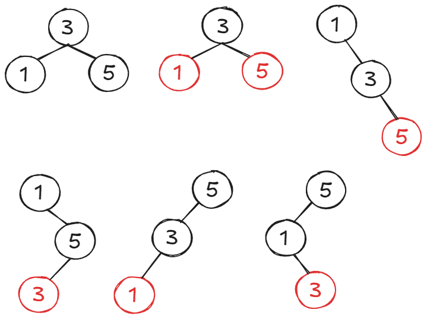

# Table of contents
- [Table of contents](#table-of-contents)
  - [1 - Red-Black Trees](#1---red-black-trees)
    - [1.1 - Introducere](#11---introducere)
    - [1.2 - Search](#12---search)
    - [1.3 - Insert](#13---insert)
    - [1.4 - Delete](#14---delete)
  - [2 - Segment Trees](#2---segment-trees)
    - [2.1 - Introducere](#21---introducere)
    - [2.2 - Exemplu de Sum Query](#22---exemplu-de-sum-query)
    - [2.3 - Exemplu de Update Query](#23---exemplu-de-update-query)
    - [2.4 - Implementare](#24---implementare)
  - [3 - Lowest Ancestor \& Lowest Common Ancestor](#3---lowest-ancestor--lowest-common-ancestor)
    - [3.1 - Lowest Ancestor](#31---lowest-ancestor)
    - [3.2 - Lowest Common Ancestor](#32---lowest-common-ancestor)
  - [4 - Exercitii examen](#4---exercitii-examen)
    - [Seria 13](#seria-13)
    - [Seria 13 - rezolvari](#seria-13---rezolvari)

---

## <ins>1 - Red-Black Trees</ins>
### <ins>1.1 - Introducere</ins>
- Un **Red-Black Tree** este un **BST**, in care fiecare nod are o proprietate in 
plus: **culoarea**, care poate sa fie **red** sau **black**. Exista cateva reguli 
pentru colorarea nodurilor, ce ne asigura ca arborele va ramane mereu "echilibrat", 
iar operatiile vor fi **O(logn)**.
- Orice nod va avea urmatoarele campuri/atribute/proprietati:
    - **<ins>key</ins>**: cheia nodului.
    - **<ins>val</ins>**: valoarea nodului.
    - **<ins>color</ins>**: culoarea nodului, care poate fi **rosu/negru**.
    - **<ins>left</ins>**: copilul stang.
    - **<ins>right</ins>**: copilul drept.
    - **<ins>parent</ins>**: parintele nodului.
- Cum determinam culoarea unui nod?
    - **Radacina** va fi **mereu** colorata cu **negru**.
    - Orice nod **NULL** este colorat cu **negru**.
    - Daca un nod este colorat cu **rosu**, atunci copiii sai sunt neaparat 
    colorati cu **negru**.
    - **Black-height**: pentru un nod oarecare, orice drum de la nodul respectiv catre 
    o frunza **NULL** va parcurge acelasi numar de noduri colorate cu negru. Aceasta 
    este **proprietatea de echilibrare**. **ATENTIE**: este vorba de drumul catre
    nodurile **NULL**, nu catre nodurile care sunt doar frunze.
- **Teorema**: un RB-Tree cu **n** noduri are inaltimea maxim **2*log(n+1)**.


### <ins>1.2 - Search</ins>
- Este identic cu search-ul de la **BST-uri** (Tutoriat 3) si **AVL Trees** (Tutoriat 4); nu exista nimic de adaugat.
- **Complexitate O(logn)**.

### <ins>1.3 - Insert</ins>
- **Pasul 1**: inseram nodul ca intr-un BST normal.
- **Pasul 2**: notam nodul inserat cu **T**, parintele sau cu **P**, bunicul cu **G** si fratele lui **P** cu **S**. Cand inseram un nod, implicit va fi colorat cu **rosu**, iar acest lucru ar putea afecta structura arborelui. Identificam cazul si actionam corespunzator:
    - **Cazul 1**: nodul **T** este radacina => il recoloram cu **negru**.
    - **Cazul 2**: nodul **P** este colorat cu **negru** => proprietatile nu sunt incalcate.
    - **Cazul 3**: nodul **P** este colorat cu **rosu**. Exista doua subcazuri:
        - **Cazul 3.1**: nodul **S** este colorat cu **negru** sau este **NULL**. Aplicam rotatii pe nodurile **G-P-T** in functie de caz (**LL/RR/LR/RL**); noua radacina a subarborelui o coloram cu **negru**, iar cei 2 copii vor fi colorati cu **rosu**.
        - **Cazul 3.2**: nodul **S** este colorat cu **rosu**. Coloram nodurile **P** si **S** cu negru, iar pe **G** cu **rosu**. Verificam, din nou, cazurile pe **G** in mod recursiv (deoarece parintele lui **G** ar putea fi un nod **rosu**).



---

### <ins>1.4 - Delete</ins>
- **Pasul 1**: stergem nodul ca intr-un BST normal.
- **Pasul 2**: notam nodul sters cu **T**, fratele sau cu **S** si parintele sau cu 
**P** (**OBSERVATIE**: nodul sters mereu o sa fie o frunza sau un nod cu un copil, 
datorita modului in care functioneaza stergerea la BST-uri). Introducem o noua notiune 
de **double-black (DB)**: daca am sters un nod colorat cu **negru**, se modifica 
**black-height-ul** arborelui si trebuie sa "plimbam" culoarea stearsa prin arbore, 
pana ii gasim o noua pozitie. Ca sa scapam de **DB** si sa reparam proprietatile, 
exista urmatoarele cazuri:
    - **Cazul 1**: nodul **T** este radacina => ne oprim. Chiar daca este colorat cu 
    **negru**, nu se intampla nimic daca il stergem. De asemenea, de tinut minte 
    pentru urmatoarele cazuri ca **DB-ul** se anuleaza in radacina.
    - **Cazul 2**: nodul **T** este o **frunza rosie** => nu facem nimic, deoarece nu 
    sunt incalcate proprietati.
    - **Cazul 3**: nodul **T** este colorat cu **negru** si are un singur fiu colorat 
    cu **rosu** => fiul lui **T** va fi colorat cu **negru** (**DB-ul** se duce in fiu).
    - **Cazul 4**: nodul **T** este colorat cu **negru**, nodul **S** este colorat cu 
    **negru**, iar copiii lui **S** sunt **NULL** sau colorati cu **negru**. Il coloram 
    pe **S** cu **rosu**; daca **P** este **rosu**, il coloram cu **negru**, si daca 
    este deja colorat cu **negru** il facem **DB** si aplicam recursiv verificarea pe el.
    - **Cazul 5**: nodul **T** este colorat cu **negru**, nodul **S** este colorat cu 
    **negru**, iar copilul lui **S** mai apropiat de **T** este colorat cu **rosu** 
    (**observatie**: mai intai verificam copilul indepartat; daca acesta este colorat 
    cu **rosu**, ignoram culoarea celui apropiat si devine **cazul 7**). Notam copilul 
    respectiv cu **C**. Dam swap intre culorile lui **S** si **C** si aplicam o 
    rotatie ca sa il tragem pe **S** mai departe de **T** (adica spre celalalt copil - 
    fratele lui **C**). In final, aplicam **cazul 7**.
    - **Cazul 6**: nodul **T** este colorat cu **negru**, nodul **S** este colorat cu 
    **negru**, iar copilul lui **S** mai indepartat de **T** este colorat cu **rosu**. 
    Notam copilul respectiv cu **C**. Dam swap intre culorile lui **S** si **P**, il 
    coloram pe **C** cu **negru** si aplicam o rotatie ca sa il tragem pe **P** in 
    directia lui **T**. 
    - **Cazul 7**: nodul **T** este colorat cu **negru**, iar nodul **S** este colorat 
    cu **rosu**. Nodul **T** devine **DB**. Dam swap la culorile lui **P** si **S**, 
    si aplicam o rotatie ca sa il tragem pe **P** in directia lui **T**. Aplicam din 
    nou recursiv verificarea de caz pe **T**, deoarece inca este **DB**.
- **Observatie**: nu exista cazul in care nodul **T** este colorat cu **rosu** si are
un singur fiu, deoarece ar fi gresit **black-heightul** arborelui.



--- 

## <ins>2 - Segment Trees</ins>
### <ins>2.1 - Introducere</ins>
- Un **Segment Tree** imparte un **array** in mai multe **subintervale**, reprezentate intr-un **arbore binar complet**. Acest lucru ne permite sa raspundem la **range query-uri** in mod eficient (suma unor elemente consecutive, elementul minim dintr-un range specificat, etc.). De asemenea, avem posibilitatea de a modifica cate un element (**array[i] = x**), sau un interval intreg (putem modifica fiecare element din intervalul **[l..r]**).
- Fiind un **arbore binar complet**, fiecare nivel **k** are maxim **2<sup>k</sup>** noduri, iar inaltimea arborelui este **log(n)**.
- Nodurile reprezinta intervale; radacina contine tot vectorul - intervalul de baza **[0, n-1]**, iar pe masura ce inaintam in noduri, obtinem subintervale mai mici. Frunzele contin intervale ce acopera un singur element.
- Un nod oarecare dintr-un **Segment Tree** va avea urmatoarele campuri/atribute/proprietati:
    - Intervalul pe care il stocheaza: **[left, right]**.
    - Copilul stang: **[left, (left + right) / 2]**.
    - Copilul drept: **[((left + right) / 2) + 1, right]**.
    - O valoare specifica intervalului. De exemplu, intr-un **Sum Segment Tree**, stocam suma intervalelor.
- Complexitatea de spatiu este liniara: pentru a stoca un array cu **N** elemente, avem nevoie de **4*N** noduri in arbore.
- Constructia unui **Segment Tree** este un proces recursiv: pentru a obtine valoarea asociata intervalului **[left, right]**, avem nevoie de cele 2 subintervale asociate (valorile copiilor nodului respectiv). Totusi, inainte de a construi un **Segment Tree**, trebuie sa avem in vedere 2 lucruri:
    - Valoarea care va fi stocata la fiecare interval/nod: aceasta ar putea fi minimul intervalului, sau suma intervalului, etc.
    - Operatia de **merge**, care combina valorile a 2 intervale. De exemplu, intr-un **Sum Segment Tree**, ca sa obtinem suma unui interval, trebuie sa adunam sumele celor 2 copii ai sai.

### <ins>2.2 - Exemplu de Sum Query</ins>
- Sa presupunem ca ni se dau 2 indecsi **left** si **right**; sarcina este sa obtinem suma corespunzatoare intervalului **[left, right]** in complexitate **O(logn)**.
- Cum gestionam situatia cand arborele nu contine intervalul respectiv? Sa presupunem ca ne aflam la nodul **[a, b]** si avem nevoie de suma pentru **[left, right]**:
    - **Cazul 1**: intervalul **[a, b]** este inclus in **[left, right]** => returnam valoarea asociata lui **[a, b]**.
    - **Cazul 2**: verificam care nod dintre copiii lui **[a, b]** se intersecteaza cu **[left, right]** (ar putea fi ambii copii); pentru nodurile care au o intersectie, apelam recursiv procesul.



### <ins>2.3 - Exemplu de Update Query</ins>
- Sa presupunem ca vrem sa schimbam un element din vector **v[i] = x**. Aceasta modificare ar putea afecta anumite query-uri; de exemplu, exista o sansa ridicata sa se schimbe suma pentru orice interval care contine index-ul **i**.
- Strategia este sa gasim si sa actualizam valoarea fiecarui interval care contine index-ul respectiv.
- **Algoritmul de cautare**: incepem din radacina. Evident, aceasta contine index-ul respectiv (deci va trebui sa actualizam valoarea radacinii). La fiecare pas, doar unul din copii contine index-ul (subintervalul stang sau subintervalul drept); identificam copilul potrivit si apelam recursiv procesul. Noua valoare a unui nod depinde de valorile copiilor => va trebui sa mergem in recursivitate pana cand ne lovim de cazul de baza, iar apoi urcam.



### <ins>2.4 - Implementare</ins>
```cpp
template <typename T> class SegmentTree {
private:
  vector<T> tree;
public:
  SegmentTree(int n, int val = 0) {
      tree.resize(4 * n + 4, val);
  }

  void update(int node, int l, int r, int pos, T val) {
      if (l == r) {
          tree[node] = val;
          return;
      }
      int mid = (l + r) / 2;
      if (pos <= mid) {
          update(2 * node, l, mid, pos, val);
      } else {
          update(2 * node + 1, mid + 1, r, pos, val);
      }
      tree[node] = tree[2 * node] + tree[2 * node + 1];
  }

  T query(int node, int l, int r, int st, int fn) {
      if (st > fn) return 0;
      if (st <= l and r <= fn) {
          return tree[node];
      }
      int mid = (l + r) / 2;
      T ans1 = 0, ans2 = 0; // instead of 0 add the identity element of the operation
      if (st <= mid) {
          ans1 = query(2 * node, l, mid, st, fn);
      }
      if (fn > mid) {
          ans2 = query(2 * node + 1, mid + 1, r, st, fn);
      }
      return ans1 + ans2;
  }
};
```

---

## <ins>3 - Lowest Ancestor & Lowest Common Ancestor</ins>

### <ins>3.1 - Lowest Ancestor</ins>
- Reprezinta o problema de algoritmica pe arbori.
- **Cerinta**: se da un nod intr-un arbore si un numar intreg **k**. Afisati stramosul de nivel **K** al nodului dat. Stramosul de nivel **0** este nodul respectiv, cel de nivel **1** este parintele, cel de nivel **2** este bunicul, etc.
- **Solutie 1**: cel mai evident mod de a rezolva problema este de a parcurge mereu arborele, cautand stramosul respectiv. Complexitatea nu este optima, in cel mai rau caz fiind **O(h)**; de asemenea, la un moment dat, parcurgerile se vor repeta incontinuu.
- **Solutie 2**: putem raspunde in timp **O(1)**, daca pentru fiecare nod **i** stocam stramosul de nivel **j** in **D[i][j] = t**. Avand **n** noduri si inaltimea arborelui **h**, pentru fiecare nod trebuie sa retinem **h** stramosi => matricea va ocupa spatiu **O(n*h)**.
- **Solutie 3**: ne folosim de **sqrt decomposition**. Calculam **pas=sqrt(n)**, iar pentru fiecare query de tipul **(nod=x, nivel=k)**, verificam de cat de multe ori intra **pas** in **k**. Daca **k=5** si **pas=3**, atunci stramosul de ordin **k** pentru **x** ar fi query-ul **parent[parent[jump[x]]]**, deoarece sarim peste **pas** noduri cu **jump** si apoi mai parcurgem **2** noduri cu **parent**. Alt exemplu - pentru **(nod=x, k=3, pas=4**), ar trebui sa returnam **parent[parent[parent[x]]]**, deoarece **pas** nu intra in **k**. Preprocesarea datelor ia timp **O(n)**, folosim spatiu **O(n)**, iar query-urile au **O(sqrt(n))**.
- **Solutie 4**: ne folosim de puteri de **2**. Pentru fiecare nod, retinem stramosii de nivel **1, 2, 4, 8, 16...**. Ideea este la fel ca la solutia anterioara, dar in loc sa avem un pas fixat, ne folosim de cea mai mare putere de **2** care intra in **k**. Preprocesarea datelor ia timp **O(nlogn)**, spatiul folosit este **O(nlogn)** (care poate fi redus la **O(n)** cu talent), iar query-urile au timp **O(logn)**.

### <ins>3.2 - Lowest Common Ancestor</ins>
- Reprezinta o problema de algoritmica pe arbori.
- **Cerinta**: se dau **2** noduri distincte intr-un arbore. Sa se gaseasca cel mai apropiat stramos comun.
- **Idee**: problema de **LCA** poate fi tradusa/modificata sa devina o problema de **RMQ**.

```cpp
class LCA {
   private:
    vector<vector<int>> tree, parent;
    vector<int> depth;
    int sz, maxPw;

   public:
    LCA(vector<vector<int>> graph, int n, int root = 1) {
        this->sz = n;
        this->tree = graph;
        this->maxPw = log2(2 * n);
        this->depth.resize(n + 1);
        this->parent.assign(n + 1, vector<int>(maxPw + 1));
        precalcAncestors(root, 0);
    }

    void precalcAncestors(int node, int par) {
        parent[node][0] = par;
        depth[node] = depth[par] + 1;
        for (int i = 1; i <= maxPw; ++i) {
            parent[node][i] = parent[parent[node][i - 1]][i - 1];
        }
        for (int dest : tree[node]) {
            if (dest != par) {
                precalcAncestors(dest, node);
            }
        }
    }

    int getLCA(int a, int b) {
        if (depth[a] > depth[b]) {
            swap(a, b);
        }
        for (int i = maxPw; i >= 0; --i) {
            if (depth[parent[b][i]] >= depth[a]) {
                b = parent[b][i];
            }
        }
        if (a == b) {
            return a;
        }
        for (int i = maxPw; i >= 0; --i) {
            if (parent[a][i] != parent[b][i]) {
                a = parent[a][i];
                b = parent[b][i];
            }
        }
        return parent[a][0];
    }

    int getDist(int a, int b) {
        return depth[a] + depth[b] - 2 * depth[getLCA(a, b)];
    }
};
```

---

## <ins>4 - Exercitii examen</ins>

### <ins>Seria 13</ins>
1. Care noduri sunt colorate in mod sigur in negru in arborele de mai jos, daca stim 
ca trebuie sa fie un arbore red-black? 



2. Vrem sa reprezentam multimea **S = {1,3,5}** cu un red-black tree. In cate moduri 
putem face acest lucru? Doi arbori pot difera fie prin forma, fie prin culoare.

### <ins>Seria 13 - rezolvari</ins>
1. Nodul **8** (deoarece este radacina) si nodurile **2, 7, 16**. Am atasat rezolvarea:



2. Sunt **2** moduri. Am atasat rezolvarea:



    