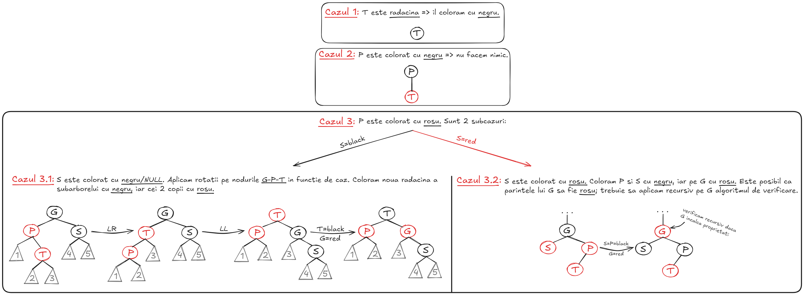
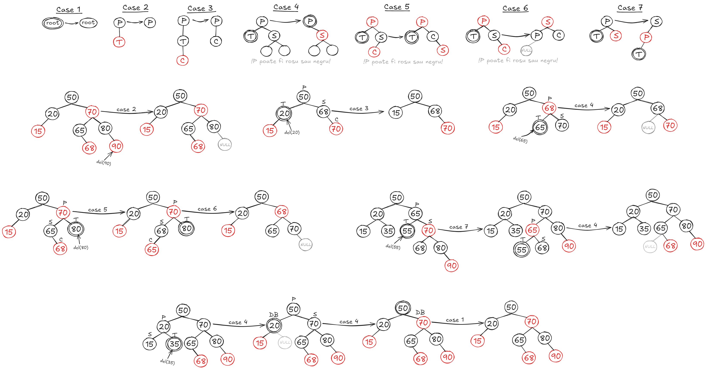
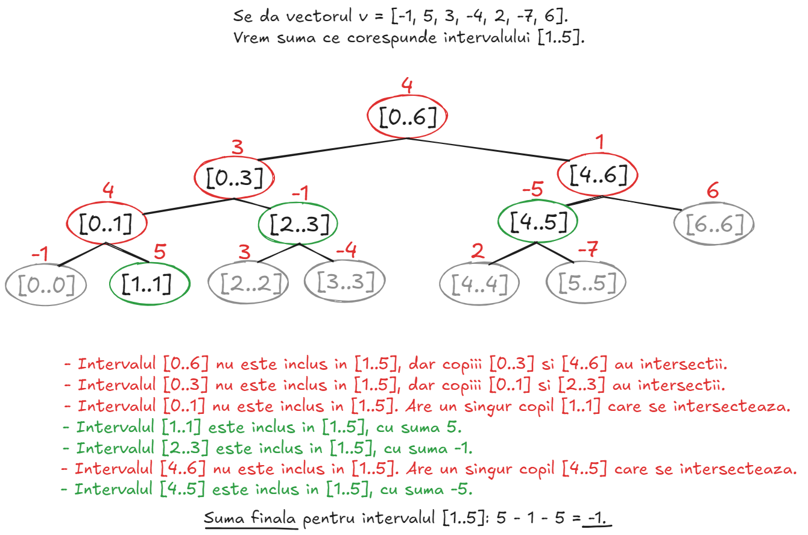

# Table of contents
- [Table of contents](#table-of-contents)
  - [1 - Red-Black Trees](#1---red-black-trees)
    - [1.1 - Introducere](#11---introducere)
    - [1.2 - Search](#12---search)
    - [1.3 - Insert](#13---insert)
    - [1.4 - Delete](#14---delete)
  - [2 - Segment Trees](#2---segment-trees)
    - [2.1 - Introducere](#21---introducere)
    - [2.2 - Exemplu de Sum Query](#22---exemplu-de-sum-query)
    - [2.3 - Exemplu de Update Query](#23---exemplu-de-update-query)
    - [2.4 - Implementare](#24---implementare)
  - [3 - Lowest Common Ancestor](#3---lowest-common-ancestor)
  - [4 - Exercitii examen](#4---exercitii-examen)
    - [Seria 13](#seria-13)
    - [Seria 13 - rezolvari](#seria-13---rezolvari)
    - [Seria 14](#seria-14)
    - [Seria 14 - rezolvari](#seria-14---rezolvari)
    - [Seria 15](#seria-15)
    - [Seria 15 - rezolvari](#seria-15---rezolvari)
      - [Notes](#notes)

---

## <ins>1 - Red-Black Trees</ins>
### <ins>1.1 - Introducere</ins>
- Un **Red-Black Tree** este un **BST**, in care fiecare nod are o proprietate in plus: **culoarea**, care poate sa fie **red** sau **black**. Exista cateva reguli pentru colorarea nodurilor, care ne asigura ca arborele va ramane mereu "echilibrat", iar operatiile vor fi **O(logn)**.
- Orice nod va avea urmatoarele campuri/atribute/proprietati:
    - **<ins>key</ins>**: cheia nodului.
    - **<ins>val</ins>**: valoarea nodului.
    - **<ins>color</ins>**: culoarea nodului, care poate fi rosu sau negru.
    - **<ins>left</ins>**: copilul stang.
    - **<ins>right</ins>**: copilul drept.
    - **<ins>parent</ins>**: parintele nodului.
- Cum determinam culoarea unui nod?
    - **Radacina** va fi **mereu** colorata cu **negru**.
    - Orice nod **NULL** este colorat cu **negru**.
    - Daca un nod este colorat cu **rosu**, atunci **copiii** sai sunt neaparat colorati cu **negru**.
    - **Black-height**: pentru un nod oarecare, orice drum de la nodul respectiv catre o frunza **NULL** va parcurge acelasi numar de noduri colorate cu negru. Exemplu: daca din nodul **X** putem ajunge in 3 frunze diferite **F1**, **F2** si **F3**, atunci drumurile **X->F1**, **X->F2** si **X->F3** parcurg acelasi numar de noduri colorate cu negru. Aceasta este **proprietatea de echilibru**.
- **Teorema**: un RB-Tree cu **n** noduri are inaltimea maxim **2*log(n+1)**.
- Am atasat o imagine care exemplifica cum ar trebui sa arate un **RB-Tree**:


### <ins>1.2 - Search</ins>
- Este identic cu search-ul de la **BST-uri** (Tutoriat 3) si **AVL Trees** (Tutoriat 4); nu exista nimic de adaugat.
- **Complexitate O(logn)**.

### <ins>1.3 - Insert</ins>
- **Pasul 1**: inseram nodul ca intr-un BST normal.
- **Pasul 2**: notam nodul inserat cu **T**, parintele sau cu **P**, bunicul cu **G** si fratele lui **P** cu **S**. Cand inseram un nod, implicit va fi colorat cu **rosu**, iar acest lucru ar putea afecta structura arborelui. Identificam cazul si actionam corespunzator:
    - **Cazul 1**: nodul **T** este radacina => il recoloram cu **negru**.
    - **Cazul 2**: nodul **P** este colorat cu **negru** => proprietatile nu sunt incalcate.
    - **Cazul 3**: nodul **P** este colorat cu **rosu**. Exista cateva subcazuri:
        - **Cazul 3.1**: nodul **S** este colorat cu **negru** sau este **NULL**. Aplicam rotatii pe nodurile **G-P-T** in functie de caz (**LL/RR/LR/RL**); noua radacina a subarborelui o coloram cu **negru**, iar cei 2 copii vor fi colorati cu **rosu**.
        - **Cazul 3.2**: nodul **S** este colorat cu **rosu**. Coloram nodurile **P** si **S** cu negru, iar pe **G** cu **rosu**. Verificam, din nou, cazurile pe **G** in mod recursiv (deoarece parintele lui **G** ar putea fi un nod **rosu**).



---

### <ins>1.4 - Delete</ins>
- **Pasul 1**: stergem nodul ca intr-un BST normal.
- **Pasul 2**: notam nodul sters cu **T**, fratele sau cu **S** si parintele sau cu **P** (**OBSERVATIE**: nodul sters mereu o sa fie o frunza sau un nod cu un copil, datorita modului in care functioneaza stergerea la BST-uri). Introducem o noua notiune de **double-black (DB)**: daca am sters un nod colorat cu **negru**, se modifica **black-height-ul** arborelui si trebuie sa "plimbam" culoarea stearsa prin arbore, pana ii gasim o noua pozitie. Ca sa scapam de **DB** si sa reparam proprietatile, exista urmatoarele cazuri:
    - **Cazul 1**: nodul **T** este o **frunza rosie** => nu facem nimic, deoarece nu sunt incalcate proprietati.
    - **Cazul 2**: nodul **T** este colorat cu **rosu** si are un singur fiu => nu facem nimic, deoarece nu sunt incalcate proprietati.
    - **Cazul 3**: nodul **T** este radacina => ne oprim. Chiar daca este colorat cu **negru**, nu se intampla nimic daca il stergem. De asemenea, **DB-ul** se anuleaza in radacina (de tinut minte pentru urmatoarele cazuri). 
    - **Cazul 4**: nodul **T** este colorat cu **negru**, nodul **S** este colorat cu **negru**, iar copiii lui **S** sunt **NULL** sau colorati cu **negru**. Il coloram pe **S** cu **rosu**; daca **P** este **rosu**, il coloram cu **negru**, si daca este deja colorat cu **negru** il facem **DB** si aplicam recursiv verificarea pe el.
    - **Cazul 5**: nodul **T** este colorat cu **negru**, nodul **S** este colorat cu **negru**, iar copilul lui **S** mai apropiat de **T** este colorat cu **rosu**. Notam copilul respectiv cu **C**. Dam swap intre culorile lui **S** si **C** si aplicam o rotatie ca sa il tragem pe **S** mai departe de **T** (adica spre celalalt copil - fratele lui **C**). In final, aplicam **cazul 6**.
    - **Cazul 6**: nodul **T** este colorat cu **negru**, nodul **S** este colorat cu **negru**, iar copilul lui **S** mai indepartat de **T** este colorat cu **rosu**. Notam copilul respectiv cu **C**. Dam swap intre culorile lui **S** si **P**, il coloram pe **C** cu **negru** si aplicam o rotatie ca sa il tragem pe **P** in directia lui **T**. 
    - **Cazul 7**: nodul **T** este colorat cu **negru**, iar nodul **S** este colorat cu **rosu**. Nodul **T** devine **DB**. Dam swap la culorile lui **P** si **S**, si aplicam o rotatie ca sa il tragem pe **P** in directia lui **T**. Aplicam din nou recursiv verificarea de caz pe **T**, deoarece inca este **DB**.
- **Observatie**: cand verificam **cazurile 5 si 6**, mai intai verificam copilul indepartat; daca este colorat cu **rosu**, avem **cazul 6**. Altfel, il verificam pe cel apropiat.



--- 

## <ins>2 - Segment Trees</ins>
### <ins>2.1 - Introducere</ins>
- Un **Segment Tree** imparte un **array** in mai multe **subintervale**, reprezentate intr-un **arbore binar complet**. Acest lucru ne permite sa raspundem la **range query-uri** in mod eficient (suma unor elemente consecutive, elementul minim dintr-un range specificat, etc.). De asemenea, avem posibilitatea de a modifica cate un element (**array[i] = x**), sau un interval intreg (putem modifica fiecare element din intervalul **[l..r]**).
- Fiind un **arbore binar complet**, fiecare nivel **k** are maxim **2<sup>k</sup>** noduri, iar inaltimea arborelui este **log(n)**.
- Nodurile reprezinta intervale; radacina contine tot vectorul - intervalul de baza **[0, n-1]**, iar pe masura ce inaintam in noduri, obtinem subintervale mai mici. Frunzele contin intervale ce acopera un singur element.
- Un nod oarecare dintr-un **Segment Tree** va avea urmatoarele campuri/atribute/proprietati:
    - Intervalul pe care il stocheaza: **[left, right]**.
    - Copilul stang: **[left, (left + right) / 2]**.
    - Copilul drept: **[((left + right) / 2) + 1, right]**.
    - O valoare specifica intervalului. De exemplu, intr-un **Sum Segment Tree**, stocam suma intervalelor.
- Complexitatea de spatiu este liniara: pentru a stoca un array cu **N** elemente, avem nevoie de **4*N** noduri in arbore.
- Constructia unui **Segment Tree** este un proces recursiv: pentru a obtine valoarea asociata intervalului **[left, right]**, avem nevoie de cele 2 subintervale asociate (valorile copiilor nodului respectiv). Totusi, inainte de a construi un **Segment Tree**, trebuie sa avem in vedere 2 lucruri:
    - Valoarea care va fi stocata la fiecare interval/nod: aceasta ar putea fi minimul intervalului, sau suma intervalului, etc.
    - Operatia de **merge**, care combina valorile a 2 intervale. De exemplu, intr-un **Sum Segment Tree**, ca sa obtinem suma unui interval, trebuie sa adunam sumele celor 2 copii ai sai.

### <ins>2.2 - Exemplu de Sum Query</ins>
- Sa presupunem ca ni se dau 2 indecsi **left** si **right**; sarcina este sa obtinem suma corespunzatoare intervalului **[left, right]** in complexitate **O(logn)**.
- Cum gestionam situatia cand arborele nu contine intervalul respectiv? Sa presupunem ca ne aflam la nodul **[a, b]** si avem nevoie de suma pentru **[left, right]**:
    - **Cazul 1**: intervalul **[a, b]** este inclus in **[left, right]** => returnam valoarea asociata lui **[a, b]**.
    - **Cazul 2**: verificam care nod dintre copiii lui **[a, b]** se intersecteaza cu **[left, right]** (ar putea fi ambii copii); pentru nodurile care au o intersectie, apelam recursiv procesul.



### <ins>2.3 - Exemplu de Update Query</ins>
- Sa presupunem ca vrem sa schimbam un element din vector **v[i] = x**. Aceasta modificare ar putea afecta anumite query-uri; de exemplu, exista o sansa ridicata sa se schimbe suma pentru orice interval care contine index-ul **i**.
- Strategia este sa gasim si sa actualizam valoarea fiecarui interval care contine index-ul respectiv.
- **Algoritmul de cautare**: incepem din radacina. Evident, aceasta contine index-ul respectiv (deci va trebui sa actualizam valoarea radacinii). La fiecare pas, doar unul din copii contine index-ul (subintervalul stang sau subintervalul drept); identificam copilul potrivit si apelam recursiv procesul. Noua valoare a unui nod depinde de valorile copiilor => va trebui sa mergem in recursivitate pana cand ne lovim de cazul de baza, iar apoi urcam.


### <ins>2.4 - Implementare</ins>
```cpp
template <typename T> class SegmentTree {
private:
  vector<T> tree;
public:
  SegmentTree(int n, int val = 0) {
      tree.resize(4 * n + 4, val);
  }

  void update(int node, int l, int r, int pos, T val) {
      if (l == r) {
          tree[node] = val;
          return;
      }
      int mid = (l + r) / 2;
      if (pos <= mid) {
          update(2 * node, l, mid, pos, val);
      } else {
          update(2 * node + 1, mid + 1, r, pos, val);
      }
      tree[node] = tree[2 * node] + tree[2 * node + 1];
  }

  T query(int node, int l, int r, int st, int fn) {
      if (st > fn) return 0;
      if (st <= l and r <= fn) {
          return tree[node];
      }
      int mid = (l + r) / 2;
      T ans1 = 0, ans2 = 0; // instead of 0 add the identity element of the operation
      if (st <= mid) {
          ans1 = query(2 * node, l, mid, st, fn);
      }
      if (fn > mid) {
          ans2 = query(2 * node + 1, mid + 1, r, st, fn);
      }
      return ans1 + ans2;
  }
};
```

---

## 3 - Lowest Common Ancestor 

---

## 4 - Exercitii examen

### <ins>Seria 13</ins>
1. Care noduri sunt colorate in mod sigur in negru in arborele de mai jos, daca stim ca trebuie sa fie un arbore red-black? 
    - 1
    - 6
    - 8
    - 14


2. Vrem sa reprezentam multimea **S = {1,3,5}** cu un red-black tree. In cate moduri putem face acest lucru? Doi arbori pot difera fie prin forma, fie prin culoare.
    - 1
    - 2
    - 3
    - 8
    - Raspunsul corect este altul.

### <ins>Seria 13 - rezolvari</ins>

### <ins>Seria 14</ins>

### <ins>Seria 14 - rezolvari</ins>

### <ins>Seria 15</ins>

### <ins>Seria 15 - rezolvari</ins>

---

#### Notes 
- **Seria 13**: Red-Black Trees **(R.I.P.)**.
- **Seria 14**: RMQ (Range Minimum Queries, din nou).
- **Seria 15**: Interval Trees (arbori de intervale), LCA (Lowest Common Ancestor), RMQ (Range Minimum Queries).
    