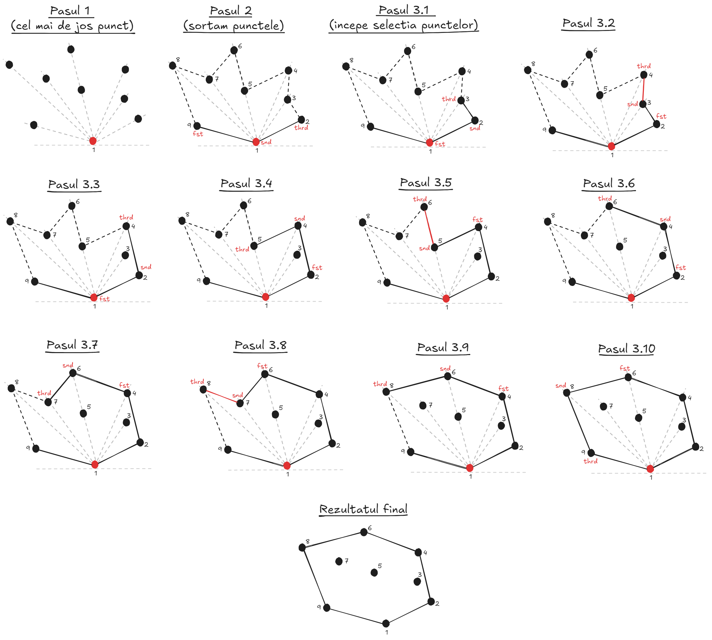
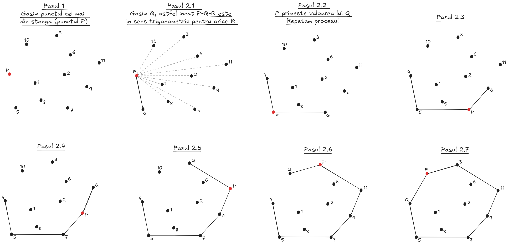
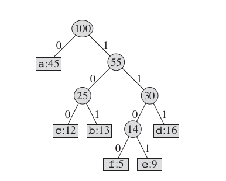
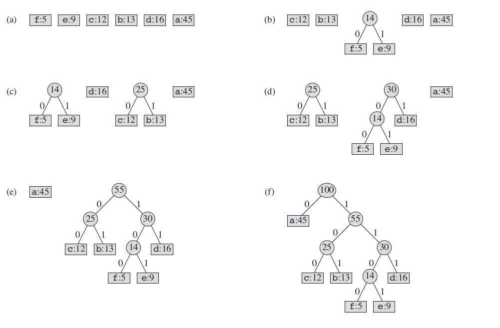

# Table of contents
- [1 - Convex Hulls (infasuratori convexe)](#1---convex-hulls-infasuratori-convexe)
	- [1.1 - Introducere](#11---introducere)
    - [1.2 - Orientarea unui triplet de puncte](#12---orientarea-unui-triplet-de-puncte)
	- [1.3 - Graham's Scan](#13---grahams-scan)
	- [1.4 - Jarvis' March](#14---jarvis-march)
- [2 - Alegerea medianei in O(n). Mediane si statistici de ordine](#2---alegerea-medianei-in-on-mediane-si-statistici-de-ordine)
	- [Notiuni teoretice](#notiuni-teoretice)
    - [Formularea problemei](#formularea-problemei)
- [3 - Coduri Huffman](#3---coduri-huffman)
- [4 - Exercitii examen](#4---exercitii-examen)
    - [Seria 13](#seria-13)
    - [Seria 13 - rezolvari](#seria-13---rezolvari)
    - [Seria 14](#seria-14)
    - [Seria 14 - rezolvari](#seria-14---rezolvari)
    - [Seria 15](#seria-15)
    - [Seria 15 - rezolvari](#seria-15---rezolvari)

---

## <ins>1 - Convex Hulls (infasuratori convexe)</ins>

### <ins>1.1 - Introducere</ins>
- O **multime convexa** este o multime de puncte, astfel incat daca luam orice segment determinat de oricare 2 puncte din multimea respectiva, toate punctele de pe segment vor fi incluse in totalitate in multime.
- Multimile finite de puncte cu cel putin 2 elemente nu sunt convexe => au nevoie de o **acoperire/infasuratoare convexa** (**convex hull**). Sa presupunem ca avem o multime finita de puncte **P**; o **acoperire convexa** are urmatoarele definitii echivalente:
    - Cel mai mic poligon convex care contine **P**.
    - Cea mai "mica" (in sensul incluziunii) multime convexa care contine **P**.
    - Intersectia tuturor multimilor care contin **P**.
- Avand o multime finita de puncte, vom trece prin 2 algoritmi pentru a determina un poligon convex de dimensiune minima care sa includa toate punctele din multimea respectiva => o **acoperire convexa**.
    - **Input**: o multime de cel putin 3 puncte necoliniare din **R<sup>2</sup>**.
    - **Output**: o lista care sa contina varfurile ce determina frontiera acoperirii convexe (ordinea varfurilor din lista fiind in sens trigonometric).
- Inainte de a trece prin algoritmii respectivi, **orientarea unui triplet de puncte** este un concept esential pentru a ii putea intelege.


### <ins>1.2 - Orientarea unui triplet de puncte</ins>
- Fiind date **3** puncte, exista trei posibilitati in ceea ce priveste orientarea lor:
    - Punctele sunt **coliniare**.
    - Orientarea este in sens **orar** (sensul acelor de ceasornic).
    - Orientarea este in sens **antiorar** (**trigonometric**).
- Pentru a determina orientarea unui triplet de puncte **A(x<sub>1</sub>, y<sub>1</sub>), B(x<sub>2</sub>, y<sub>2</sub>), C(x<sub>3</sub>, y<sub>3</sub>)**, calculam pantele dreptelor **AB** si **AC** (reamintim: **panta unei drepte** reprezinta variatia verticala in raport cu variatia orizontala). Notam **slope(AB) = (y<sub>2</sub> - y<sub>1</sub>) / (x<sub>2</sub> - x<sub>1</sub>)** si **slope(AC) = (y<sub>3</sub> - y<sub>1</sub>) / (x<sub>3</sub> - x<sub>1</sub>)**. Exista trei cazuri:
    - **slope(AB) == slope(AC)**: nu se schimba directia => punctele sunt coliniare.
    - **slope(AB) - slope(AC) > 0**: panta lui **AB** este mai mare => sens trigonometric.
    - <b>slope(AB) - slope(AC) < 0</b>: panta lui **AC** este mai mare => sens orar.
- Totusi, cand scriem asta in cod, este mai adecvat sa evitam impartirile (deoarece numitorul poate fi **0**, iar impartirile sunt mai lente). Rescriem relatia: **slope(AB) ? slope(AC)** <=> **(y<sub>2</sub> - y<sub>1</sub>) / (x<sub>2</sub> - x<sub>1</sub>) ? (y<sub>3</sub> - y<sub>1</sub>) / (x<sub>3</sub> - x<sub>1</sub>)** <=> <b>(y<sub>2</sub> - y<sub>1</sub>) * (x<sub>3</sub> - x<sub>1</sub>) ? (y<sub>3</sub> - y<sub>1</sub>) * (x<sub>2</sub> - x<sub>1</sub>)</b> <=> <b>(y<sub>2</sub> - y<sub>1</sub>) * (x<sub>3</sub> - x<sub>1</sub>) - (y<sub>3</sub> - y<sub>1</sub>) * (x<sub>2</sub> - x<sub>1</sub>) ? 0</b>. Daca relatia este egala cu 0, punctele sunt **coliniare**; daca este mai mica decat 0, avem **sens trigonometric**, iar daca este mai mare decat 0, avem **sens orar**.
      


### <ins>1.3 - Graham's Scan</ins>
- **Pasul 1**: Gasim punctul care se afla cel mai jos (are cea mai mica coordonata **y**). Daca sunt mai multe asemenea puncte, il selectam pe cel care se afla cel mai in stanga-jos. Motivul pentru care il selectam este pentru ca acest punct mereu va face parte din poligonul convex final.
- **Pasul 2**: Sortam punctele ramase in functie de unghiul format cu punctul gasit anterior (punctul de baza al poligonului): notam punctul gasit cu **A** si doua puncte aleatoare cu **B** si **C**. Mergand in sens trigonometric, daca ne lovim mai intai de dreapta **AB**, ar trebui sa avem ordinea **{A, B, C}**; altfel, **{A, C, B}**. Daca **AB** si **AC** coincid, atunci punctul mai apropiat de **A** o sa vina primul.
- **Pasul 3**: Incepem cu o stiva, care este initial goala. Incepem sa trecem prin punctele ramase din lista sortata. Pentru punctul curent, verificam daca respecta sensul trigonometric in raport cu ultimele 2 puncte adaugate in poligon (vom avea variabilele **prev**, **curr**, **next**). Cat timp proprietatea nu este respectata, scoatem un nod de pe stiva, actualizam variabilele si verificam proprietatea. Odata ce proprietatea este respectata, adaugam nodul curent pe stiva, actualizam variabilele si trecem la urmatorul punct din lista. Repetam acest pas pana cand am trecut prin toate punctele.
- **Complexitate timp O(nlogn)**:
    - **O(n)**: gasim punctul din stanga-jos.
    - **O(nlogn)**: sortare.
    - **O(n)**: restul codului (stiva, afisarea).
- **Complexitate spatiu O(n)**.



### <ins>1.4 - Jarvis' March</ins>
- Este un algoritm de tip **incremental**: nu necesita o sortare/prelucrare a datelor.
- **Pasul 1**: Initial, lista de puncte pentru poligonul convex este goala. Vom incepe cu un punct care sigur va fi un varf al poligonului; acest varf ar putea fi cel mai din stanga, sau cel mai de jos, sau cel mai de stanga-jos.
- **Pasul 2**: la fiecare pas, notam ultimul punct adaugat in poligon cu **P**. Vrem sa gasim un punct **Q**, astfel incat pentru orice punct **R** ramas in poligon, orientarea **P-Q-R** o sa fie in sens trigonometric. Il adaugam pe **Q** in poligon, iar la urmatorul pas noul **P** o sa fie acest **Q** gasit. Algoritmul se incheie cand inchidem ciclul poligonului.
- **Complexitate O(m*n)**: **m** este numarul de puncte de pe poligonul convex format, iar **n** este numarul total de puncte din input. Pentru fiecare punct **m** de pe poligon, am verificat restul de **n-2** puncte.



--- 

## <ins>2 - Alegerea medianei in O(n). Mediane si statistici de ordine</ins>
### Notiuni teoretice
- **A i-a statistica de ordine** pentru un sir este al i-lea cel mai mic element al sirului.
- **Mediana** unui sir impar este elementul din mijloc in ordinea sortarii, iar pentru un sir par este media aritmetica a elementelor din mijloc in ordinea sortarii.

### Formularea problemei
- Ni se da un sir de n elemente nesortate distincte (pentru simplitate, metodele de mai jos se pot generaliza si pentru cazurile cand se repeta elementele). Dorim sa aflam a i-a statistica de ordine.
- Evident, o modalitate de a face asta este sa sortam, insa asta ar fi in $O(nlogn)$ sau $O(nb)$ pentru radix sort. Totusi, noi vrem mai rapid de atat. Preferabil $O(n)$
- Solutia la aceasta problema este sa folosim ideea de la quicksort (vezi **tutoriatul 1**), dar sa mergem doar pe o ramura a partitionarii sirului de catre pivot, iar pe acesta sa-l generam random. Pe langa asta, la fiecare pas din recursivitate tinem minte a cata pozitie vrem sa aflam din respectivul subsir continuu $(l, r)$. Pentru mai multe detalii consultati implementare de mai jos. Aceasta implementare are complexitate in $O(n)$, demonstratia este foarte matematica, nu o voi pune aici.
- **Sarcina pentru voi**: modificati algoritmul de mai jos sa tina cont si de duplicate, ele reprezentand aceleasi pozitii in lista sortata.

```cpp
#include <bits/stdc++.h>
#define ll long long
#define ii pair<int, int>
using namespace std;
ifstream fin("sdo.in");
ofstream fout("sdo.out");

int generate_random(int start, int end) {
    std::random_device rd;
    std::mt19937 gen(rd());
    std::uniform_int_distribution<> dis(start, end);
    return dis(gen);
}

int get_pivot_position(vector<int> &a, int l, int r) {
    int pivot = generate_random(l, r);
    swap(a[pivot], a[r]);
    int idx = l;
    for (int i = l; i < r; ++i) {
        if (a[i] < a[r]) {
            swap(a[i], a[idx]);
            idx++;
        }
    }
    swap(a[r], a[idx]);
    return idx;
}

int get_i_smallest(vector<int> &a, int l, int r, int i) {
    if (l >= r) {
        return a[l];
    }
    int pivot_pos = get_pivot_position(a, l, r);
    int local_ord = pivot_pos - l + 1;
    if (local_ord == i) {
        return a[pivot_pos];
    } else if (local_ord < i) {
        return get_i_smallest(a, pivot_pos + 1, r, i - local_ord);
    }
    return get_i_smallest(a, l, pivot_pos - 1, i);
}

int main() {
    ios_base::sync_with_stdio(false); cin.tie(nullptr);
    int n, k;
    fin >> n >> k;
    vector<int> a(n + 1);
    for (int i = 1; i <= n; ++i) {
        fin >> a[i];
    }
    fout << get_i_smallest(a, 1, n, k) << '\n';
    return 0;
}
```
---

## <ins>3 - Coduri Huffman</ins>
- Fie urmatoarea problema: avem un text format din diferite simboluri pe care dorim sa-l codificam binar. Totusi, vrem sa facem acest lucru cat mai eficient i.e. folosind cat mai putina memorie. Aceasta problema este exact cea de la ASC din sem 1.
- Pe scurt, solutia consta in determinarea frecventelor tuturor simbolurilor in setul de date si condificare lor intr-un mod neambiguu si folosind siruri binare de lungime variabila.
- Prin neambiguitate ma refer la evitarea tuturor situatiilor in care un sir este prefix al altui sir. In acest fel, daca vom scrie toate sirurile lipite si incercam sa parsam apoi sa decodificam textul, vom obtine exact aceleasi simboluri. Aceste siruri se mai cheama si **prefix codes**.
- Codificare lor in sir binar se bazeaza pe constructia unui arbore binar in care valorile nodurilor intermediare reprezinta suma frunzelor din subarborele a carui radacina este el, iar valorile frunzelor reprezinta frecventa unui simbol in setul de date. Pe frunze se afla valorile 0 (fiul stang) si 1, iar encoding-ul unui simbol reprezinta concatenarea caracterelor de pe muchii, din drumul de la radacina la simbolul dorit.

- Desi codificarile obtinute din acest arbore sunt foarte eficient, modul cum se construieste acesta este destul de simplu:
  - Prima data se formeaza nodurile cu frecventele simbolurilor
  - Apoi se vor adauga aceste noduri intr-o structura de date (de obicei **priority_queue**)
  - Cat timp mai sunt cel putin 2 noduri in coada se vor extrage cele 2 noduri cu frecventele cele mai mici, se va crea un alt nod ce va fi parintele celor doi, iar acesta din urma se va adauga inapoi in coada avand ca valoare suma frecventelor fiilor.

- Pentru implementare consultati [acest link](https://github.com/eusebiuuu/assembler-and-executor/blob/main/encoder/huffman.cpp).
- **Sarcina**: rezolvati problema [aceasta](https://www.infoarena.ro/problema/huffman) fara sa mai consultati implementarea data.


---

## <ins>4 - Exercitii examen</ins>

### <ins>Seria 13</ins>

### <ins>Seria 13 - rezolvari</ins>

### <ins>Seria 14</ins>

### <ins>Seria 14 - rezolvari</ins>

### <ins>Seria 15</ins>

### <ins>Seria 15 - rezolvari</ins>

---

#### <ins>Notes</ins>
- **Seria 13**: Convex Hulls (Graham's Scan, Jarvis' March).
- **Seria 14**: Alegerea medianei in **O(n)** (algoritm aleator, algoritm determinist).
- **Seria 15**: BSTs (**Tutoriat 3**), coduri Huffman.
