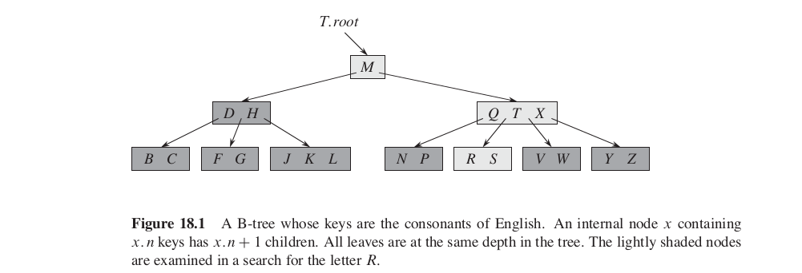
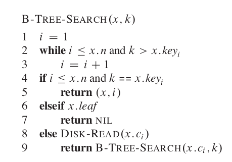
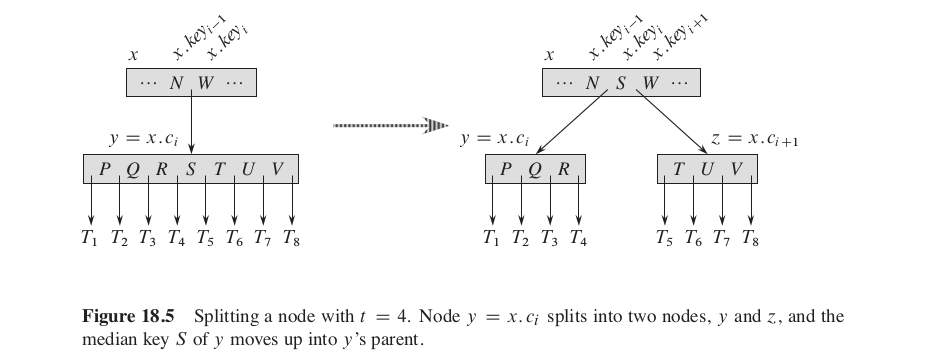
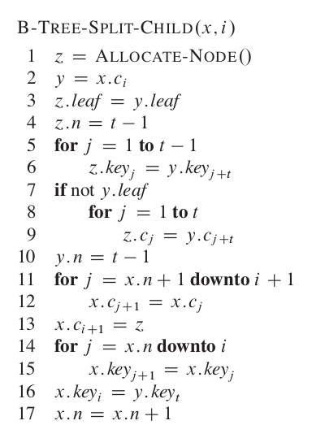
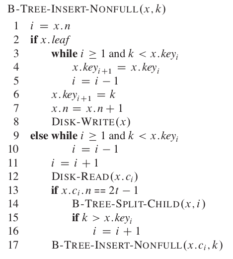
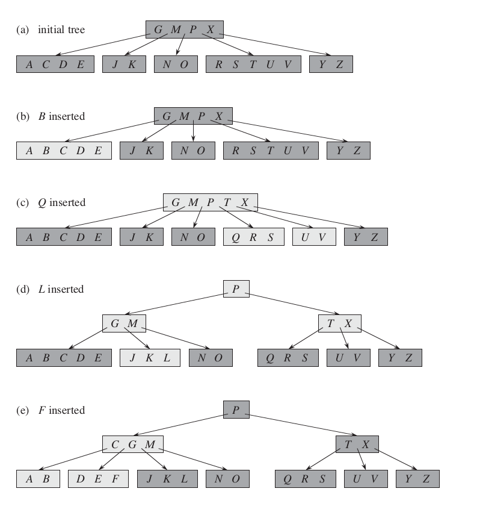
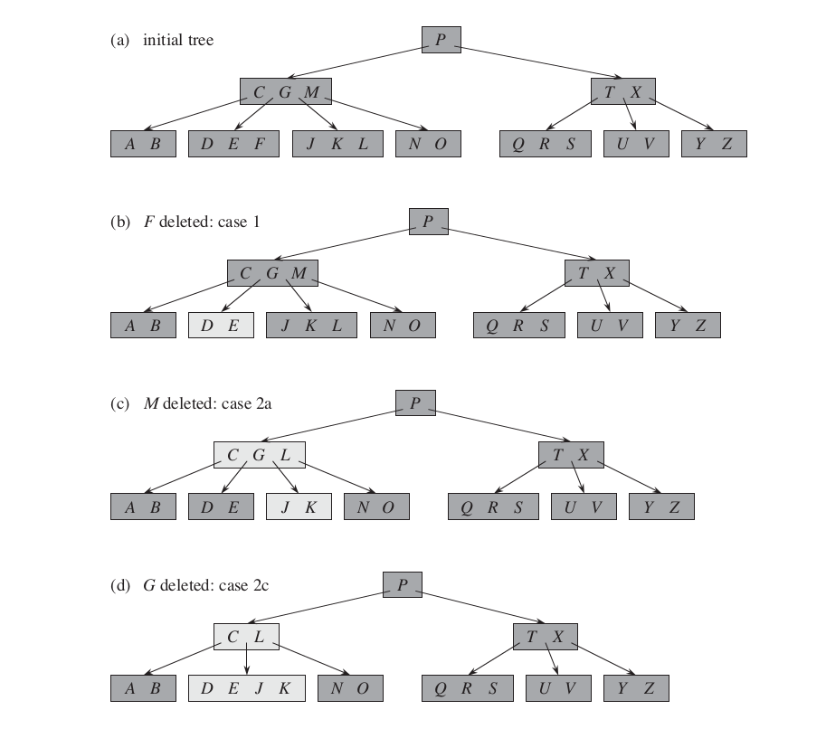
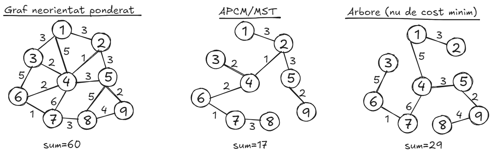
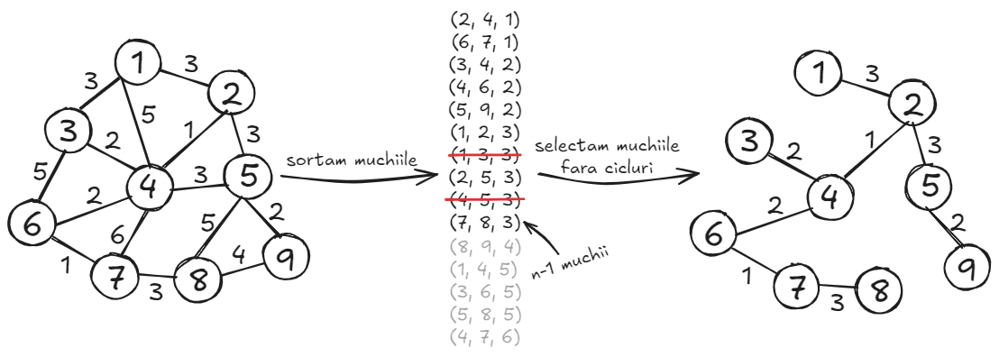
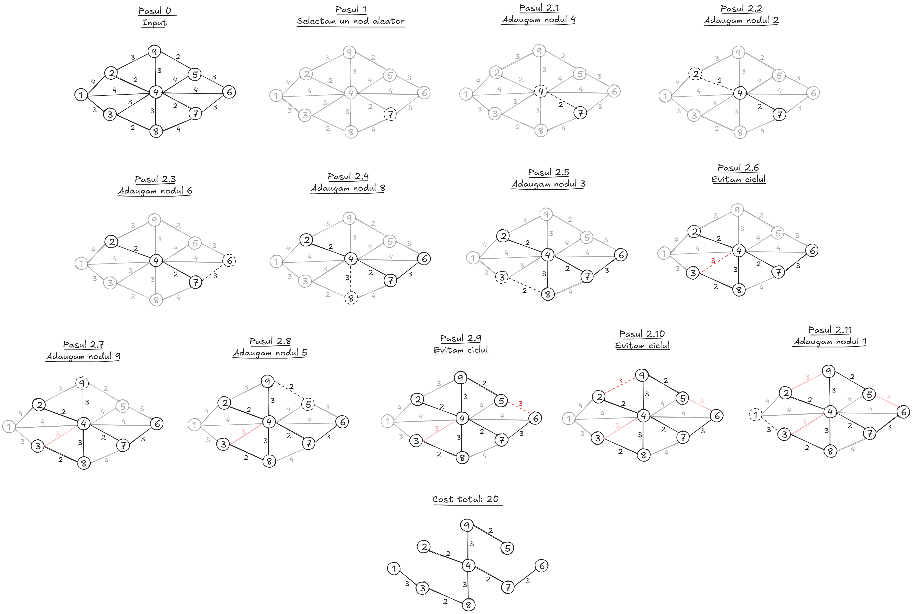

# Table of contents
- [1 - B-Trees](#1---b-trees)
	- [1.1 - Introducere](#11---introducere)
    - [1.2 - Search](#12---search)
    - [1.3 - Insert](#13---insert)
    - [1.4 - Delete](#14---delete)
- [2 - MST (Minimum Spanning Trees)](#2---mst-minimum-spanning-trees)
    - [2.1 - Introducere](#21---introducere)
	- [2.2 - Detectarea ciclurilor: vector de culori](#22---detectarea-ciclurilor---vector-de-culori)
	- [2.3 - Detectarea ciclurilor: arbori](#23---detectarea-ciclurilor---arbori)
    - [2.4 - Algoritmul lui Kruskal](#24---algoritmul-lui-kruskal)
    - [2.5 - Algoritmul lui Prim](#25---algoritmul-lui-prim)
- [3 - Aho-Corasick Algorithm](#3---aho-corasick-algorithm)
- [4 - Exercitii examen](#4---exercitii-examen)
    - [Seria 13](#seria-13)
    - [Seria 13 - rezolvari](#seria-13---rezolvari)
    - [Seria 14](#seria-14)
    - [Seria 14 - rezolvari](#seria-14---rezolvari)
    - [Seria 15](#seria-15)
    - [Seria 15 - rezolvari](#seria-15---rezolvari)

---

## <ins>1 - B-Trees</ins>

### <ins>1.1 - Introducere</ins>
- Un **B-Tree** este un arbore de cautare echilibrat. Comparativ cu arborii binari studiati pana acum, un nod poate avea un numar variabil de fii, ceea ce face **branch factor-ul** sa devina mare, dar inaltimea este mult mai buna decat **O(logn)**.
- Proprietati esentiale:
    - Fiecare nod are un numar variabil de chei, retinute intr-o lista sortata.
    - Daca cheia unui nod este compusa din **n** componente, atunci poate avea maxim **n+1** fii.
    - Toate frunzele au aceeasi adancime in arbore.
    - Fiecare B-Tree are definit un numar numit **gradul minim al arborelui** (**minimum degree**): fiecare nod (in afara de radacina) are cel putin **t** copii, iar fiecare nod (inclusiv radacina) are cel mult **2t** copii (caz in care se cheama **full node**).
- Observati aplicarea proprietatilor pe exemplul de mai jos:

- **Intrebare**: ce minimum degree are arborele din imagine?
- In functie de factorul **t**, inaltimea arborelui este maxim $log_t\frac{n + 1}{2}$.
- O alta precizare importanta este ca operatiile se realizeaza cu chei, nu cu noduri. Cautam, stergem si inseram **chei, nu noduri**.
- **Aplicatii**: Proprietatile de mai sus fac ca acest tip de arbore sa fie extrem de util in situatii low level, cum ar fi proiectarea sistemelor de operare sau interogarile in baze de date. Datorita faptului ca numarul de fii al unui nod depinde de cheia acestuia, care ii partitioneaza, putem stoca foarte multe date ce pot fi accesate rapid (se pastreaza o ordine intre fii, iar inaltimea este foarte mica). In multe situatii, acest avantaj nu este de mare folos; insa, cand analizam operatiile care sunt realizate de sistemele de operare, constatam ca dorim sa minimizam numarul unora. De exemplu - citirile de pe disk: sunt operatii foarte lente, insa pentru ca memoria principala nu este asa incapatoare, suntem nevoiti sa le folosim. Totusi, vrem sa utilizam cat mai putine si aici intervin **B-trees**, care sunt folositi la structurarea cat mai buna a datelor de pe disk, astfel incat numarul de accesari de elemente de pe disk (care inseamna numarul de noduri de la radacina la frunza dorita) sa fie cat mai mic. In acest fel, minimizam operatiile de pe disk si ajungem la elementul dorit cat mai repede. Se poate observa ca aici B-tree-ul se comporta ca o interfata a disk-ului.

### <ins>1.2 - Search</ins>
- Ignorati linia 8 - are legatura cu ce am mentionat anterior.



### <ins>1.3 - Insert</ins>
- Ideea generala este sa cautam in arbore, pana ajungem la frunze, locul cel mai potrivit unde ar sta cheia inserata, folosind algoritmul de cautare de mai sus, iar apoi sa inseram cheia in ultimul nod din parcurgere. Totusi, avem o problema: structura arborelui poate sa se strice. Mai exact, nu se mai respecta proprietatea de **minimum degree**, deoarece putem avea cazul in care nodul in care dorim sa inseram este **full node** (adica are $2t - 1$ chei).
- O metoda de a rezolva problema este **splitting**-ul **full node**-urilor. Concret, pe nodul cu $2t$ fii il vom imparti in 2 noduri, unde fiecare are cate $t$ fii. De asemenea, vom pune mediana sirului de chei al nodului spart in lista de chei a parintelui nodului spart, pe pozitia corespunzatoare.

- Totusi, ce ne facem cand cele 2 noduri nou obtinute il vor strica pe parintele nodului spart? Din nou splitting...
- Ca urmare concepem urmatorul algoritm: plecam din radacina si vom parcurge arborele in stilul cautarii de mai sus, iar in cazul in care dam de **full nodes** le vom da split, chiar daca s-ar putea sa nu fie nevoie. Parcurgem in acest fel arborele pana ajungem la frunze, in care vom insera cheia noastra; de asemenea, in cazul in care radacina este si ea full, ii vom da split si acesteia alocand un alt nod ce va reprezenta noua radacina



- **Exemplu la tabla**: Show the results of inserting the keys F; S; Q; K; C; L; H; T; V; W; M; R; N; P; A; B; X; Y; D; Z; E in order into an empty B-tree with minimum degree 2. Draw only the configurations of the tree just before some node must split, and also draw the final configuration.
- **Exercitiu**: Explain how to find the minimum key stored in a B-tree and how to find the predecessor of a given key stored in a B-tree.
- **Exercitiu**: Se pastreaza proprietatea inaltimii?

### <ins>1.4 - Delete</ins>
- Stergerea dintr-un B-Tree este un pic mai complicata. Pe scurt, ea consta din urmatoarele cazuri:
  - Cazul 1: In cazul in care cheia care trebuie stearsa se afla intr-o frunza, o stergem pur si simplu
  - Cazul 2: Daca cheia $k$ se afla in nodul $x$, iar $x$ nu este frunza (**internal node**):
    - a: Fie nodul $y$ fiul nodului $x$ pentru care $k$ este limita superioara. Aflam predecesorul cheii $k$ din subarborele a carui radacina este $y$, fie acesta $m$ (vom parcurge arborele pana la frunze, mereu alegand cel mai din dreapta fiu). In continuare, dupa ce l-am aflat, il vom sterge pe $m$ din toate nodurile aplicand algoritmul de stergere prezentat aici (cazul 3) si apoi il vom **inlocui** pe $k$ cu $m$.
    - b: Fie nodul $z$ fiul nodului $x$ pentru care $k$ este limita inferioara. In cazul in care $z$ are cel putin $t$ chei, vom incerca sa aflam succesorul cheii $k$ aplicand acelasi algoritm de mai sus, doar ca vom merge mereu pe fiul cel mai din stanga in parcurgerea subarborelui a carui radacina este $z$. Din nou, la final, **inlocuim** pe $k$ cu succesorul lui.
    - c: Daca niciunul din cazurile de mai sus nu are loc, atunci ambele noduri care au limita (fie superioara, fie inferioara) pe $k$ au exact $t - 1$ chei. Ca urmare, vom combina cele 2 noduri si vom elimina pur si simplu cheia $k$ din lista de chei a nodului $x$. Ulterior, vom sterge recursiv cheia $k$ din subarborele nodului $x$ aplicand acelasi algoritm (pentru cazurile cand avem duplicate)
  - Cazul 3: Daca cheia $k$ nu se afla in nodul $x$ vom incerca sa cautam in fiii lui pe cel care l-ar putea avea pe $k$ in subarbore. In plus, dorim ca nodul in care sa se afle $k$ sa aiba cel putin $t$ chei. Asta, deoarece vom intra in cazul 3 fie inainte sa gasim cheia $k$ in arbore, fie dupa ce am gasit-o si dorim sa stergem predecesorul / succesorul. Astfel, atunci cand suntem in cazul 2 si stergem recursiv predecesorul / succesorul cheii $k$ din nodurile corespunzatoare (cazurile a si b) vom intra cu stergerea pe acest caz, ce presupune **stergerea efectiva a cheii** (nu inlocuirea ei ca in cazul 2). Iar pentru ca vrem sa stergem chei, trebuie sa avem cel putin $t$ chei in nod. Astfel, pentru a ne asigura ca avem cel putin $t$ chei in nodul curent avem urmatoarele cazuri:
    - a: Fie parintele nodului $x$ din care dorim sa stergem cheia $k$ si fie $p$ parintele lui. Daca avem ca $p$ are ca fiu un nod cu cel putin $t$ chei imediat la stanga sau la dreapta lui $x$, atunci vom muta o cheie din acel nod in $x$ si vom modifica cheia corespunzatoare in $p$.
    - b: In situatia in care cazul 3a nu se respecta, avem de realizat urmatoarea operatie: unim cheile nodului din stanga sau din dreapta nodului $x$ (care stim ca sunt in numar de $t - 1$) cu cele ale nodului $x$ care sunt tot $t - 1$ obtinand astfel un nod $v$ cu $2t - 2$ la care vom muta cheia dintre ele aflata in nodul $p$ in acest nou nod $v$ ca mediana. Astfel, in loc de $x$ si nodul din stanga / dreapta lui obtinem nodul $v$ cu $2t - 1$ chei. **Intrebare**: De ce nodul $p$ nu va avea $t - 2$ chei?
- 
- **Exercitiu**: Din arborele de mai sus stergeti in ordine D, B, C, P, V
--- 

## <ins>2 - MST (Minimum Spanning Trees)</ins>

### <ins>2.1 - Introducere</ins>
- Fiind dat un graf neorientat ponderat (muchiile au costuri), apare problema determinarii unui **APCM (arbore partial de cost minim) / MST (minimum spanning tree)** = un arbore care contine toate nodurile grafului si are suma ponderilor muchiilor minima. Evident, problema se aplica si grafurilor orientate - dar noi ne vom concentra pe grafuri neorientate.
- Exista 2 obstacole cand incercam sa determinam un MST:
    - Evitarea ciclurilor: cand construim MST-ul si selectam o muchie, este posibil sa formeze un ciclu.
    - Selectia muchiilor: vrem ca suma ponderilor sa fie minima => ne uitam mereu dupa muchiile care nu au fost inca incluse si care au costul minim.
- Un graf poate avea mai multe MST-uri (cel mai simplu exemplu: fiecare muchie are aceeasi pondere - aici putem selecta muchiile in mai multe moduri).
- Mai departe vor fi prezentati **algoritmul lui Kruskal** si **algoritmul lui Prim**, folositi in rezolvarea acestei probleme. Diferenta dintre acest algoritmi este faptul ca **Kruskal** realizeaza o prelucrare a datelor; ceilalti pasi sunt foarte similari:
    - Se selecteaza o muchie neinclusa in arbore, de cost minim.
    - Se verifica daca muchia respectiva ar forma un ciclu cu restul muchiilor incluse. In caz afirmativ, se trece la urmatoarea muchie; altfel, o includem si apoi trecem la urmatoarea.



### <ins>2.2 - Detectarea ciclurilor - vector de culori</ins>
- Un pas comun in cei doi algoritmi este verificarea formarii unui ciclu cand adaugam o muchie. 
- O metoda (mai ineficienta) presupune crearea unui vector de culori. Initial, avem 0 muchii, iar fiecare nod reprezinta propria sa componenta conexa => fiecare nod are o culoare diferita (reprezentata printr-un numar; **color[0] = 0, color[1]** = 1, etc.).
- Cand adaugam o muchie, verificam daca extremitatile ei fac parte din aceeasi componenta colorata. In caz afirmativ, inseamna ca adaugam o muchie care formeaza un ciclu. Altfel, cele doua extremitati apartin unor componente colorate diferite, care vor fi unite sa formeze o singura componenta.
- Motivul pentru care este ineficienta abordarea: cand vrem sa unim doua componente colorate (consideram ca prima componenta primeste culoarea celeilalte componente), trebuie sa iteram prin toate nodurile din graf, verificand daca nodul curent are culoarea primei componente; in caz afirmativ, il recoloram. **Complexitate O(n)**.

```cpp
// Initializare 
std::vector<int> colors(n):
for (int i = 0; i < n; ++i) {
    colors[i] = i;
}

// Verificare daca sunt doua componente colorate diferite 
if (r[i] != r[j]) {
    // ...
}

// Reuniunea 
const int c1 = color[i];
const int c2 = color[j];
for (int k = 0; k < n; ++k) {
  if (color[k] == c1) {
    color[k] = c2;
  }
}
```

### <ins>2.3 - Detectarea ciclurilor - arbori</ins>
- O alternativa pentru metoda discutata anterior este utilizarea a doi vectori auxiliari, care simuleaza un arbore. Fiecare nod **i** are urmatoarele proprietati:
  - **parent[i]**: radacina arborelui din care face parte nodul, care se mai numeste si reprezentantul. Aici intra un truc: fiecare arbore va incerca sa simuleze cat mai bine structura de o radacina cu numar nelimitat de copii, pentru ca arborele sa fie de inaltime minima. Astfel, daca incepem cautarea reprezentantului dintr-un nod care se afla departe de radacina, la final vom trece nodul respectiv ca si copil al radacinii, pentru a minimiza drumul pentru cautarile din viitor.
  - **height[i]**: inaltimile arborilor reprezentantilor. Aceasta proprietate este actualizata numai pentru reprezentanti.
- Initial, fiecare nod reprezinta propria sa componenta conexa (avem **n** componente), iar inaltimea fiecarei componente este 0.
- Cand reunim doi arbori, cel care are inaltimea mai mica va deveni subarbore in arborele mai mare. Daca au inaltimi egale, alegem aleator care devine subarbore, iar inaltimea creste cu 1. Actualizam doar inaltimea reprezentantului (nu ne pasa de subarborii sai).

```cpp
// Initializare 
std::vector<int> parent(n);
for (int i = 0; i < n; ++i) {
  parent[i] = i;
}
std::vector height(n, 0);

// Obtinerea reprezentantului unei componente 
int find(int node) {
  if (node == parent[node]) {
    return node;
  }
  return parent[node] = find(parent[node]); // truc de eficienta
}

// Reuniunea a doua componente 
void unite(int x, int y) {
  const int r1 = find(x);
  const int r2 = find(y);

  if (r1 != r2) {
    if (height[r1] < height[r2]) {
      parent[r1] = r2;
    }
    else if (height[r1] > height[r2]) {
      parent[r2] = r1;
    }
    else {
      parent[r2] = r1;
      height[r1]++;
    }
  }
}
```

### <ins>2.4 - Algoritmul lui Kruskal</ins>
- Este un algoritm de tip **greedy**, deoarece mai intai se realizeaza o prelucrare a datelor, iar apoi formam solutia finala trecand prin lista de muchii, selectand dupa un anumit criteriu.
- **Pasul 1**: Sortam muchiile crescator dupa pondere.
- **Pasul 2**: Initial, solutia noastra (multimea de muchii pentru MST) este goala. Iteram prin multimea sortata de muchii: daca muchia curenta nu formeaza un ciclu, o adaugam in solutie; altfel, sarim peste ea. Algoritmul se incheie cand avem **n-1** muchii.
- **Complexitate timp O(mlogn) sau O(mlogm)**:
  - Sortarea muchiilor: **O(mlogm)**.
  - Iteram prin toate muchiile si aplicam operatiile de **unite** si **find**. Complexitatea pentru find este **O(logn)**, iar analiza complexitatii pentru aceasta operatie e mai complicata si nu stiu sa o demonstrez (totusi, worst-case-ul este usor de desenat si poate ajuta la intelegerea complexitatii).
  - In final, obtinem **O(mlogm + mlogn)**. In cel mai rau caz, graful este complet, deci $m \in O(n^2)$, ceea ce inseamna ca **O(logm)** este echivalent cu **O(logn)**, iar complexitatea devine **O(mlogm)** sau **O(mlogn)**.



### <ins>2.5 - Algoritmul lui Prim</ins>
- TODO



---

## <ins>3 - Aho-Corasick Algorithm</ins>

---

## <ins>4 - Exercitii examen</ins>

### <ins>Seria 13</ins>
1. Show all legal B-trees of minimum degree 2 where the nodes are in the following list {1, 2, 3, 4, 5}.
### <ins>Seria 13 - rezolvari</ins>

### <ins>Seria 14</ins>

### <ins>Seria 14 - rezolvari</ins>

### <ins>Seria 15</ins>

### <ins>Seria 15 - rezolvari</ins>

---

#### <ins>Notes</ins>
- <ins>**Seria 13**</ins>: Minimum Spanning Trees (**Kruskal's Algorithm, Prim's Algorithm**).
- <ins>**Seria 14**</ins>: Aho-Corasick Algorithm.
- <ins>**Seria 15**</ins>: B-Trees.
