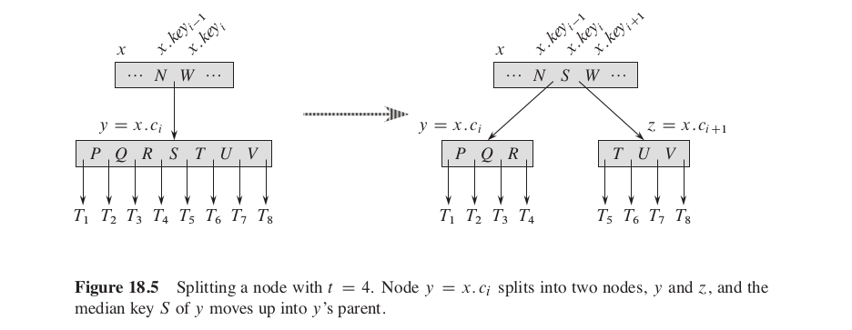
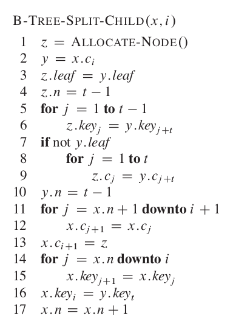
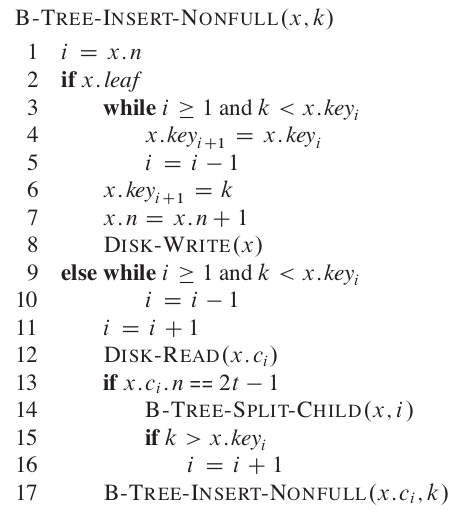
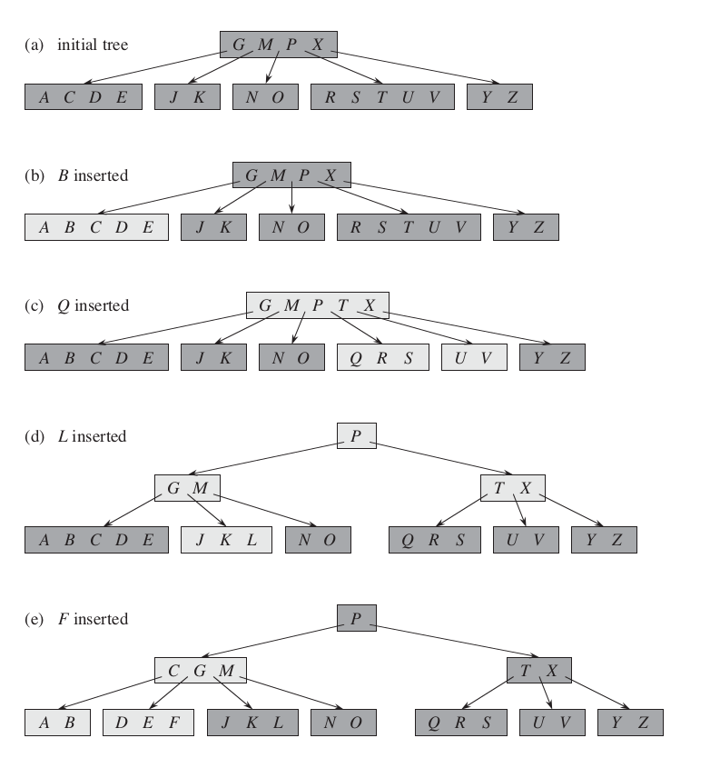

# Table of contents
- [Table of contents](#table-of-contents)
  - [1 - B-Trees](#1---b-trees)
    - [1.1 - Introducere](#11---introducere)
    - [1.2 - Search](#12---search)
    - [1.3 - Insert](#13---insert)
    - [1.4 - Delete](#14---delete)
  - [2 - MST (Minimum Spanning Trees)](#2---mst-minimum-spanning-trees)
    - [2.1 - Introducere](#21---introducere)
    - [2.2 - Algoritmul lui Kruskal](#22---algoritmul-lui-kruskal)
    - [2.3 - Algoritmul lui Prim](#23---algoritmul-lui-prim)
  - [3 - Aho-Corasick Algorithm](#3---aho-corasick-algorithm)
  - [4 - Exercitii examen](#4---exercitii-examen)
    - [Seria 13](#seria-13)
    - [Seria 13 - rezolvari](#seria-13---rezolvari)
    - [Seria 14](#seria-14)
    - [Seria 14 - rezolvari](#seria-14---rezolvari)
    - [Seria 15](#seria-15)
    - [Seria 15 - rezolvari](#seria-15---rezolvari)
      - [Notes](#notes)

---

## <ins>1 - B-Trees</ins>

### <ins>1.1 - Introducere</ins>
- **Exercitiu de intuitie: generalizare balanced BST**
- B-Trees sunt tot niste arbori de cautare balansati, insa, comparativ cu ceilalti prezentati pana acum, un nod din B-Tree poate avea un numar variabil de fii; astfel, desi **branch factor**-ul este mare, inaltimea este in general mult mai buna decat $O(logn)$.
- Proprietati:
  - fiecare nod are un numar de chei si sirul de chei stocat si sortat
  - daca cheia unui nod este compusa din $n$ componente atunci va avea exact $n + 1$ fii; mai mult, fiecare dintre chei separa cate 2 fii
  - Toate frunzele au aceeasi adancime
  - Pentru fiecare B-Tree avem definit un numar $t$ ce se mai numeste **minimum degree**-ul arborelui, deoarece influenteaza structura lui in felul urmator: fiecare nod **in afara de radacina** are cel putin $t$ copii si fiecare nod **inclusiv radacina** are cel mult $2t$ copii (caz in care se cheama **full node**).
- Observati aplicarea proprietatilor pe exemplul de mai jos:

- **Intrebare**: ce minimum degree are arborele din imagine?
- In functie de factorul $t$, inaltimea arborelui este maxim $log_t\frac{n + 1}{2}$
- O alta precizare importanta este ca operatiile se realizeaza cu chei, nu cu noduri. Deci, noi vom vrea sa cautam, stergem si inseram **chei, nu noduri**.
- **Aplicatii**: Proprietatile de mai sus fac ca acest tip de arbore sa fie extrem de util in situatii foarte low level cum ar fi proiectarea sistemelor de operare sau baze de date. Concret, prin faptul ca numarul de fii al unui nod depinde de cheia acestuia, care ii partitioneaza, putem stoca foarte multe date in acesta si sa le accesam foarte rapid (se pastreaza o ordine intre fii si inaltimea este foarte mica). In multe situatii acest avantaj nu este de mare folos, insa cand analizam operatiile care sunt realizate de sistemele de operare constatam ca dorim sa minimizam numarul unora. Astfel este cazul si citirilor de pe disk: sunt operatii foarte lente, insa pentru ca memoria principala nu este asa incapatoare, suntem nevoiti sa le folosim. Totusi, vrem sa utilizam cat mai putine si aici intervin B-trees. Ei sunt folositi la structurarea cat mai buna a datelor de pe disk, astfel incat numarul de accesari de elemente de pe disk (care inseamna numarul de noduri de la radacina la frunza dorita) sa fie cat mai mic. In acest fel, minimizam operatiile de pe disk si ajungem la elementul dorit cat mai repede. Se poate observa ca aici B-tree-ul se comporta ca o interfata a disk-ului.
### <ins>1.2 - Search</ins>
(ignorati linia 8 - are legatura cu ce am zis mai sus)

### <ins>1.3 - Insert</ins>
- Pentru a insera o cheie in B-Tree avem de lucru putin :(
- Ideea generala este sa cautam in arbore, pana ajungem la frunze, locul cel mai potrivit unde ar sta cheia inserata, folosind algoritmul de cautare de mai sus, iar apoi sa inseram cheia in ultimul nod din parcurgere. Totusi, avem o problema: structura arborelui poate sa se strice. Mai exact, nu se mai respecta proprietatea de **minimum degree**, deoarece putem avea cazul in care nodul in care dorim sa inseram este **full node** (adica are $2t - 1$ chei).
- O metoda de a rezolva problema este **splitting**-ul **full node**-urilor. Concret, pe nodul cu $2t$ fii il vom imparti in 2 noduri, unde fiecare are cate $t$ fii. De asemenea, vom pune mediana sirului de chei al nodului spart in lista de chei a parintelui nodului spart, pe pozitia corespunzatoare.

- Totusi, ce ne facem cand cele 2 noduri nou obtinute il vor strica pe parintele nodului spart? Din nou splitting...
- Ca urmare concepem urmatorul algoritm: plecam din radacina si vom parcurge arborele in stilul cautarii de mai sus, iar in cazul in care dam de **full nodes** le vom da split, chiar daca s-ar putea sa nu fie nevoie. Parcurgem in acest fel arborele pana ajungem la frunze, in care vom insera cheia noastra; de asemenea, in cazul in care radacina este si ea full, ii vom da split si acesteia alocand un alt nod ce va reprezenta noua radacina

- **Exemplu la tabla**: Show the results of inserting the keys F; S; Q; K; C; L; H; T; V; W; M; R; N; P; A; B; X; Y; D; Z; E in order into an empty B-tree with minimum degree 2. Draw only the configurations of the tree just before some node must split, and also draw the final configuration.
- **Exercitiu**: Explain how to find the minimum key stored in a B-tree and how to find the predecessor of a given key stored in a B-tree.
- **Exercitiu**: Se pastreaza proprietatea inaltimii?

### <ins>1.4 - Delete</ins>
- Stergerea dintr-un B-Tree este un pic mai complicata. Pe scurt, ea consta din urmatoarele cazuri:
  - Cazul 1: In cazul in care cheia care trebuie stearsa se afla intr-o frunza, o stergem pur si simplu
  - Cazul 2: Daca cheia $k$ se afla in nodul $x$, iar $x$ nu este frunza (**internal node**):
    - a: Fie nodul $y$ fiul nodului $x$ pentru care $k$ este limita superioara. Aflam predecesorul cheii $k$ din subarborele a carui radacina este $y$, fie acesta $m$ (vom parcurge arborele pana la frunze, mereu alegand cel mai din dreapta fiu). In continuare, dupa ce l-am aflat, il vom sterge pe $m$ din toate nodurile aplicand algoritmul de stergere prezentat aici (cazul 3) si apoi il vom **inlocui** pe $k$ cu $m$.
    - b: Fie nodul $z$ fiul nodului $x$ pentru care $k$ este limita inferioara. In cazul in care $z$ are cel putin $t$ chei, vom incerca sa aflam succesorul cheii $k$ aplicand acelasi algoritm de mai sus, doar ca vom merge mereu pe fiul cel mai din stanga in parcurgerea subarborelui a carui radacina este $z$. Din nou, la final, **inlocuim** pe $k$ cu succesorul lui.
    - c: Daca niciunul din cazurile de mai sus nu are loc, atunci ambele noduri care au limita (fie superioara, fie inferioara) pe $k$ au exact $t - 1$ chei. Ca urmare, vom combina cele 2 noduri si vom elimina pur si simplu cheia $k$ din lista de chei a nodului $x$. Ulterior, vom sterge recursiv cheia $k$ din subarborele nodului $x$ aplicand acelasi algoritm (pentru cazurile cand avem duplicate)
  - Cazul 3: Daca cheia $k$ nu se afla in nodul $x$ vom incerca sa cautam in fiii lui pe cel care l-ar putea avea pe $k$ in subarbore. In plus, dorim ca nodul in care sa se afle $k$ sa aiba cel putin $t$ chei. Asta, deoarece vom intra in cazul 3 fie inainte sa gasim cheia $k$ in arbore, fie dupa ce am gasit-o si dorim sa stergem predecesorul / succesorul. Astfel, atunci cand suntem in cazul 2 si stergem recursiv predecesorul / succesorul cheii $k$ din nodurile corespunzatoare (cazurile a si b) vom intra cu stergerea pe acest caz, ce presupune **stergerea efectiva a cheii** (nu inlocuirea ei ca in cazul 2). Iar pentru ca vrem sa stergem chei, trebuie sa avem cel putin $t$ chei in nod. Astfel, pentru a ne asigura ca avem cel putin $t$ chei in nodul curent avem urmatoarele cazuri:
    - a: Fie parintele nodului $x$ din care dorim sa stergem cheia $k$ si fie $p$ parintele lui. Daca avem ca $p$ are ca fiu un nod cu cel putin $t$ chei imediat la stanga sau la dreapta lui $x$, atunci vom muta o cheie din acel nod in $x$ si vom modifica cheia corespunzatoare in $p$.
    - b: In situatia in care cazul 3a nu se respecta, avem de realizat urmatoarea operatie: unim cheile nodului din stanga sau din dreapta nodului $x$ (care stim ca sunt in numar de $t - 1$) cu cele ale nodului $x$ care sunt tot $t - 1$ obtinand astfel un nod $v$ cu $2t - 2$ la care vom muta cheia dintre ele aflata in nodul $p$ in acest nou nod $v$ ca mediana. Astfel, in loc de $x$ si nodul din stanga / dreapta lui obtinem nodul $v$ cu $2t - 1$ chei. **Intrebare**: De ce nodul $p$ nu va avea $t - 2$ chei?
- 
- **Exercitiu**: Din arborele de mai sus stergeti in ordine D, B, C, P, V
--- 

## <ins>2 - MST (Minimum Spanning Trees)</ins>

### <ins>2.1 - Introducere</ins>

### <ins>2.2 - Algoritmul lui Kruskal</ins>

### <ins>2.3 - Algoritmul lui Prim</ins>

---

## <ins>3 - Aho-Corasick Algorithm</ins>

---

## <ins>4 - Exercitii examen</ins>

### <ins>Seria 13</ins>
1. Show all legal B-trees of minimum degree 2 where the nodes are in the following list {1, 2, 3, 4, 5}.
### <ins>Seria 13 - rezolvari</ins>

### <ins>Seria 14</ins>

### <ins>Seria 14 - rezolvari</ins>

### <ins>Seria 15</ins>

### <ins>Seria 15 - rezolvari</ins>

---

#### <ins>Notes</ins>
- <ins>**Seria 13**</ins>: Minimum Spanning Trees (**Kruskal's Algorithm, Prim's Algorithm**).
- <ins>**Seria 14**</ins>: Aho-Corasick Algorithm.
- <ins>**Seria 15**</ins>: B-Trees.
